### DJI Mavic Airの飛ばし方

7月12日から14日までの伊豆大島ドローンツアーに参加してきました！

私はドローン初心者コースに参加し、期間中は[DJI社のMavic Air](https://www.dji.com/jp/mavic-air)を操縦していました。

というわけで、今回はMavic Airの飛ばし方を説明していきます！

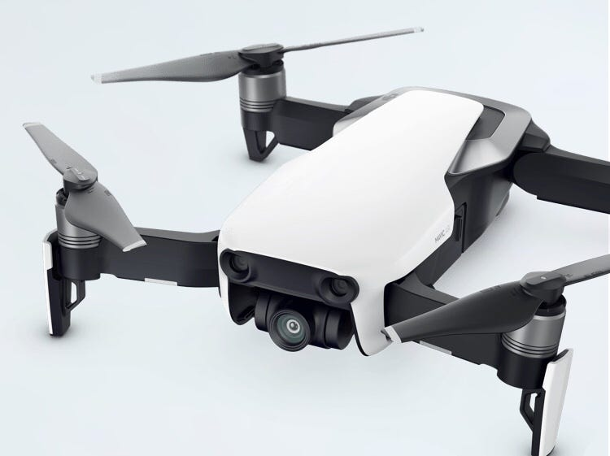

機体の表

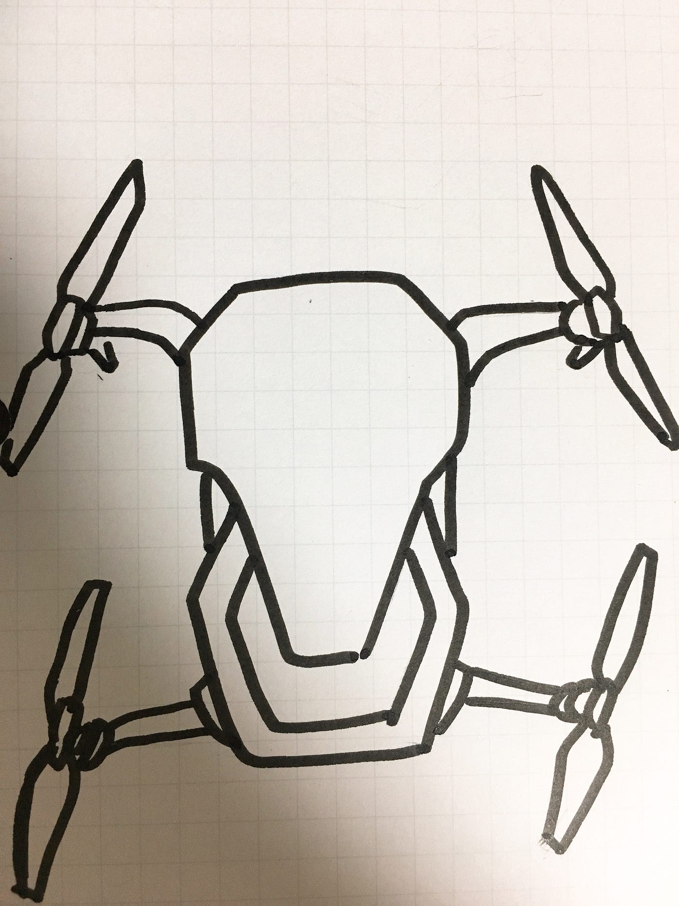

プロポ(折りたたまれた状態)

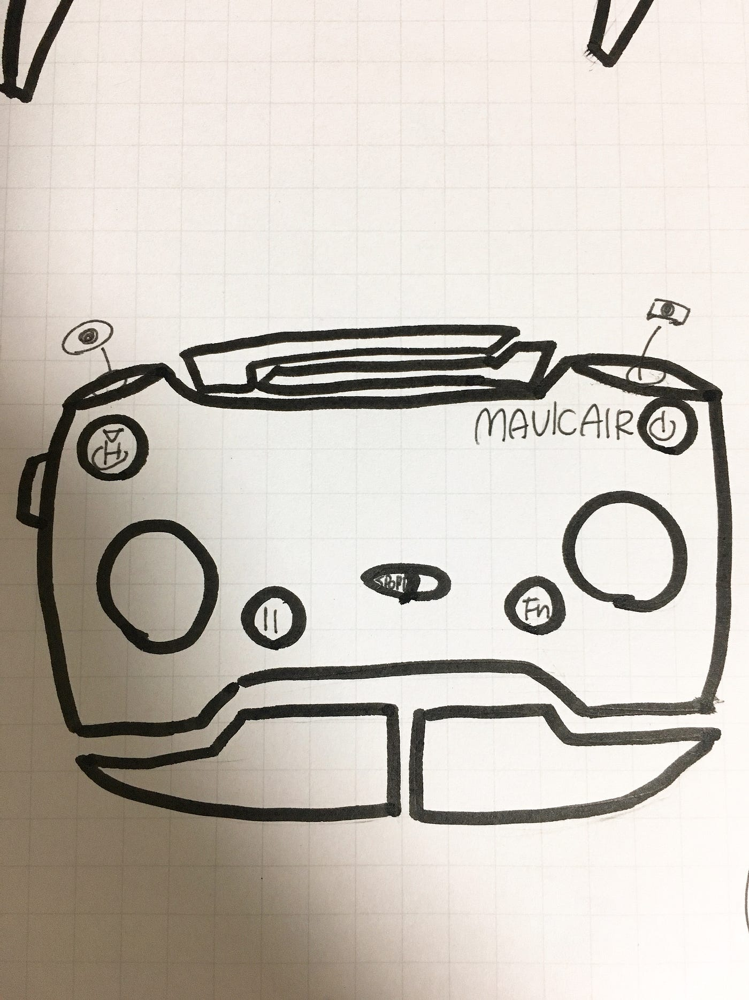

まずは送信機(プロポ)を組み立てます。

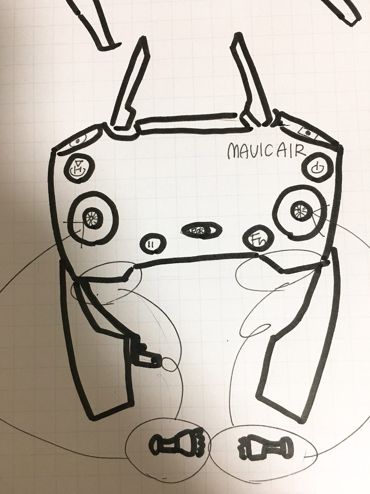

コントローラースティックがプロポの下に付いているので取り出して取り付けましょう。

機体とプロポの用意ができたらスマホアプリ「DJI GO 4」を開きます。

アプリはあらかじめインストールしておきましょう！データ量が多いので要注意です。

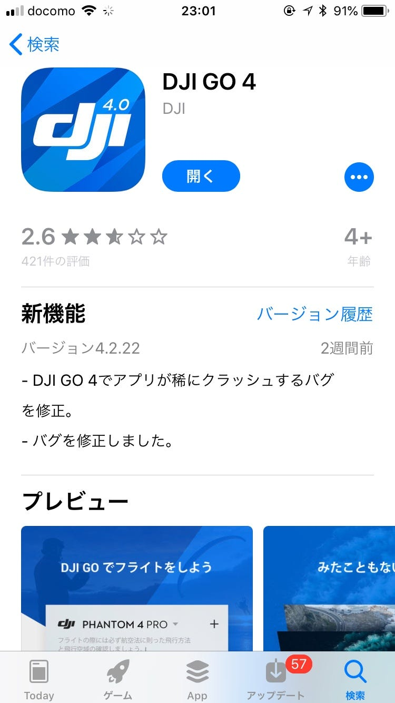

アプリを開くとこの画面に切り替わります。

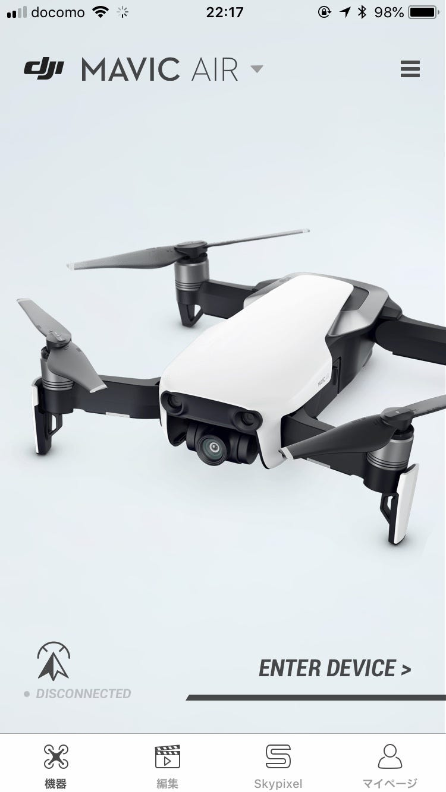

さて、この状態になったらプロポにスマホを繋ぎます。

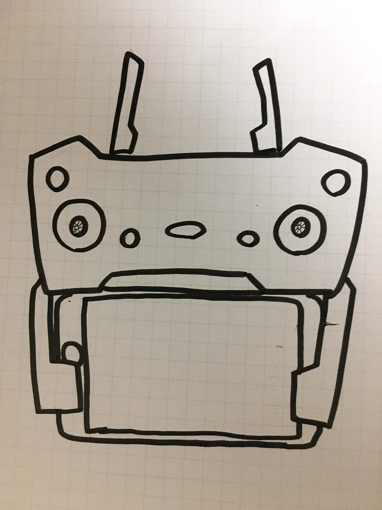

この状態にします。スマホは有線で繋いでいます。

プロポの電源を入れましょう。

右上の電源ボタンを2度押します。2度目は長めに押してください。

次に、機体の電源を入れます。

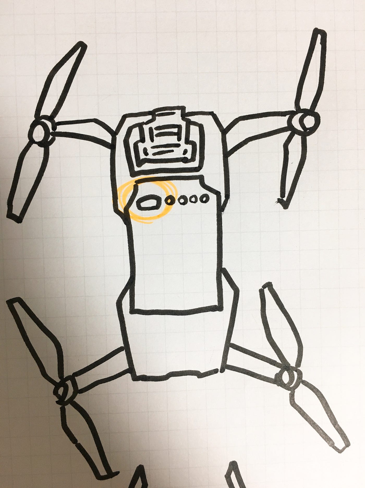

オレンジ囲ったボタンを2度押します。プロポと同じく2度目は長押しです。

プロポと機体の電源がついたらアプリ上に表示される「GO FLY」をタップします。

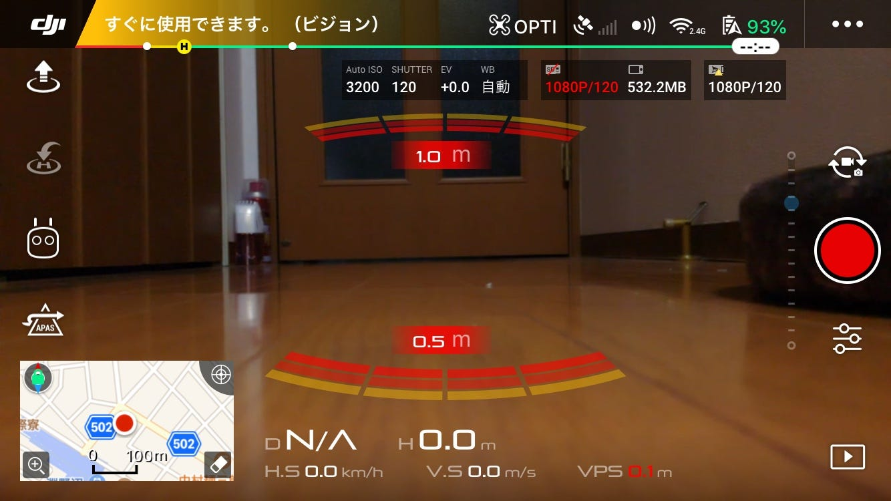

するとこの画面に切り替わるはずです。

まずは

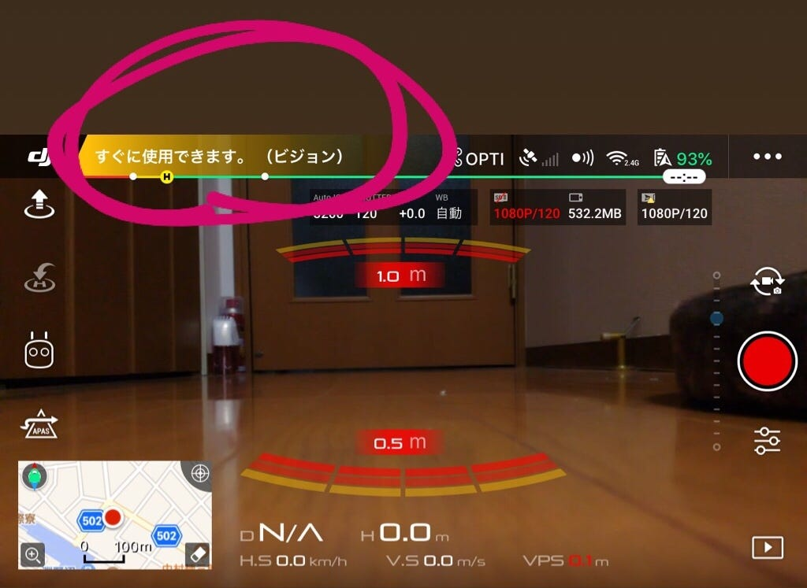

ここをチェック！

すぐに飛ばせることを確認してから飛ばします。

ちなみに画面についてですが、

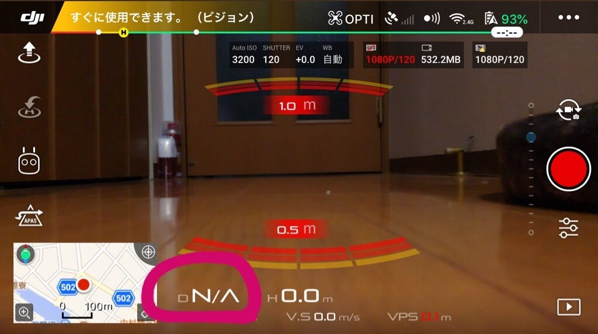

丸で囲ったところはプロポからどれくらい機体が離れているかを示しています。

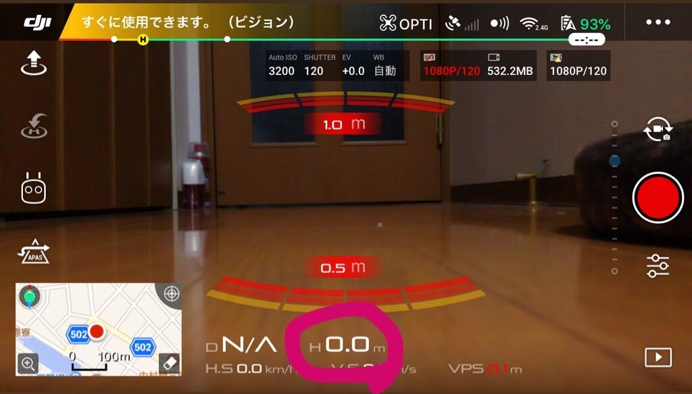

これは機体の高さを表しています。

では早速飛ばしてみましょう！

プロポのコントロールスティックをハの字に引きます。

すると、機体のプロペラが回り出し、飛行準備が整います。

その状態で左のスティックを上にあげると機体が浮き上がります。

左のスティックは上下で機体の高さを、左右で機体の向きを変えることができます。

右のスティクは上に傾けると前に、下に傾けると後ろに、左右には傾けた方向に進みます。

操作に慣れてきたら空撮です！

空撮の仕方は今日中に書ききれなさそうなので明日更新します。

取り急ぎの更新なのでこのページも改良していきたいと思います。すみません！
