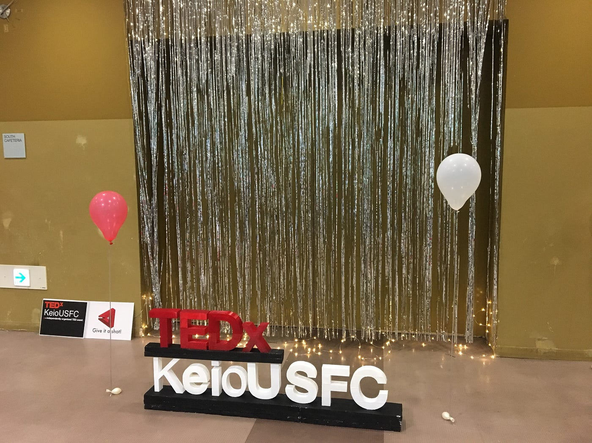
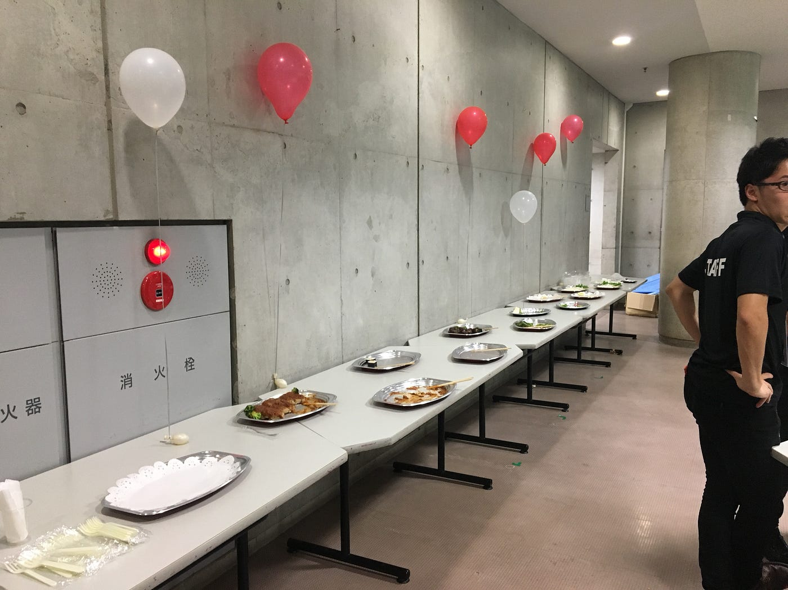

### **TEDxKeioUSFCに行ってきた！！**

7月15日（日）慶應大学湘南藤沢キャンパスにてTEDxUSFCにスタッフとして参加させていただきました！

遠かった湘南…でもその分得るものは大きかったです！貴重な機会をいただきました。

テーマはGive it a shot!

SFCというと自由が特徴の学部といった印象が強い一方で、その自由度ゆえに学生の間になにをすればよいのかわからなくなる学生が多いそう。

そこから、何事にも恐れずにやってみるという挑戦をテーマにしたこのメッセージが今回のテーマになったそうです。

ロゴが動画になっていて動いたり、壇上のTEDxKeioUSFCの文字が赤く照らされていたりと、なにかとオシャレで感動しました。

レセプションも風船が散りばめられていてオシャレ

スピーカーのみなさんは、このテーマに沿ったさまざまな事にこれまで挑戦してきた方が話されていました。

アーカイブ映像が楽しみです。

またスタッフとして今回私はスピーカー周りのことを担当させていただいたのですが、改めてこのTEDxを通して面白い人が多いなと、スピーカーの方も話しても、関連した他のスタッフの人と話しても思いました。

ただ、同じイベントである程度同じような価値観を共有してるというゆえに成り立つコミュニケーションは大きいなとも感じました。

今回はとりあえずここまで、

また写真とともに編集します。
