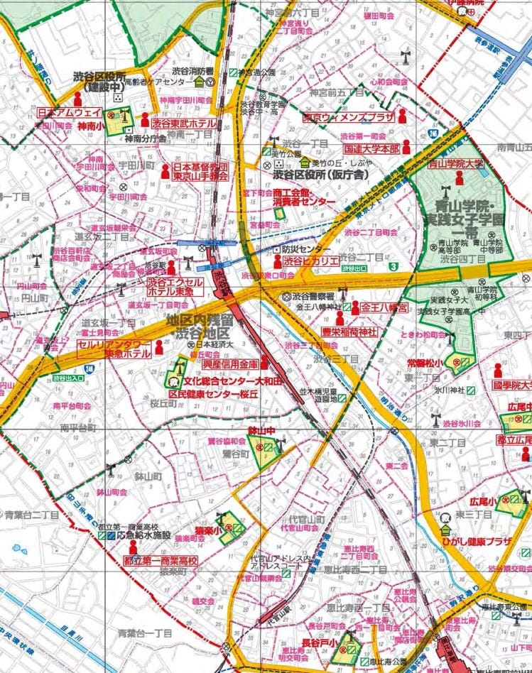

### どんな地図作ろう

今週はオープンキャンパス地図作成を通して、 自作地図の大変さが身にしみた一週間でした…

#### どんな地図にしよう！！

これは渋谷区防災地図(平成28/12)ですが、

避難所や虹避難所、一時集合場所、帰宅困難者支援施設などなど 必要なモノがまんべんなく乗ってます。

防災地図はこんなに立派なものがあるわけだから、私はどんな差別化ができるものを作ろうか…難しいです。

今のところは

### ‘’防災’’✖️’’観光’’

を上手く組み合わせて差別化したい。

上の地図にある防災情報以外にも、

- 観光地

- 周辺情報

等も盛り込む必要があるかなと思ったのですが、かなりの情報量になりそう。

なのでまずは自分で情報をまとめる&描くことをしてみようと思います。

地図作りの大変さについて思い知った一週間でした！
