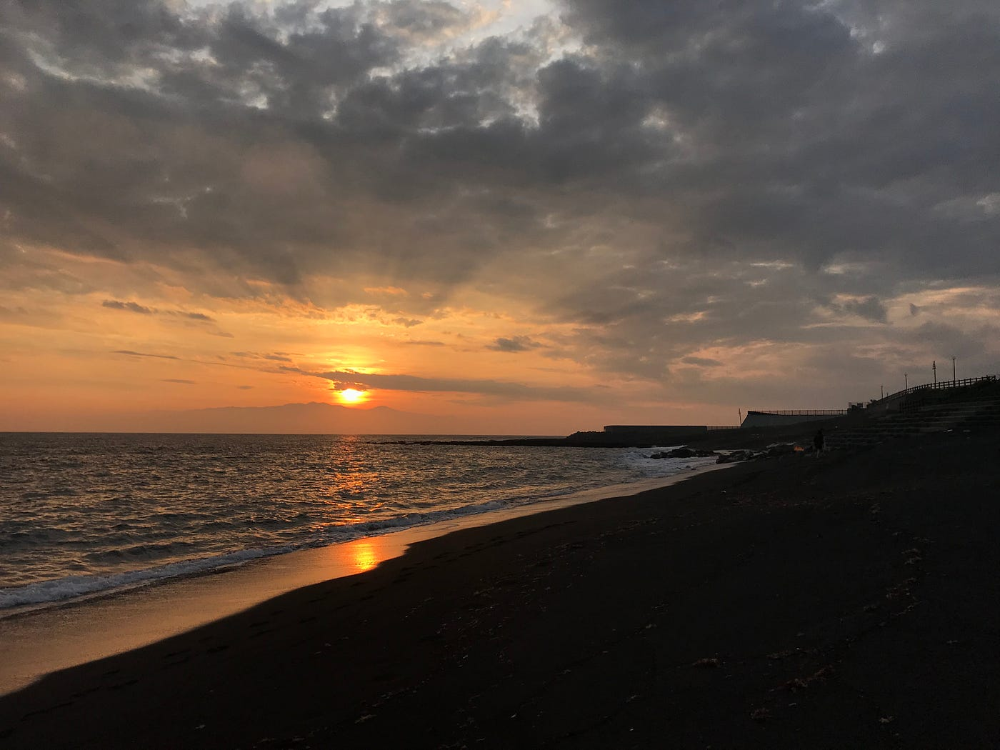
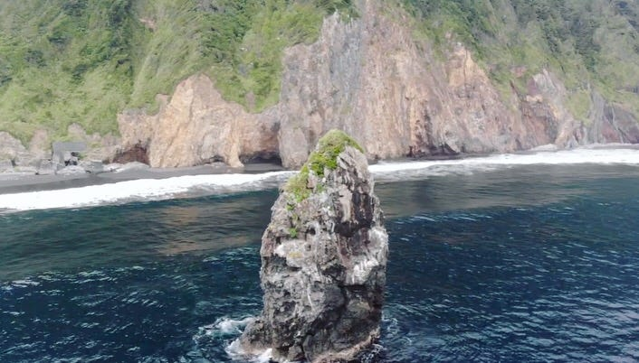
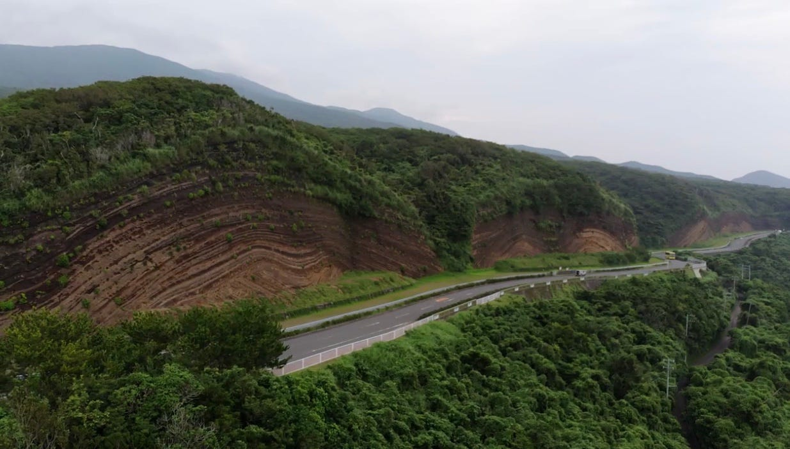
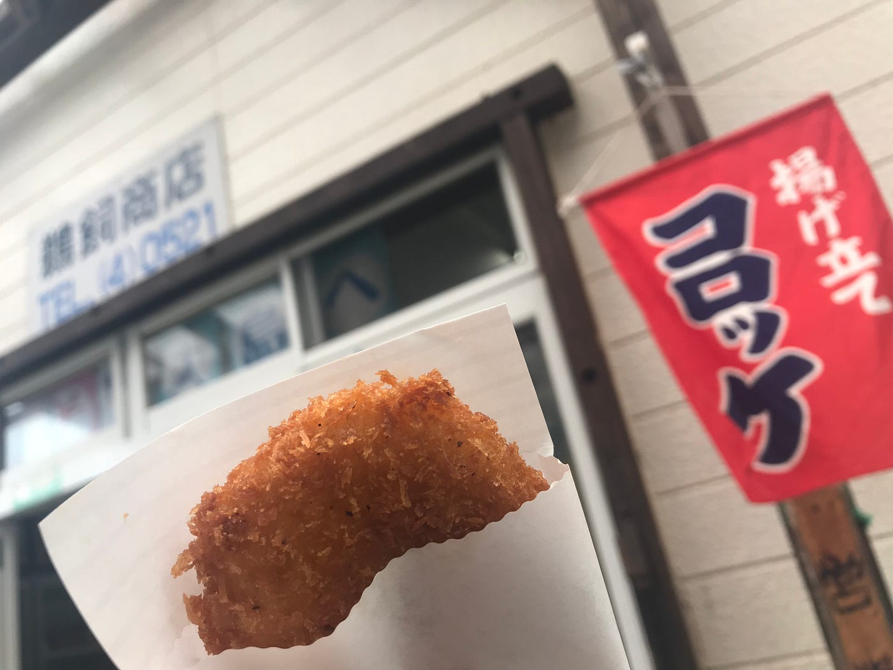
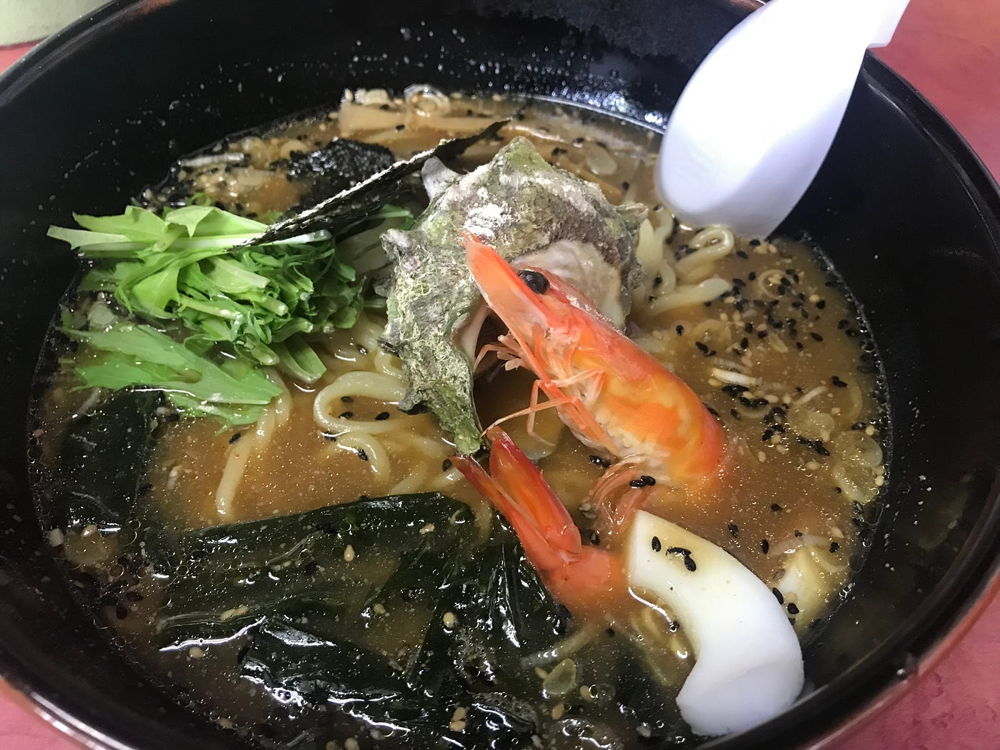
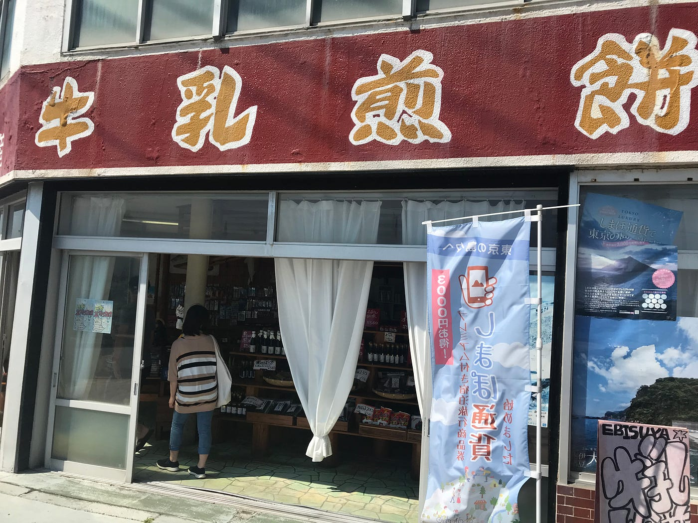

### ゼミ合宿＠伊豆大島

私が編集した動画っす！

伊豆大島へ7月12日から14日、２泊３日でゼミ合宿行ってきた〜
動画は最終日のジンポジウムの為に徹夜で編集した動画

今回のゼミ合宿＠伊豆大島は京王観光さんと(株)ブルーイノベーションさんとドローンジョプラスさんと古橋先生のコラボ企画で行われた#伊豆大島ドローン のモニターツアー！

学生が参加させていただけるだけで大変ありがたいです！！
ゼミ生では私と他３人が参加！
みんなで夕日をバックに海も入れたし最高でした！

今回、参加させていただいたモニターツアーではAチーム(初心者コース)とBチーム(経験者コース)の２つに分かれ、Aチームはドローンの空撮の練習から、Bチームは初日から空撮をして動画の作成部隊だった。

## 古橋研究室らしく行動のログ

- 1日目(空撮するたびにビビってGPS止めてたので分割された、、)
[https://www.strava.com/activities/1696728089](https://www.strava.com/activities/1696728089)
[https://www.strava.com/activities/1696849535](https://www.strava.com/activities/1696849535)
[https://www.strava.com/activities/1696961725](https://www.strava.com/activities/1696961725)
[https://www.strava.com/activities/1697076885](https://www.strava.com/activities/1697076885)

- 2日目(空撮してコロッケ食べてラーメン食べた)
[https://www.strava.com/activities/1699365168](https://www.strava.com/activities/1699365168)

- 3日目(行きは船のログが正しく取れなかったけど帰りは取れた！)
[https://www.strava.com/activities/1701219319](https://www.strava.com/activities/1701219319)

私は古橋先生と一緒にBコースに参加させてもらい、たくさん空撮して美味し物食べて徹夜で動画を作った！充実していた〜

今回は空撮した映像を元にはじめて真剣に動画作りをしたのでいろいろと学んだ！カット割りや空撮のより動画作りに使いやすい素材の撮り方。

Aチームで参加した他の学生の中のナイルも動画を作って、そんでそのナイルがすごいセンスあって(やっぱ、日頃から動画作ってるのはさすが！今回めっちゃドローンの空撮映像をYouTubeで勉強してきてたらしい、意識高い！笑)、二人で完全に空撮してからの動画作りにはまった！！

今まで空撮してもあまり編集しないでアップしていたのでこれからはカッチョイイ動画をもっともっと作りたい！卒業するまでにもっと！卒業しても作る！！

最終日ではシンポジウムで古橋先生が公演して、作成した動画の披露！ドローンジョプラスさんが島の人にドローンの体験イベントをやったりもしてた！

伊豆大島のジオパークは空撮には最高のポイントでばえる！！

先生とジオパークの方と道中二人から色々とレクチャーを受けながらの空撮でした（笑）

スコリアについて、軽くて黒くて赤い石。鉄分が多いと赤くなる。白い軽い石は軽石。伊豆大島にあるのはスコリア！

三原山(758m)は成層火山で富士山と同じ！度々噴火する！最近だと32年ほど前に噴火したらしい。しかし30年以上前なので付近にはイタドリをきっかけにススキなど植物がかなり増えていたよ。

あとは土砂崩れ(2013年)の後もよく確認しといた！先生たちが伊豆大島でマッピングパーティーを開いて、伊豆大島はOSMでのデータが最強になった直後に台風の影響で大規模な土砂崩れがあった。

5年経ったということで復興した姿を360度パノラマしたよ。

[https://www.skypixel.com/photos/63173f44-485d-470d-9b00-79dc868adaa5](https://www.skypixel.com/photos/63173f44-485d-470d-9b00-79dc868adaa5)

今回のゼミ合宿で伊豆大島が大好きになった！今回はできなかったダイビングをぜひ次回したい！海もきれいやった〜

一番初めに貼った動画是非見てね〜

以上、ゼミ合宿＠伊豆大島の報告でした！
