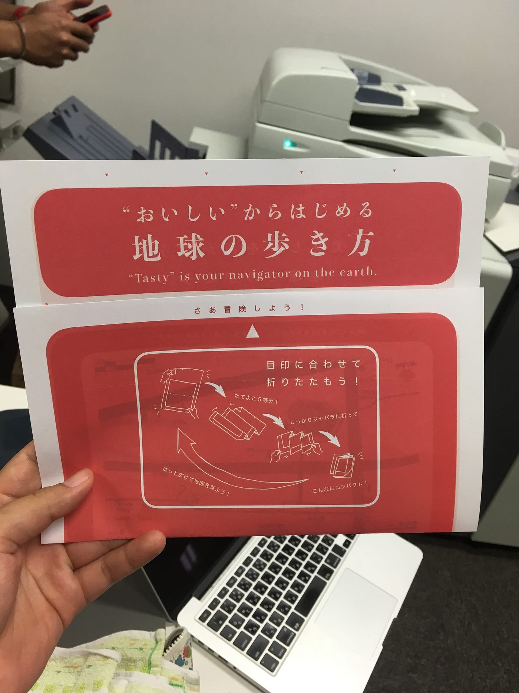
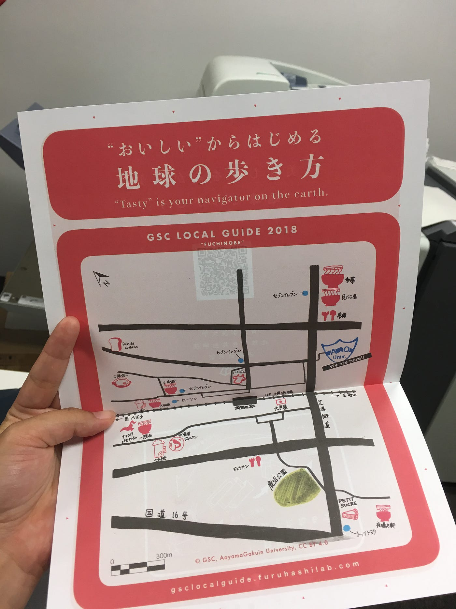

### ゼミ報告【おいしいからはじめる地球の歩き方】

こんばんは。

先日葛西臨海公園に初めて行きました。海。もう夏。特にこの土日は猛暑日とも言える2日間でしたね。

とても個人的なことですが、いろいろあって頭の整理ができていません。卒制についてもストップ中です。

なので今回は、先週のゼミの報告をしていきたいと思います。

### # 淵野辺のグルメ地図を作る？

火曜日のゼミで、週末のオープンキャンパスに来るであろう高校生向けの地球ローカルガイドを作りました。

折りたたみ地図のデザインや開き方のイラスト、またQRコードでとべる地図の位置情報整理など担当は分かれていました。私は卒制テーマの関係で、地図デザインを担当させてもらいました。下書きは事前に行っていましたが、手書き地図というのは意外と難しく、結果みんなに助けられました…。本当に感謝。

まずは地図の色デザインから話し合いました。始めは道を水色にして、エリアも色を塗ろうかと話していましたが、肝心なグルメ情報のアイコンが目立たないデザインはやめておこうということで、エリアは塗らず道とグルメ情報やその店がわかる目印だけ色をつけることになりました。アイコンは赤がわかりやすいだろう、軸となる芝溝街道や16号線、JR横浜線ははっきり描こうなど話し合い作り上げていきました。

地図の構成がとにかく大変でした。どの情報を入れてどこを省略するか、でもあまりにも実際の地図と違いすぎると地図の意味を成さなくなる、など様々なことを考慮しながら完成させました。

5限が始まる17時頃から25時頃までかかってしまいました。まさか誕生日をゼミ室で仲間たちとともに迎えることになるなんて思ってもみなかったので、貴重な経験になりました！学生最後の誕生日には相応しいと思います。

### # 完成形

反省点もありますが、自分がこれから卒業制作で作っていくための一歩になりました。今回はかなり少ない情報しかない地図でしたがそれでも苦戦しました。卒制で作る地図の情報量も絞ったほうがいいかなと感じました。再検討します！

それでは、今回はこのへんでおやすみなさい。

安藤
