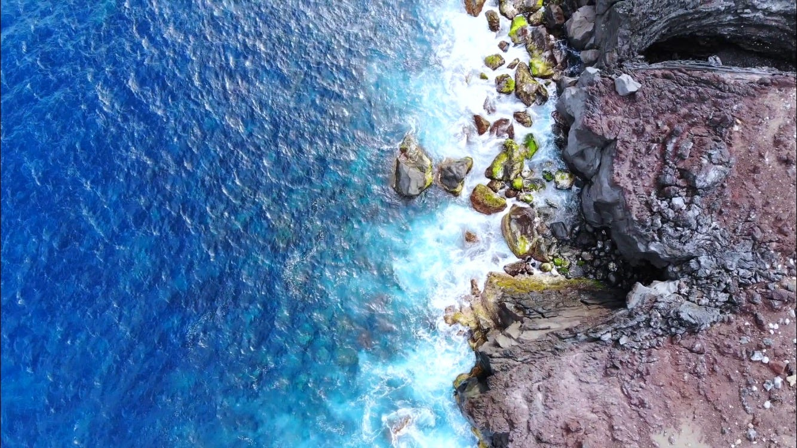

### ドローンでスカイビュー観光！

今回、伊豆大島に行きドローンを使って地方創生をできるんじゃないと考えさせられた

私は今回初めて伊豆大島に行き伊豆大島の観光客が年々減っていることを知りました。壮大な自然、火山と海の見所満載な伊豆大島に感動しました。

美味しい食べ物やフレンドリーな島の人々がどうやったらもっと観光客にきてもらえるか自分なりに考えてみた。

Google Mapにある機能でストリートビューを誰しもが一度は使ったことがあると思います。そのストリートビューならぬスカイビューを提供できることで様々な見方ができるんじゃないかなと思いました。

観光客が島に来る前に大体どのようなルートで島を観光できるのかをドローンの映像を様々な観光名所と合わせながら空から見ること。ドローンを使って自分好みのツアー用、動画を作ることができことができたら面白いと私は思いました。

例えば島に着いて、港から自分の泊まる宿までのルートをドローンを使って撮影する。そしてチェックイン後に大島の観光地を選択する。さらに、食事をする場所もそこから選択できることで普通の地図では伝わらない景色と同時に島の案内をすることができると思います。

やはり、空からの映像で伊豆大島のようなドローンの撮影に適している島を事前に見せることで観光客も島に着いてからのイメージもしやすいのかなと考えました。

私は紙媒体とネットでしか島の観光地が確認できなかったためツアーガイドさんの情報のみが頼りでした。ドローンでいい景色を動画で楽しみながらも位置情報ツールとしても使える一石二鳥（ドローン）と私は考えました。
