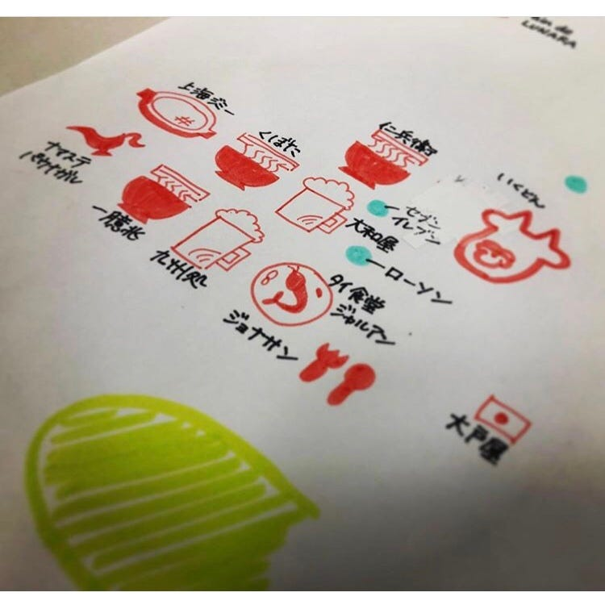

### 今週のおまめ

いや〜暑いです、こんにちは

今週は卒論の話を一旦おやすみしまして、ゼミで行ったOCのための手書き地図製作について、少しお話したいと思います。

内容は私の大学の最寄り駅である淵野辺駅周辺のおすすめグルメマップを私達古橋研の生徒で手作りしようというものです。もちろんこの地図はOCに来てくれた学生に配り、少しでも大学のことをより知ってもらい、楽しんでもらいたいという思いから生まれたものです。

私達は大学四年生、このキャンパスに通って四年目になるわけですが、馴染みのある地であっても、いざ手書きで地図を書いてみろと言われても難しいもの。よく行くおすすめのお店の位置すら正確に表せませんでした。空間情報ゼミ生として非常に恥ずかしいことです。

みんなと試行錯誤しあいながら、完成までにはとても長い時間がかかってしまいました。合っていると思っても先生からオーケーがもらえない。地図ってこんなに難しいのかと実感させられました。

皆さんも、普段行き慣れている場所や自分の家の位置さえ明確に地図に表すことは難しいのではないでしょうか。

わたしは今回の経験を通して、もっと位置情報に敏感に、ゼミ生として恥ずかしくないように位置を把握しなければと感じました。スマホで位置を把握するのが当たり前な時代ですが、そこに頼りすぎずいきたいです。
