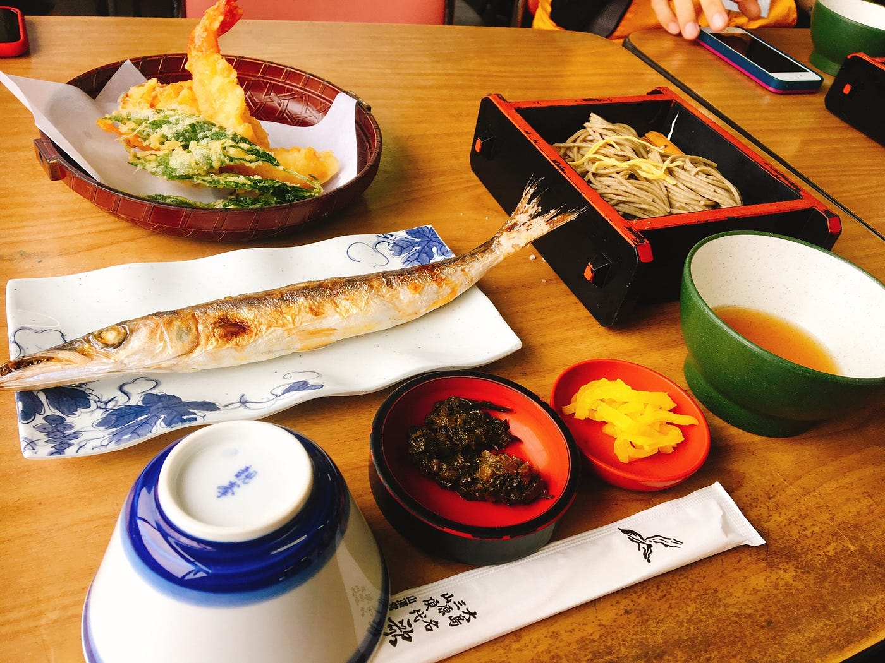
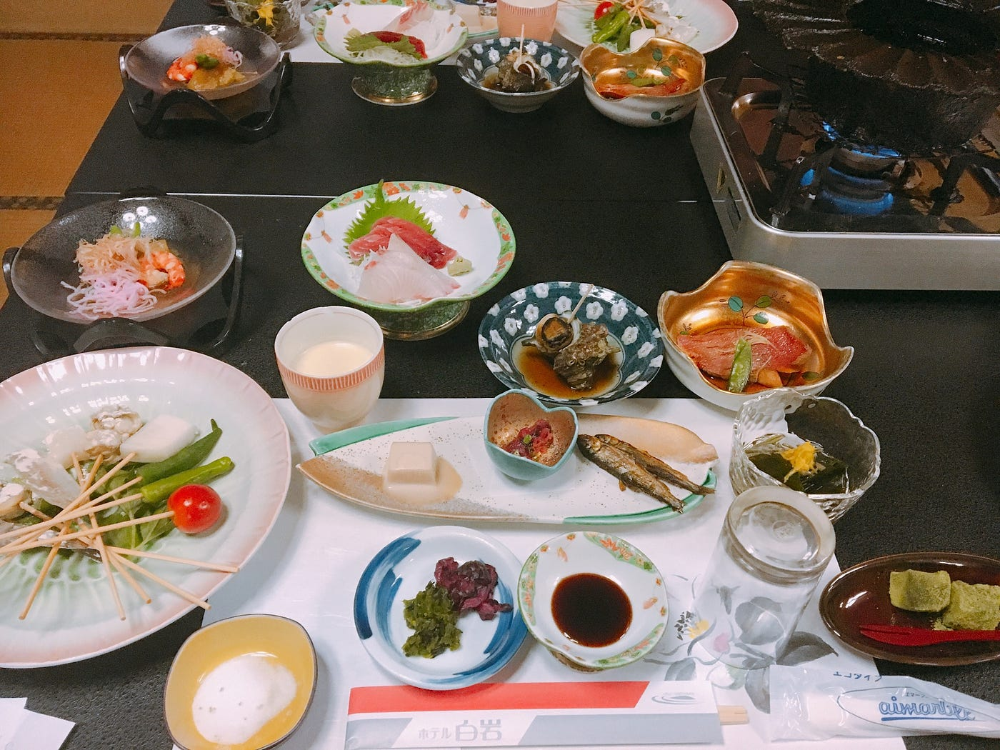
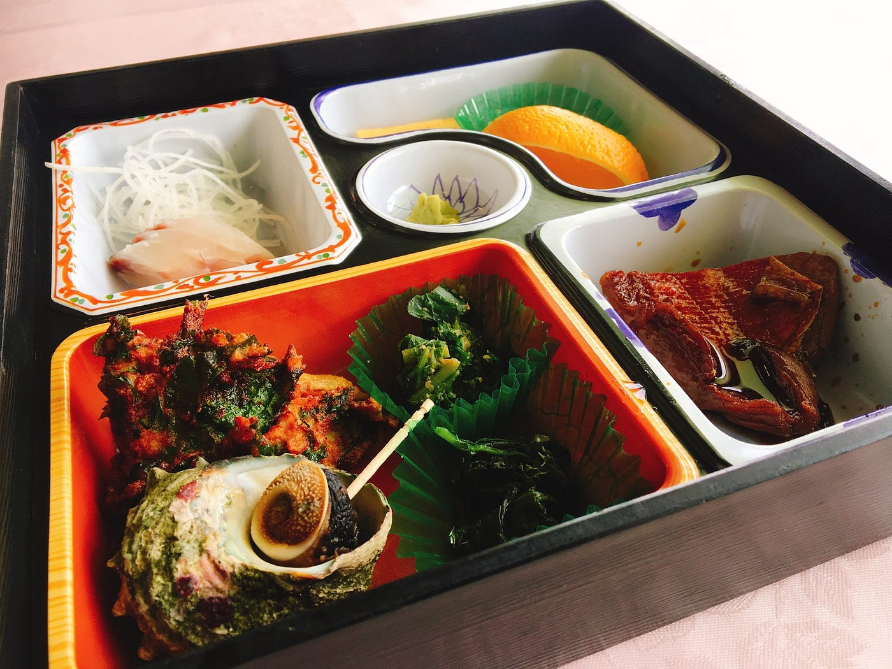
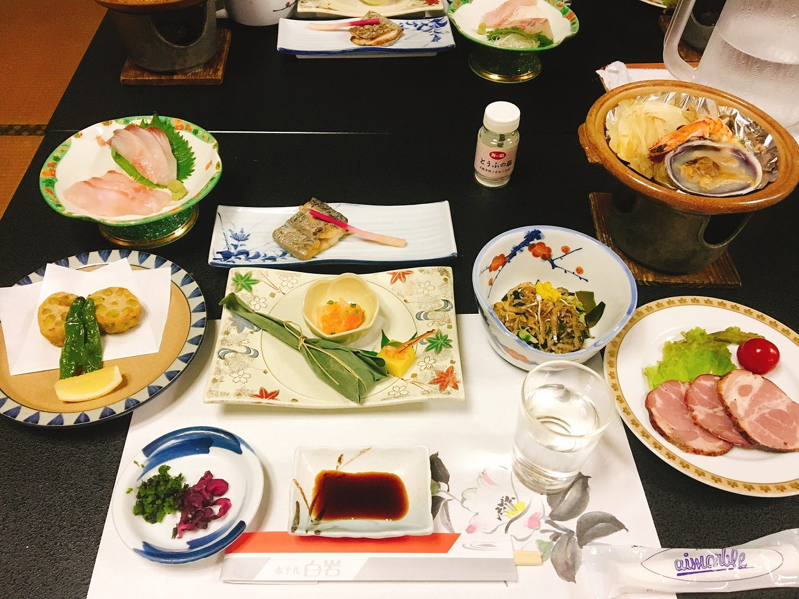
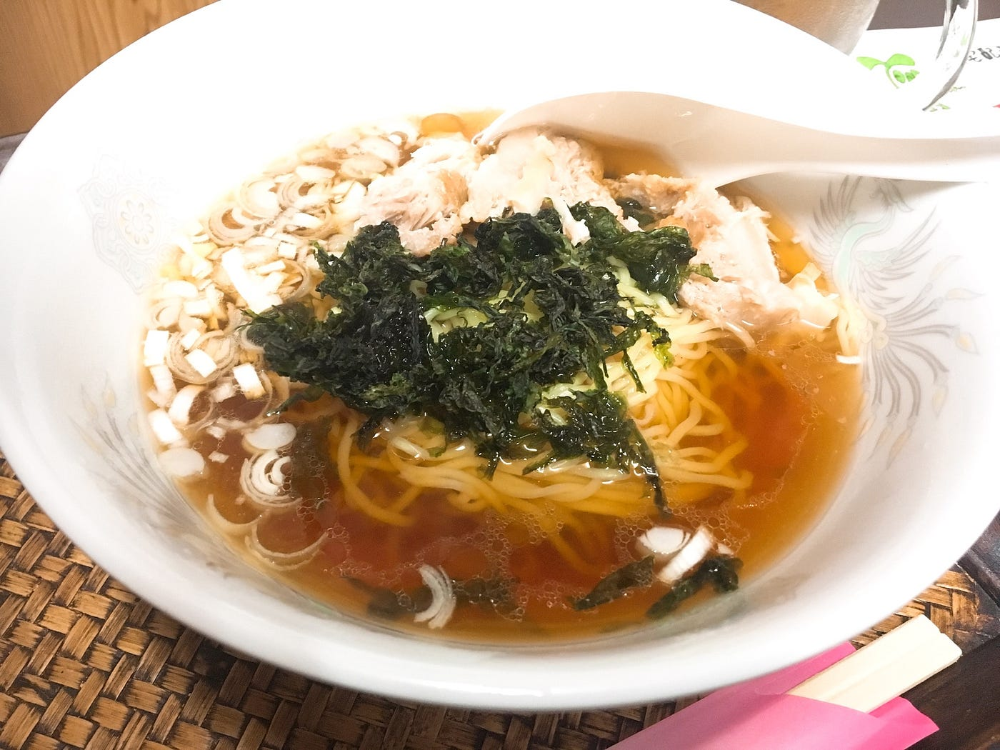
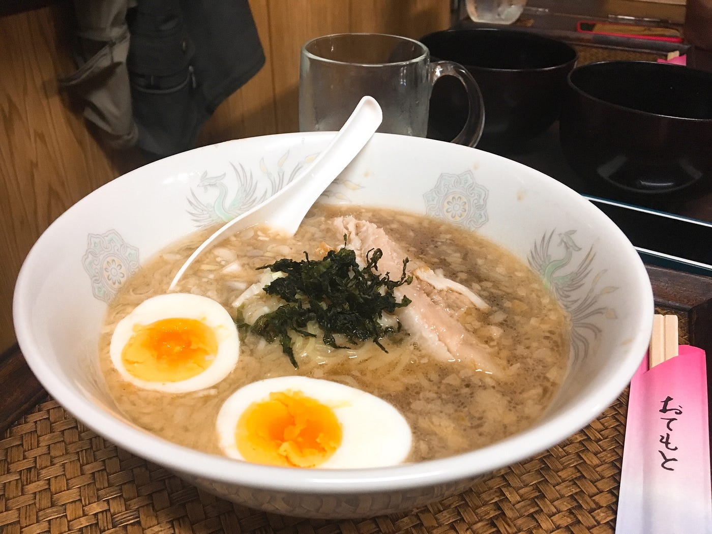
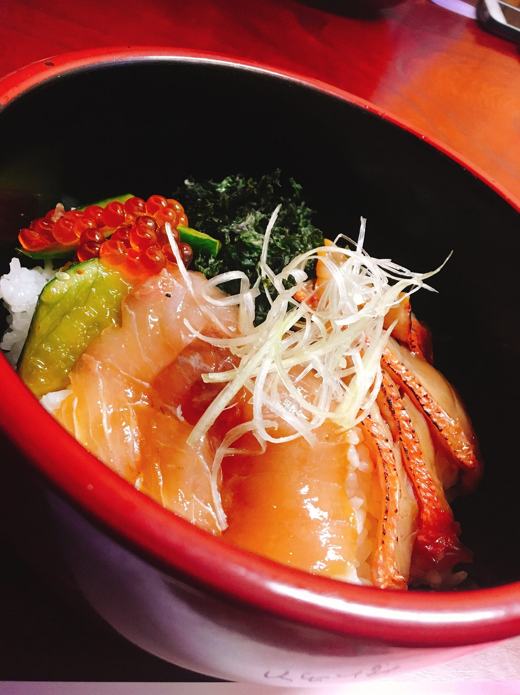
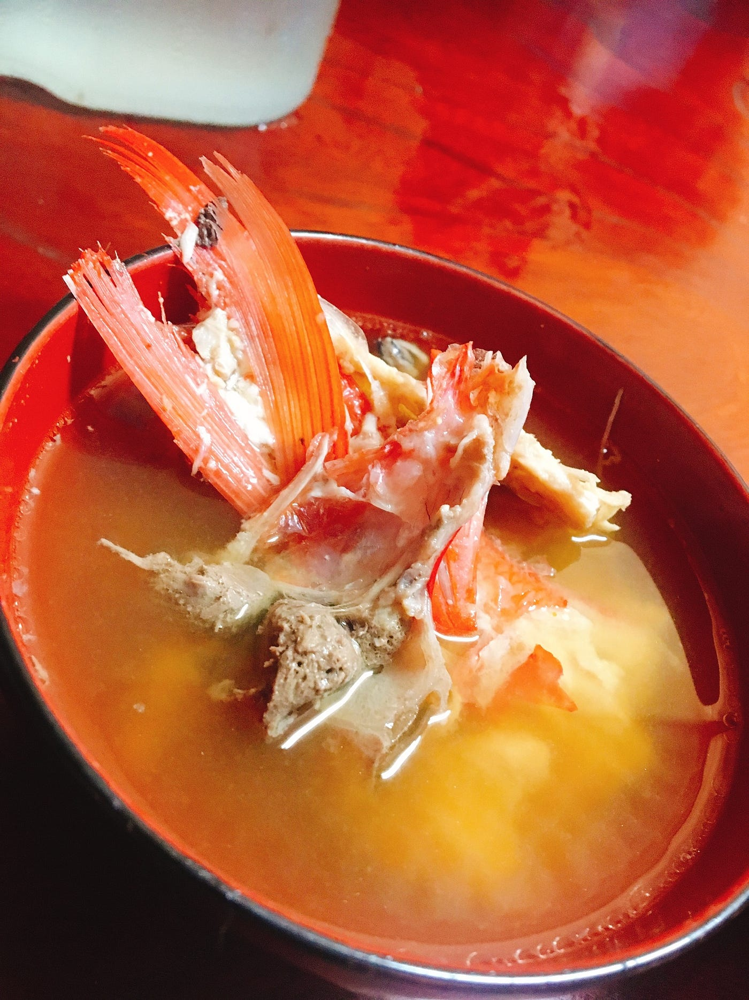

### 伊豆大島グルメ

こんにちは！ゆうなです。一昨日までゼミ合宿として、古橋さん、あやめ、みさみさ、ナイルと共に伊豆大島へ行ってきました！

詳しいことは今週分として書くとして、今回の記事では伊豆大島で食べたご飯についてドドドっと書きたいと思います。

魚はかますの塩焼き、天ぷらはエビと野菜のかきあげと明日葉の天ぷらでした！ かます初めて食べたんですけどかますの顔ってめちゃかわいくないですね、でも美味しかった！ 明日葉も（たぶん）初めて食べたけど程よい苦味が聞いてて大人の味でした！

奥にあるのは、椿油のオイルフォンデュです！左前にある具材を衣つけてあげて塩をつけて食べるんです。揚げ物なのにさっぱりしててめちゃくちゃうまい！胃もたれとか皆無でした。

この御膳プラスご飯とあら汁でした！手前に明日葉の料理が３種類（天ぷら、胡麻和え、佃煮）があるんですけどどれも明日葉の良さを殺しすぎない味付けで良きでしたね〜 お刺身は安定して美味い

ここにきてたぶん初めての肉！！！！！！！こんなに肉が出て来ない旅は初めてでした（褒め言葉） でもやはり量で見ても肉＜海鮮料理ですね〜

伊豆大島にきて一杯もラーメンを食べてなかったので夕食後にナイルと古橋先生と行ってきました、どんどん亭！

店主さんは東京本土で７店舗ぐらい出していたぐらいの料理人さんでラーメンは本業ではないそう。今回は醤油ラーメン、味噌豚骨、醤油豚骨をいただきました。

私は正直お腹がいっぱいだったので、食べきれるかなって心配だったのでひよってさっぱりめの醤油ラーメンにしました！見た目の通りさっぱりしててお腹いっぱいでも完食できました！

味噌豚骨と醤油豚骨がこってりしたかというとそうでもなかったんですよね、背脂が入ってるんですけどどろっとした感触が少なくて食べやすい。磯ラーメンとか海苔ラーメンとか、海鮮を使ったラーメンが多いと自然とさっぱりめによるのかなと思いました。（海鮮ラーメンは食べてないけど）あと、上に乗ってる海苔がめちゃくちゃおいしかったです、無限に食べれます

麺と味噌は博多でお店をやってる友人から直接取り寄せてるそうです、こだわり〜

伊豆大島にきたのにべっこう寿司を食べてない！！！！！！！！と騒ぎまくった結果、2日目の夜食（？）で行ったどんどん亭でべっこう丼をだしてもらえることになりました！

金目鯛の炙りとカンパチのべっこう丼です。もともとは保存食だったそうで、本来はめちゃくちゃ濃い味なのだそうですが、今の伊豆大島で食べられるべっこう寿司のほとんどはお客さん用に本来よりも薄味で作られてるそうです。作り方も聞いたんですけど以外と簡単！青唐辛子を入れるんですよ！ このべっこう丼も青唐辛子がきいてて辛かった・・・！とかいって辛い辛いいいながら完食しました。朝食がまだ胃に残ってたからそんなにお腹空いてなかったのに。美味しい食べ物って怖いですね。

おまけでだしてくれたあら汁も最高でした、どんどん亭のおじさん、お世話になりました！

この旅の食事で思ったのは、**全体的に薄味だった **ということです。濃い味が好きな上野人の私にとっては、正直出てくる料理の半分ぐらいは醤油とか塩をかけたくなるぐらいの薄さでした。なんで薄めなんだろう、海鮮系が多いから塩ベースが多いとして、薄味なのには何か理由があるのか、むしろ日本基準で見たらここが普通で関東が濃い味すぎるのか？ 私の感覚が麻痺ってるのか？やはりそこには土地柄が関係しているのか？わからなくなりました！

美味しいものがたくさん食べれて幸せな旅でした♡ 次来た時は絶対海鮮系のラーメン食べます。べっこう丼作るぞ〜
