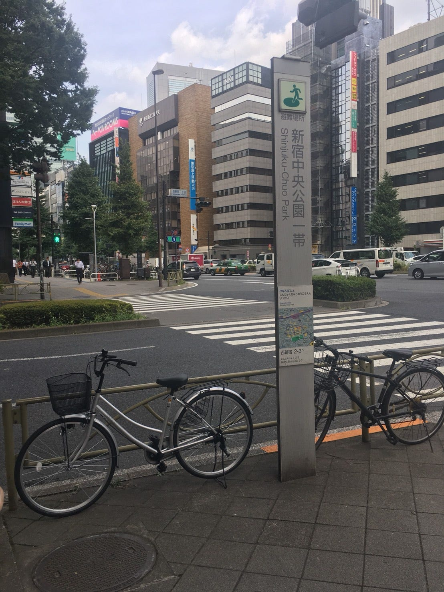
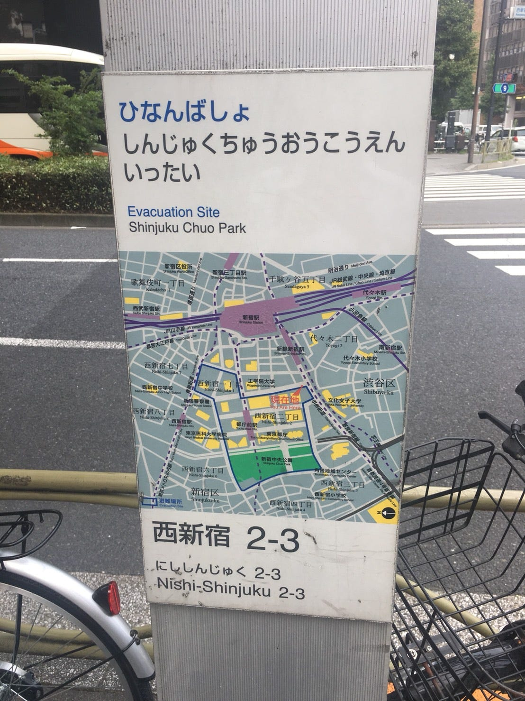
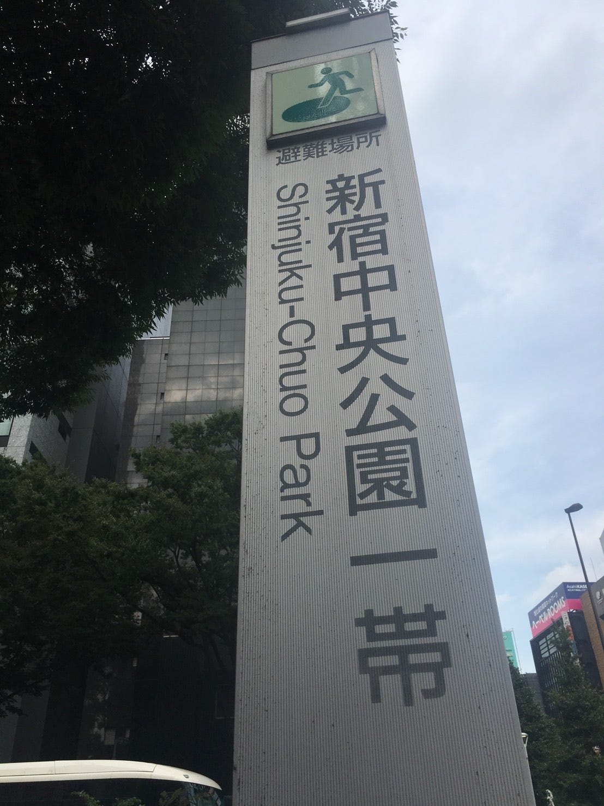

### 避難場所の目印見たことある？

新宿区にある避難場所の案内板を見てきました。

(同様のものが渋谷区ほかにもあります！)

案内板は、
・大きなひらがなで記載がある
・英語での記載もあり
・現在地を示す周辺地図

の表示があり。

また、これのすぐ隣に大きな周辺地図の案内板がありましたが、ここには避難場所の表示がありませんでした…。（写真撮り忘れてます(´;ω;｀)）

防災マップを作成する際には、この案内板の位置を地図上に示していくようにしたいと思います。

