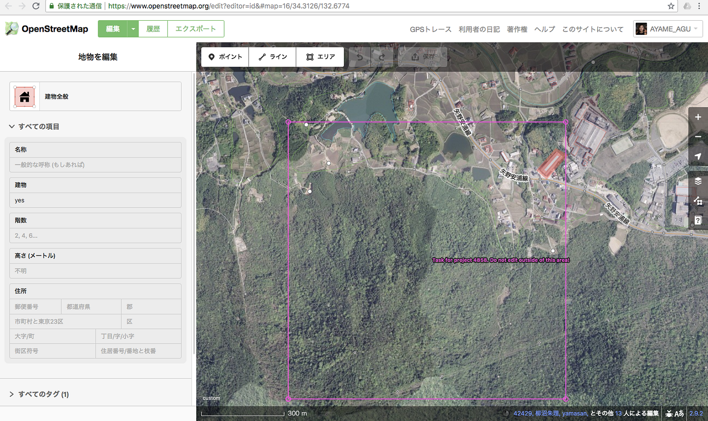
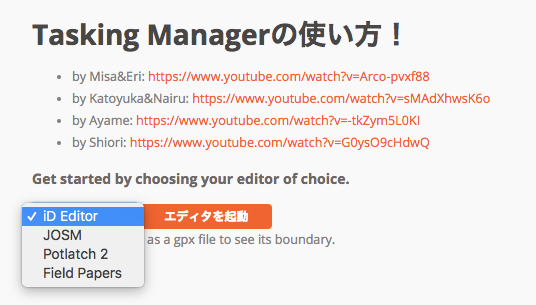
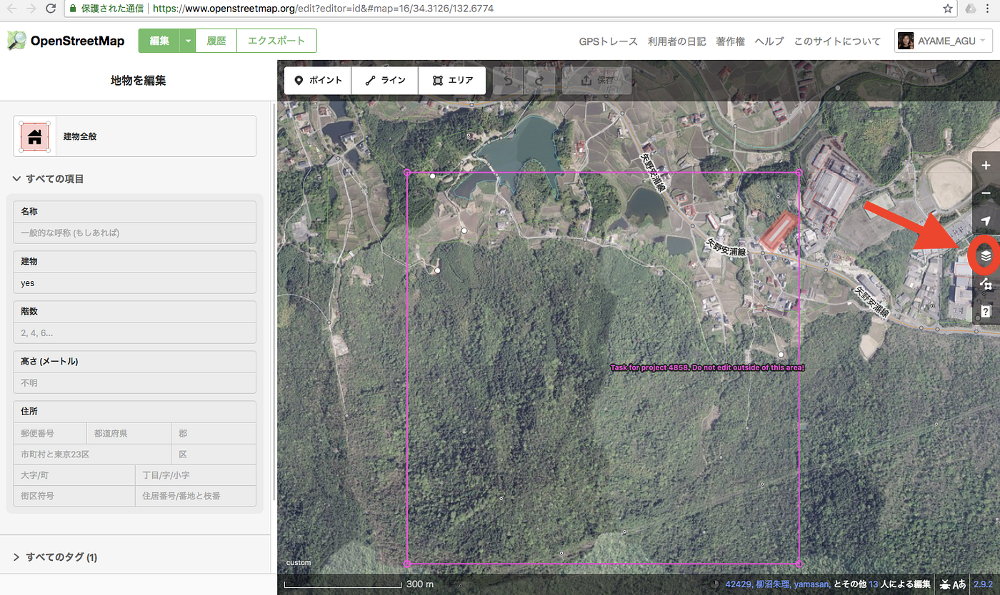
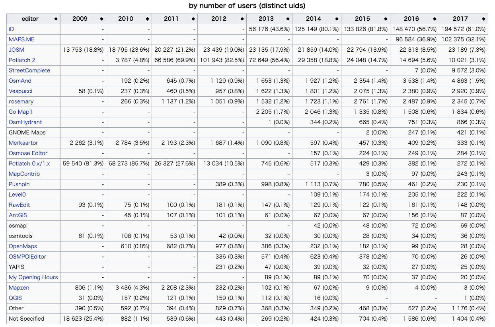

### iD Editorというツール

iD Editorは、PC用のブラウザタイプのOpenStreetMap(OSM)エディタ(編集ツール)である。またシンプルでわかりやすくなることを目的としている。

ブラウザタイプということで基本はオンラインの環境下で立ち上げて使用する。2013年5月以降、**OpenStreetMap.org **のホームページで iD を使うことができ、JOSMと同じようにHOT TaskingManagerでOSMを編集するときにiD Editorを選択することができる。

HOT TaskingManager ではこのようにマッピングをする時にどのエディタを使うか選べるようになっている。

iD Editorはこの中でも初心者のマッパーが最もとっつきやすいエディタだと思う。そして利用者人数も多い。私の大学でも多くの学生がiD EditorからOSMを編集している。

iD Editorの良いところは何しろ操作が簡単でわかりやすい。背景の衛星写真などの変更も容易で、ブラウザタイプなので日々アプリのアップデートを自分でやらなくても良いところだ。OSMの確認作業等には最適だ。

反対に使いづらい点としては、コピペで地物データを増やす作業は便利だが、建物の形や大きさがひとつひとつ違っている時、建物の角を全部クリックしなくてはならないところ。デフォルトで直角補正がされないため、自分で一手間加えて直角補正をしなくてはならない点。タグ(その地物データの属性)を一つ一つ選択しなくてはいけない点だ。

ゆえに建物のデータなどを一気にドバッと入力したいときにはJOSMの方が効率が良かったりする。反対にちょこっと編集するときは大変便利である。

一番初めにあげた画像がiD Editorのユーザーインターフェースで、左上のポイント、ライン、エリアという表記が非常にわかりやすい。ポリゴンではなく、エリア遠い表記が良い。また概念的な話をするとiD Editorではポリゴンを閉じたウェイと定義し、データの管理もシンプルだ。

タグではある程度の情報も加えることができる。赤丸で囲ったボタンから背景地図を変えることができる。衛星写真の最新度や解像度、天候などに合わせて複数の背景データを元に地物を確認するのは、非常に有効で大切なことである。迷ったときはぜひ試してほしい。

個人的に気をつけていることはやはり、ブラウザタイプなのでデータを入力したらこまめにデータをアップロードすることを心がけている。

iD Editorは2013年以降非常に広まった。

以上今回はiD Editorの紹介。

[OSMの編集ツール、もくじ
OpenStreetMapのエディタ、つまり編集ツールについて語る。
PC用のツールとスマホ用のツールの大きく分けて２パターンある。
みんなは何を使ったことがある？medium.com](https://medium.com/furuhashilab/osm%E3%81%AE%E7%B7%A8%E9%9B%86%E3%83%84%E3%83%BC%E3%83%AB-%E3%82%82%E3%81%8F%E3%81%98-b47d3410fe4f)

このもくじの通り、次回はField Papersについて紹介しようと思う。
