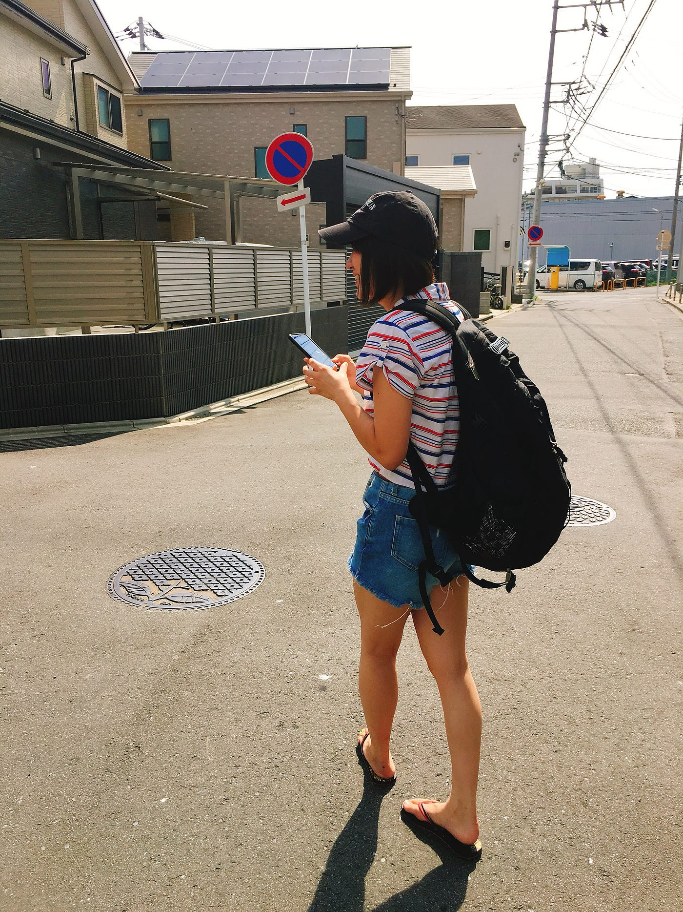
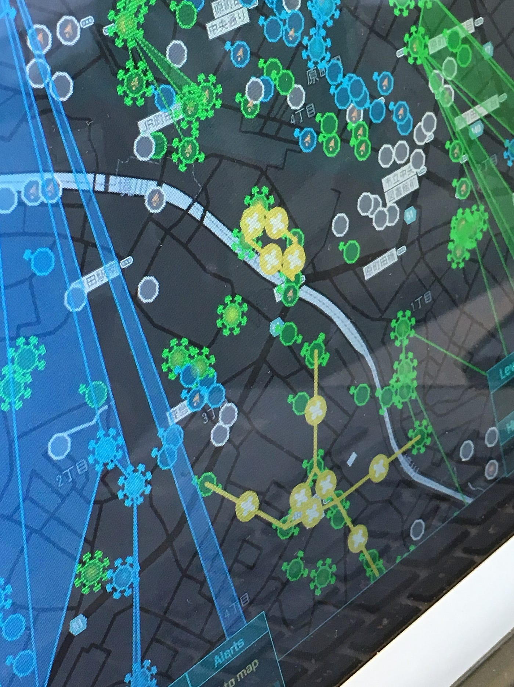
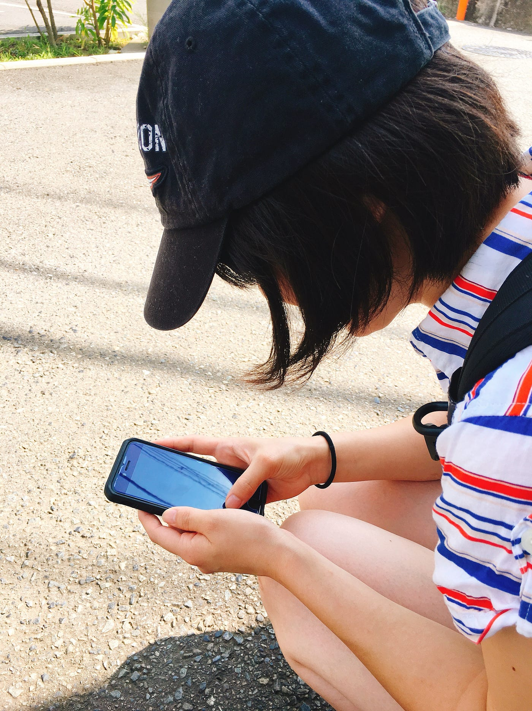
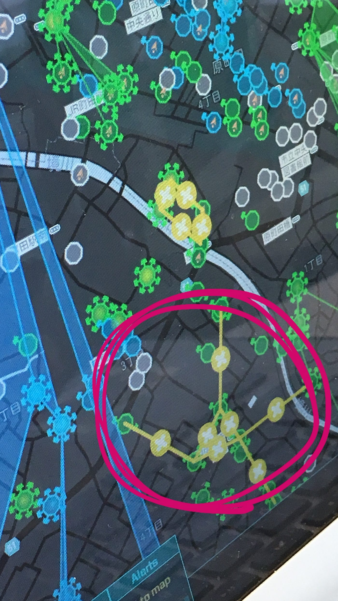

Ingressでおえかき

7月21日にあやめと町田でIngressをしてきました！

なんでもIngressの授業でIngress上でストーリー性のある図を書いてこいという課題が出たそうです。

そのお手伝いということで、約2時間町田をうろうろ歩いてきました〜

今回はその記録と気付いた点を書いていこうと思います。

この日の目標はこの図を描くこと。

まずは下方の図を描いていきます。

ハック・攻撃・破壊・デプロイを繰り返しました。

私は青、あやめは緑チームだったので、今回の私のお役目はハックしてポータルキーをゲット&ドロップすることでした。

最終的には時間の関係でこの部分しか描くことはできませんでしたが、これを描くのに2時間かかりました……。

描き終えた頃にはなかなかの達成感がありました！

今回のお手伝いで、

- 目的を持つこと

- チームでやること

この２つがポイントかなと思いました。

何人かでやることでモチベーションを維持することができますし、目的が明確になっていることでのちの達成感を味わうことができます。

逆にレベルを上げないとできないこともあるので、やっぱり経験者とともにやってレベル上げを手伝ってもらいつつイングレスのおもしろさに触れていく必要があるのではないかと感じました。

今回、激戦区である町田でイングレスをしたのでいくつもどちらのチームにも所属していないポータルにデプロイすることができました。結果レベルがあがりました！

イングレスよくわからないし何がおもしろいんだろうと思っていましたが、今回のお手伝いで楽しさが少しわかった気がします。

それではまた次週！
