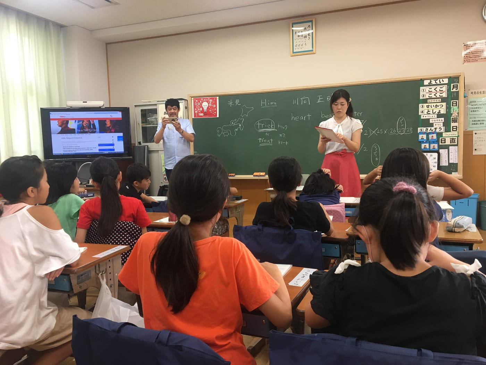
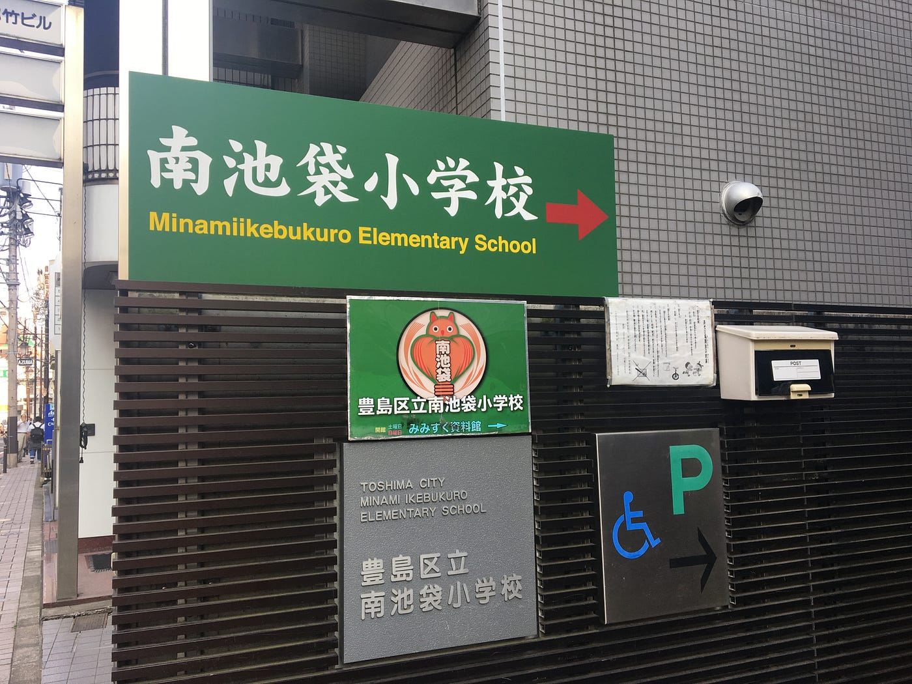
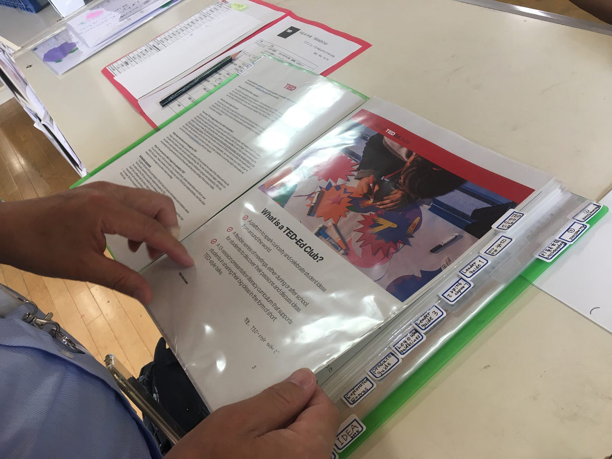
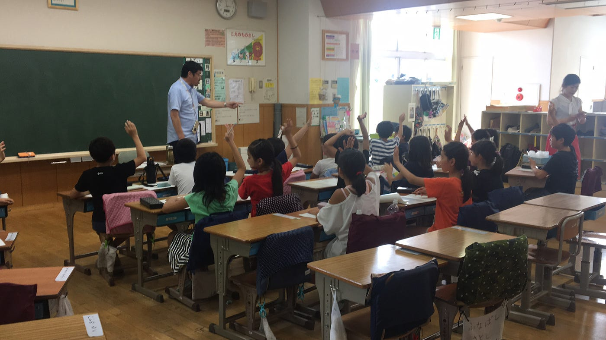
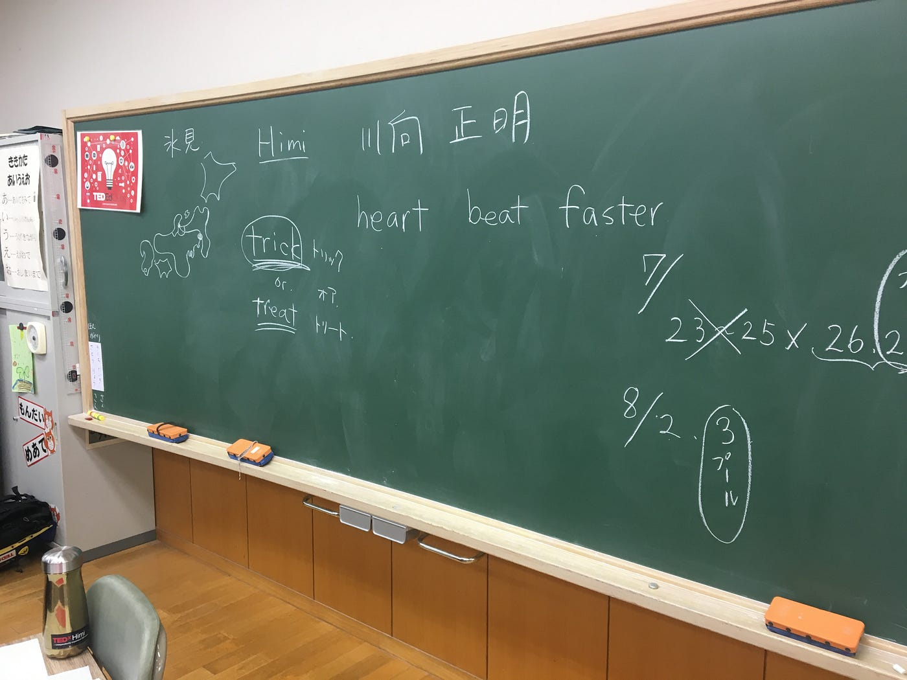
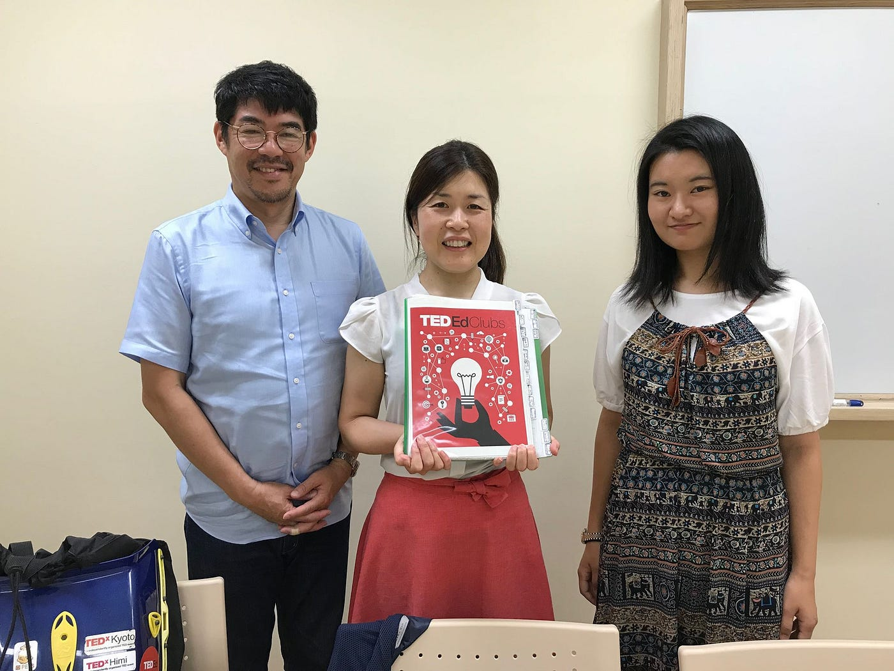

### TEDEdClubs初参加！！

以前からお邪魔させていただくことになりましたと言っていた、TEDEdClubsに参加してきました！
今回誘ってくださったのはTEDxHimiオーガナイザーであり、TEDxKyotoのスタッフである川向正明さんです。
まささんと呼ばせてもらってます。

伺った小学校は、豊島区立南池袋小学校。

日本では公立学校としては初めてのTEDEdClubs参加小学校です。
TEDというと概念的で抽象的なアイディアが多いような話が多い印象で、そう言ったベースを用いた教材を使って、子供達は一体どういう様子でこの放課後クラブに参加するのだろうととても不思議な思いで参加しました。

結果は予想以上の子供達のハイテンションと楽しそうな様子と、具体的で面白い答えの数々に圧倒されて終わりました笑

３週間ほど前に更新したブログでも書いた通り、TEDEdClubsは子供達が放課後クラブの中で、自分たちの好きなこと、情熱を持っていること、他なんでもトピックについてのパブリックスピーチを作るために計１３回のカリキュラムが組まれています。

今回お邪魔した回は第3回でした。子供達が前回までに出した好きなもの、アイディアの中から一つ自分のトピックを選ぶ回でした。

TEDEdClubsでは最初にTEDTalksや、TEDEdTalksを見せることがある、とのことなので、「自分の思いつく好きなこと、すごいと思うこと、などをあげてみてください」と言われたとき、私はみんな『家族、友達、お金』と言ったことをあげるのかなと予想していました。

予想に反して出てきた答えは

「消化器！」

「道！」

「グーグルホーム！」

グーグルホーム、、、笑

確かに、確かにすごいよねグーグルホーム。
他に印象的だったのは、料理、水道、消しゴム、コピック、などなど、、、

答えが予想以上に具体的だったことと、予想以上に個性が出まくりの子供達にびっくりしました。

その後子供達は、次の回までにそのアイディアの中から一つ選んだものについてより詳しく調べて来ることを夏休みの課題とし、TEDEdClubsは終わりました。

今回お邪魔して、子供達が自分たちの好きなことに関してとても熱心に語ろうとする様子をみて、もっとこの活動が多くの公立小学校に広まればいいのにと思いました。
今の就活生は幼い頃から親や学校から言われた通りに過ごしてきた一方で、いざ職探しになって初めて個性を出せ！と言われ戸惑うという記事をどこかでみましたが、
このような取り組みはそうした成長過程も壊せるのかなと思ったり。

そしてこの活動は日本では小中高校生が参加する資格があるのです。ただ確かにこの取り組みは普段のカリキュラム外である上に、学校の先生たちにとっては負担が多いという面でなかなか広まるのが難しいというのもわかります。

しかし、今回お邪魔して、子供達が自分たちの好きなことに関してとても熱心に語ろうとする様子をみて、もっとこの活動が多くの公立小学校に広まればいいのにと思いました。

最後に今回貴重な経験をさせていただいたまささんとめぐ先生に感謝の意をこめて、

ありがとうございました！！
