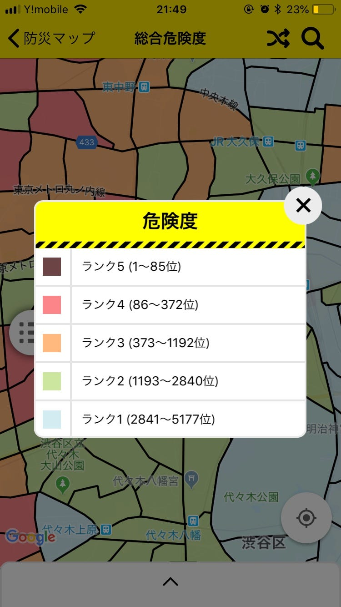

### 今いる場所の危険度知っていますか？

今回は、日本の危険度が高い場所・低い場所についてまとめます！

これは前回紹介した「東京都防災」アプリで見れる、

#### 東京危険度マップ

です！

危険度1〜5まで、結構細かく分類されています。私こういうマップ欲しいと思ってたんですよ！！！

というのも、「地震が起きたら東京は危ない…」なんて大雑把には認識してるけど、具体的に

#### 広い東京の中のどこが危ないか

は全く分かってなかったからです。

例えば古い建築物や木造の建物が多い場所が危険だと知っていても、

それがどこにあるかは分からないというのは多いと思います。

実際この地図見て、自分の家の近くが危険度3で、もっと建物が密集してる駅方面は1番低い1で驚きました…

私が対象にしてる渋谷の駅周囲もレベルは1でした。(2くらいかなと思ってた)

ちなみにこの地図は、

1. 火災危険度

1. 建物倒壊危険度

1. 総合危険度

からなっています。

もちろんレベル1でも安心してはいけないですが、

自分の地域、今いる場所はどのくらい危険とされているのかを知るのはとても大切です！

卒論マップにも、もっと細かに危険な場所とかを明記出来ればな…と思うのですが、

区別する方法とかはまだ検討が付かないのでもっと深く考えることにします。

おつかれ様です。
