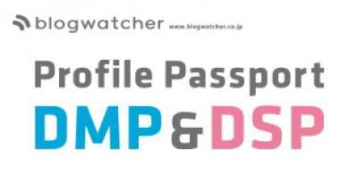

### 今週のおまめ

こんばんわ〜暑すぎて生きていけるか不安になりますね、頑張りましょう

さて今回は、以前にいくつかご紹介させていただいたジオマーケティング広告サービスの事例紹介の続きをさせていただきたいと思います。

まずは電子チラシサイトのShufoo!についてです。

20〜40代の買物意欲の高い主婦を中心に利用されている国内最大級のチラシサイトです。郵便番号単位でエリアセグメントし、生活者のよりパーソナルで需要度の高いチラシをお届けするというもの。

お次は位置情報活用マーケティングのブログウォッチャー

こちらは位置情報データを活用した広告やデータ分析などを開発し、提供しているものです。

■プロファイルパスポートAD

生活エリア情報や来店情報を活用し、高精度のターゲティング配信ができるスマホディスプレイ広告

”見込みがある人に、効率的な来店促進の実現”

■プロファイルパスポートDMP

御社店舗と競合店の来店状況を比較した分析

■プロファイルパスポートSDK

位置情報を用いたプッシュ通知が可能なアプリ開発、O2O施策

”店舗の近くに来たときに、今すぐ使える情報やクーポンをプッシュ通知”

最後に、位置情報を活用したディスプレイ広告サービス、ヤマトダイアログメディア

主に多店舗展開されている企業の店舗集客支援が可能なエリアマーケティングサービスで、ディスプレイ広告配信だけでなく、来店計測による成果の可視化やDMや新聞折込の代替も可能みたいです。
