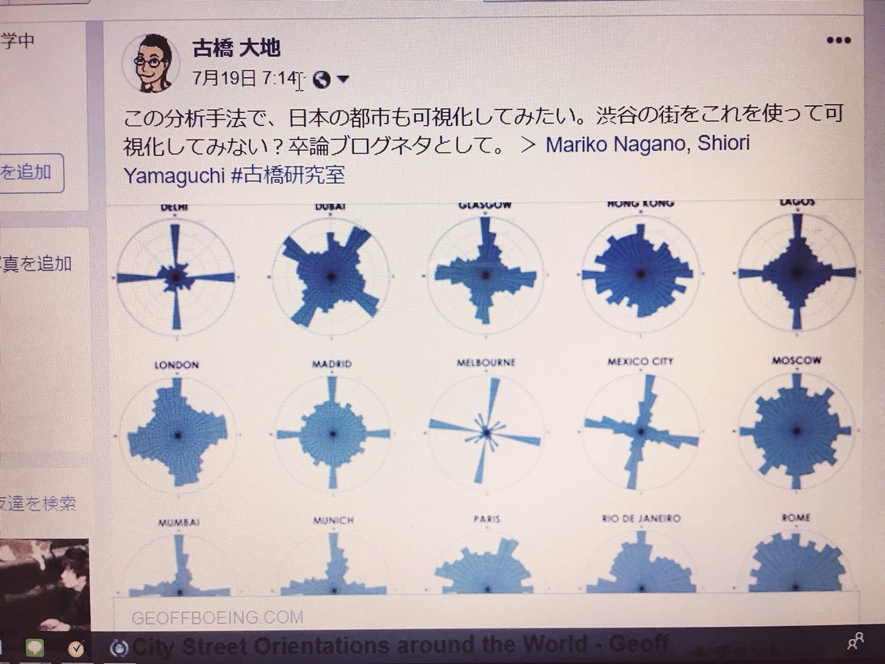

### 都市の可視化って？

きっかけは古橋先生からの一言から。

最初見たときは頭の中が「？？？」ってなっていました…（笑）

（今理解できているかというと…）

とりあえず記載していただいた_**[リンク_**](https://geoffboeing.com/2018/07/city-street-orientations-world/)から、ページを拝見。（英文に泣いた）

頑張って読むと、この図は該当する都市の道路を表している…？と把握しました。東西南北がわかりやすい道をしているときれいなブーメラン形に。入り組んでいればいるほど、丸いフォルムになっていく…ということで合ってますでしょうか。(;´Д｀)

何せ勉強のお時間が足りなくて、仕組みの完全理解はまだできていません。

でも、さまざまなもののビジュアライズ化にはとても興味があるので、ぜひぜひ勉強して、また記事にしたいと思います。

最近はほんとに暑いですね。

みなさまお体ご自愛下さいませ。
