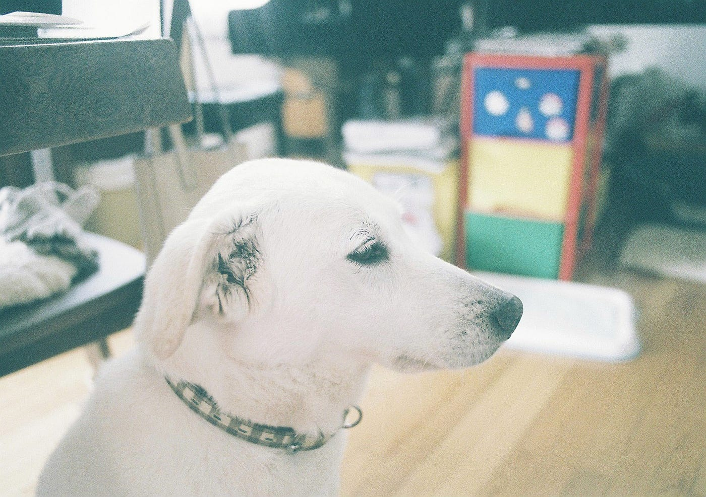
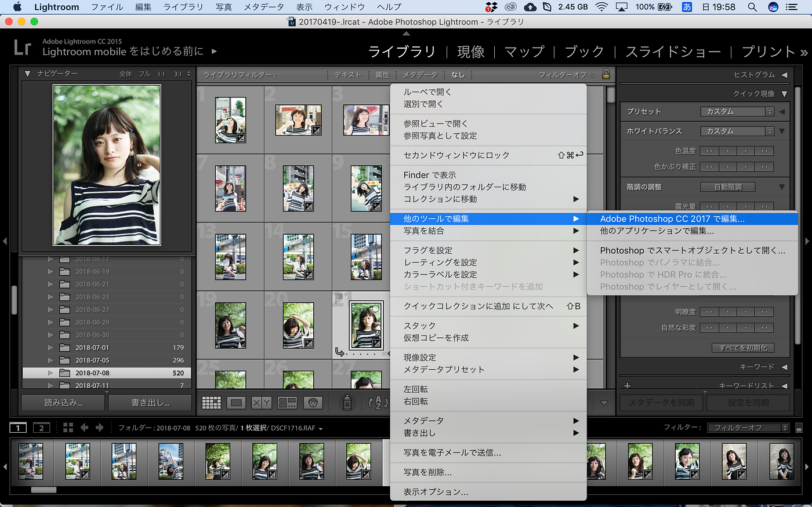
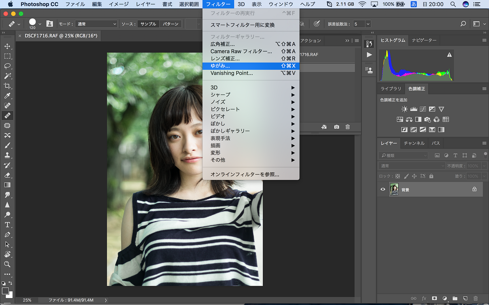
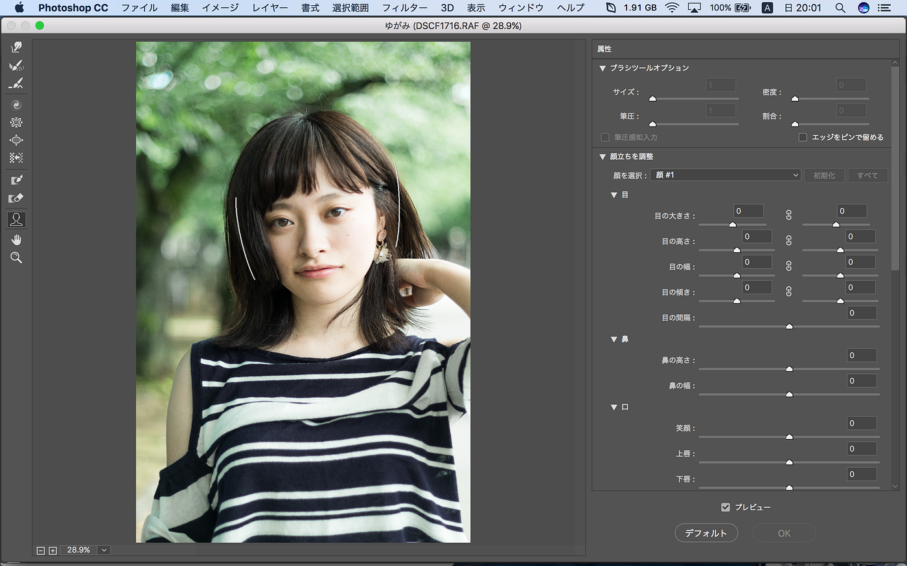

### 顔が変わる？！米有名誌も利用するPhotoshopの「ゆがみツール」

こんばんは、暑いです。7月ももう終盤に差し掛かり、大学の試験やレポート課題、就活も追い込みです。焦りに焦っていますし、気持ちも不安定です。

お肌に悪いですね。

先週、うちの犬が死んでしまいました。あっという間にいなくなってしまって未だ困惑してます。これが最後のフィルム写真となってしまいました。

物事に取り組めない状態なので、今回も卒制テーマ以外で。でも間接的にも卒制に繋がるかも、しれません。

Photoshopについてちょこっとずつ勉強し始めています。その中のある機能についてメモしておきます。

### # Photoshopを始めよう

私は普段から大量な写真を編集するので、Lightroomを使っています。ですが、その一枚一枚の、ここを修正したいとピンポイントに編集するにはPhotoshopがうってつけです。

前にも述べたことがありますが、余計な人やものを消したり体型を変えさせたりできるのがPhotoshop。両方勉強したのですが、今回は顔を編集してみようと思います。

撮らせていただいているモデルさんの自然なお顔をいじくるというのは大変心苦しいので、大きく変えるということはいたしません。やり方だけ示します。

### # LightroomからPhotoshopへ

Lightroomで作業した後、そのデータをPhotoshopに移行させて編集するには、

_該当写真を選択 → 右クリック→「他のツールで編集」 → 「Adobe Photoshop …で編集…」_

でPhotoshopが開きます。

### # Photoshopで顔補正

フォトショが開けたら、

_フィルター → 「ゆがみ」_

をクリックします。

ここで顔を補正できます。

写真の右ツールにあるように、目の大きさや離れ具合まで修正でき、鼻の高さも、そして口の大きさ、口角の上がり具合まで変えられちゃいます。怖い怖い…。

また、顔の大きさもある程度ここでいじることができてしまいます。簡単に詐欺れちゃいます。小顔も夢じゃない…！

また、他にもマスクを使って顔の輪郭をいじれるので、被写体さんのコンプレックスであるエラ張りや丸顔も理想にすることができます。また、肩幅もこの**「ゆがみツール」**で変えられます。マスクを使ったものは少しテクニックが必要なのですが、気になる方は試してみてください。

それでは就活してきます。安藤
