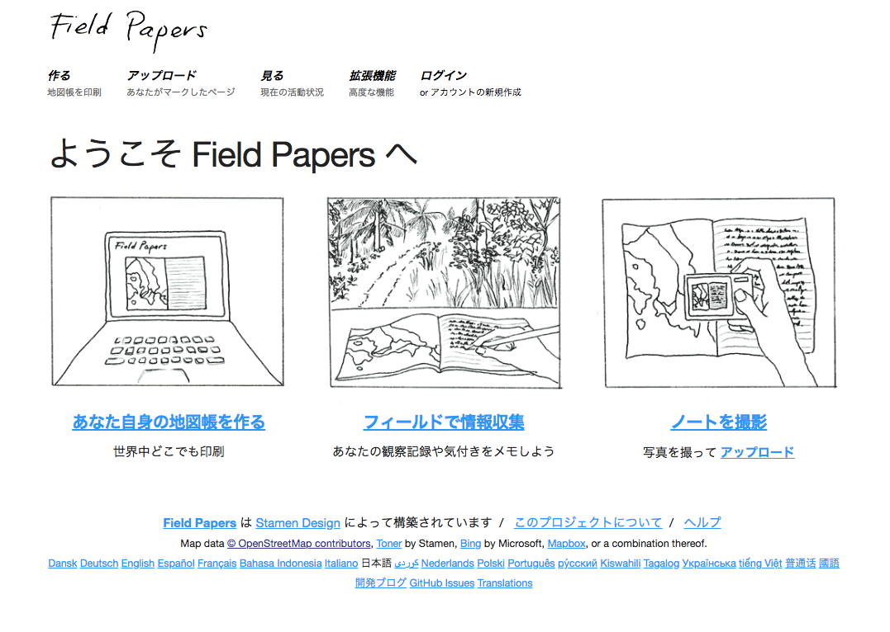

### Field Papersというツール

Field Papersは、名前にも入っているようにペーパー、**紙として印刷**して使うOpenStreetMap(OSM)エディタ(編集ツール)である。またフィールドに実際に紙にして持って行き、その場で描き込むことができる。

今までのブログで編集ツールをPC用、スマホ用に分けて紹介している。そこでField PapersはもくじではPC用として紹介しているが、紙に描き込むならだけならそのどっちでもないのでは？と疑問に思われるだろう。

[OSMの編集ツール、もくじ
OpenStreetMapのエディタ、つまり編集ツールについて語る。
PC用のツールとスマホ用のツールの大きく分けて２パターンある。
みんなは何を使ったことがある？medium.com](https://medium.com/furuhashilab/osm%E3%81%AE%E7%B7%A8%E9%9B%86%E3%83%84%E3%83%BC%E3%83%AB-%E3%82%82%E3%81%8F%E3%81%98-b47d3410fe4f)

> 以前書いたOSM編集ツール紹介用のもくじ↑

Field Papersは紙に描き込んで終わりではないのだ！
その紙をスキャン又は高画質のデジタルカメラで撮影し、Field Papersのサイトへアップロードする。そしてそのデータは**JOSM**で読み込むことができる。JOSMで紙に描かれた情報を参照してOSMを編集するのだ。

JOSMについては３週間前のWeeklyブログで紹介しているので、JOSMとは何だろうと思われたらぜひ見てほしい。(下に貼ったやつ)

[JOSMというツール
「JOSM=Java OpenStreetMap」という PC用のOSMエディタ(編集ツール)
一度にたくさん編集する時に便利で、オフラインでも編集可能。medium.com](https://medium.com/furuhashilab/josm%E3%81%A8%E3%81%84%E3%81%86%E3%83%84%E3%83%BC%E3%83%AB-4e07cac389af)

Field Papersはフィールド、現地での地理情報等の調査において、紙以外の機材を持ち歩かなくて良いという利点がある。このフィールドでの身軽さを重視した発想は個人的に大好きで、私が作る予定の卒業作品においてもこの要素を入れるつもりだ。

Field Papersの仕組みとしては、紙として印刷すると紙の下の方にQRコードが記載される。このQRコードには印刷した部分の位置情報が入っていて、JOSMでデータを読み込む際に対象の場所が表示される仕組みだ。

また初めの印刷するとき、地図の背景は基本的にはOSM表示だが、もしその場所の航空写真が提供されていたら、航空写真にも変更可能。

さらに詳しくは下記のサイトがField Papersの**使い方**などを日本語で紹介しているので、”使ってみたい！”という方は参照できる。

[LearnOSM
English Česky Deutsch Español فارسیFrançais MagyarItaliano 日本語 ဗမာ NorskNederlands Português Русский ShqipTiếng Việt…learnosm.org](https://learnosm.org/ja/mobile-mapping/field-papers/)

JOSMといったパソコンを使った作業に自信がない方も、Field Papersのサイトにスキャンしたデータを投げ込んでおくだけでもOK！パソコンを使った編集作業は得意な人に任せるといったことが、許されるのもField Papersのこれまた良いところだと思う。

フィールドワークベースの古橋研究室でもいつかみんなで描き込み大会したいなって思っていたりする。。笑

以上今回はField Papersの紹介。

次回はPC用の編集ツール紹介が終わったので、スマホ用を紹介したいのだが、先生からいただいた課題があるのでそれについて書く！内容はこれからのOSMの進むべき方向性について！

ただいま絶賛開催中の State of the Map (SotM)という国際カンファレンスで、先生がイタリアのミラノに行ってる。楽しそう！みんな！よい！！
