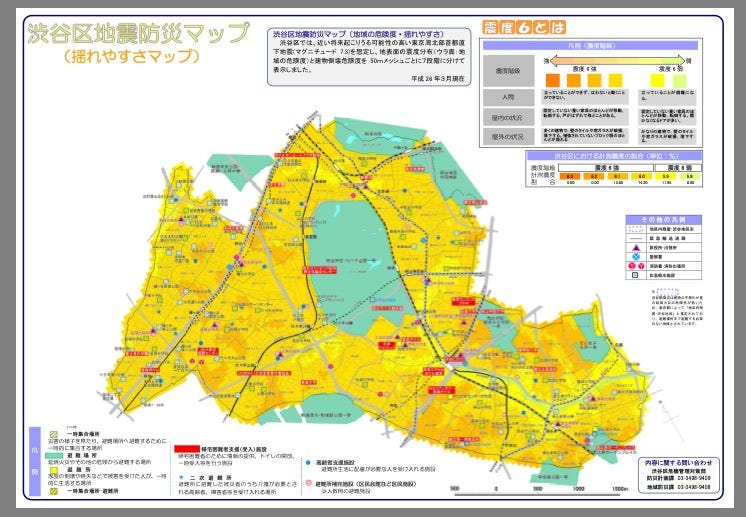
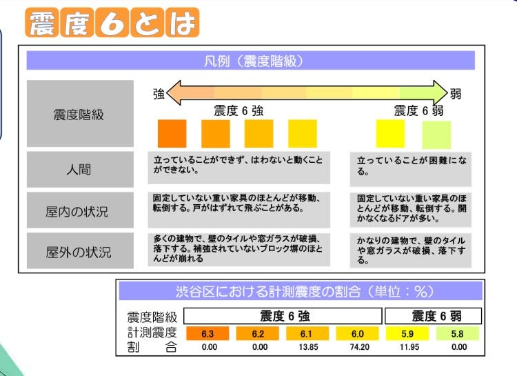

### シブヤディビジョン揺れやすさマップ

今回も、卒論制作のマップに載せたいことを少しずつ検証していきます。

二週間前のブログ記事で紹介しましたが、

渋谷区は防災に関して様々な情報を発信しています。

おさらいしておくと、

渋谷区が公開している２つのマップ

### ・渋谷区危険度マップ
・渋谷区揺れやすさマップ

上記二つです。

本日のブログでは
**「渋谷区危揺れやすさマップ」**について詳しく見ていきたいと思います。これらもまた、自分の作成するマップの参考としていきます。

東京湾北部首都直 下地震(マグニチュード 7.3)を想定して、

地表面の震度分布と建物倒壊危険度を、 50ｍのメッシュごとに７段階に分けて表示しています。

先日、母親と渋谷に行く機会があったので、「今いるところの揺れやすさわかる？」とこのマップを見せて聞いてみました。

しばらく黙って眺めていましたが、母は群馬出身で、私と買い物に行くときくらいしか渋谷に行かないので位置関係の知識がほぼ無く、

「目印が少ないのと、大きく書いてある場所が実際どこをさしているのかがわからない。」

との感想をくれました。広域の地図なので仕方ないところもありますが、目印はしっかりピンを立てたり、建物の向きも意識できるといいなと思います。

また、

マップ右上のスペースには震度六の説明がありましたが、これここに必要でしょうか…？

含め検討していきます。
