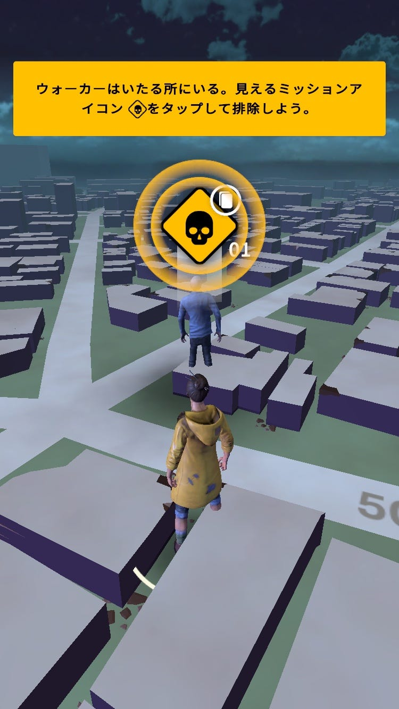
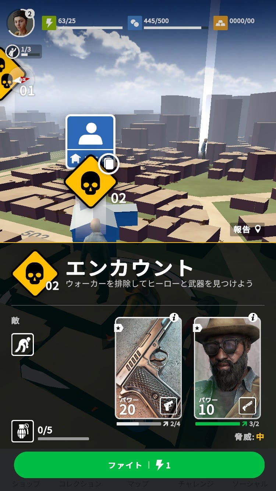
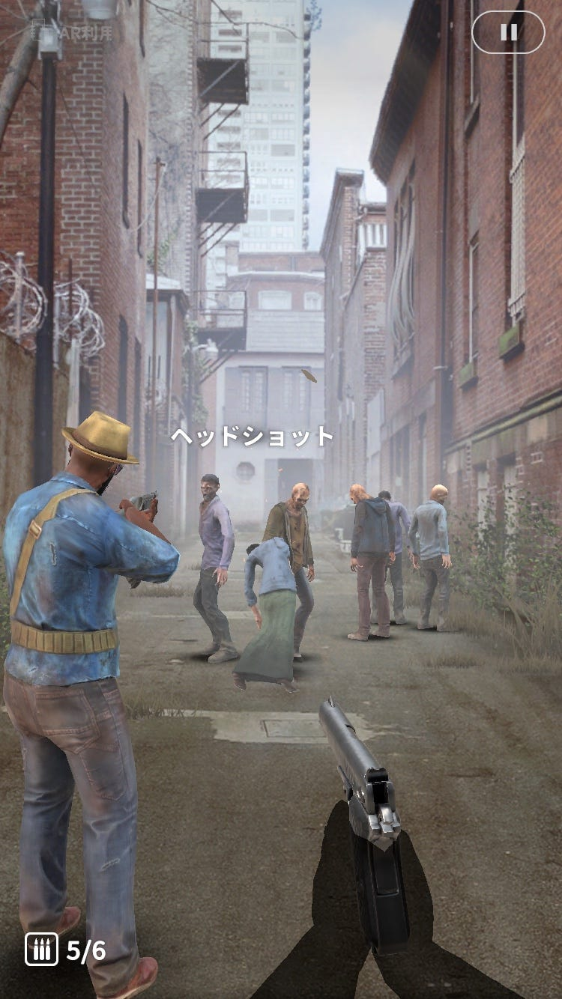
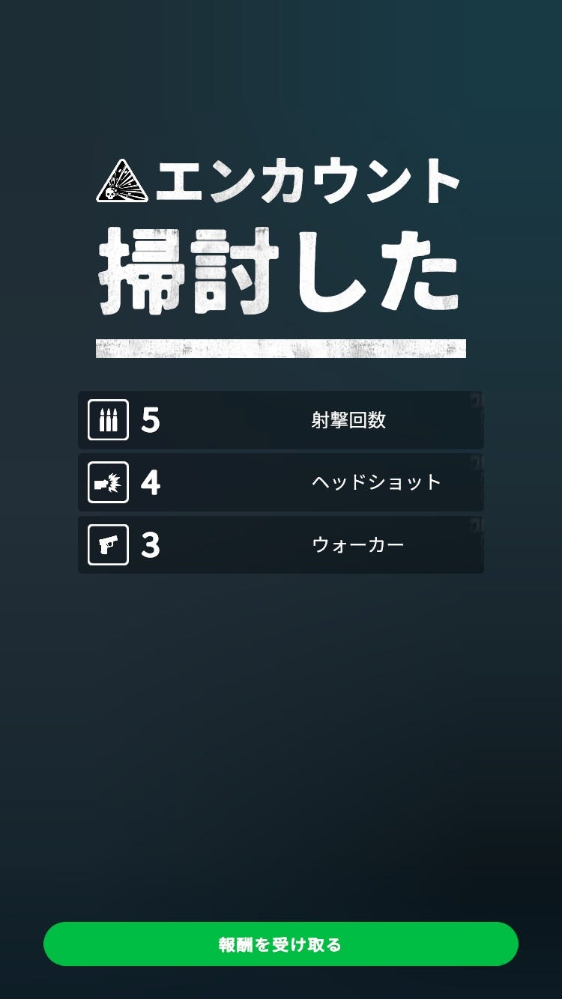

シューティングゲーム×位置情報

THE WALKING DEAD

OUR WORLD

こんな位置情報ゲームもあったんですね！

これまで「The House of The Dead」や「バイオハザード」などのゲームをちょいちょいプレイしてきました。

スマートフォン越しのゾンビゲーム面白そう！ということで、今回はこのゲームを紹介します。

では、遊び方を簡単に書いていきます！

ウォーカーというのはゾンビのことです。ウォーカーのアイコンをタップすると……

エンカウントです！

この画面に切り替わります。

先走って頭を狙って撃っちゃいました。

画面をタップした場所に向けて発砲できます。

全て倒すとこの画面に切り替わります。

あとは報酬を受け取って終わり。

さらさらっとプレイしてみて思ったのは臨場感がない。

位置情報というツールを活かしきれてない気がします。

一応有効範囲外の対象は攻撃することができない仕様になっています。しかし、いきなり出てきて襲って来るのではないかというゾンビゲーム特有の緊張感がありません。

自分の部屋にゾンビが入ってくるとか、街角にカメラを向けるとゾンビが出てくるとか、そういう演出があればもっと面白いのに。

それからゾンビを倒すのが簡単すぎる。

ヘッドショットが簡単に狙えるのは面白くないです。

まだまだ触りだからというのもあるかもしれませんが、ゾンビの欠点である頭をそんなに簡単に撃たせていいんですかね？

今後も暇つぶし程度にプレイしてみようと思います。

ではまた来週！
