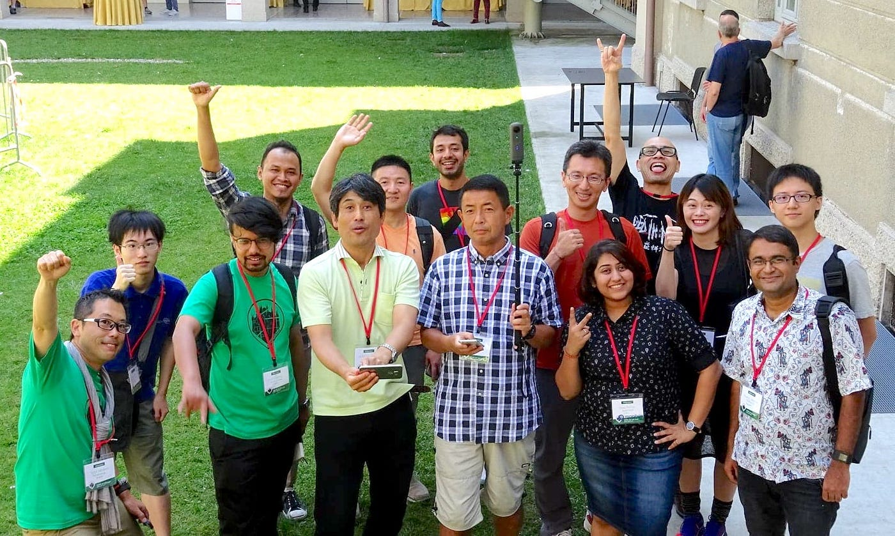
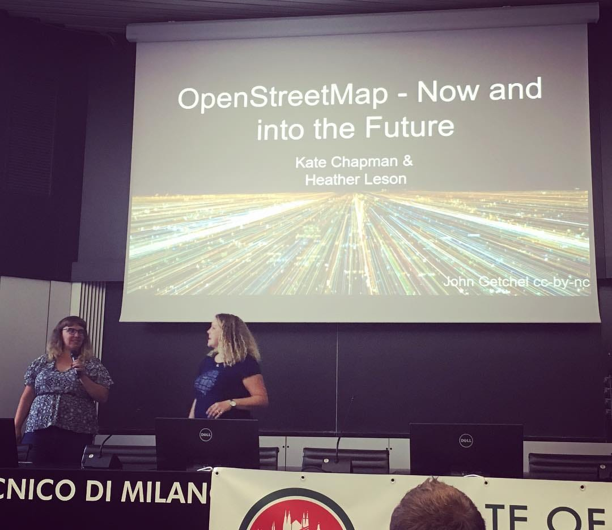
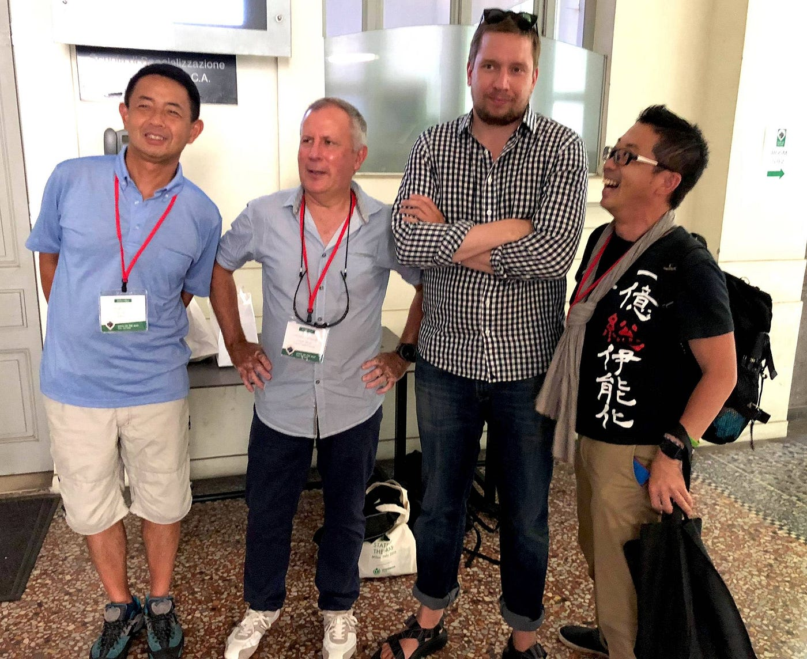
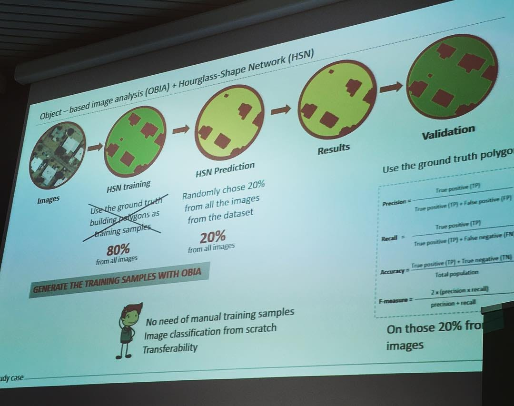

### 世界中のマッパー達と共に考え、行動する３日間がはじまった。

昨年、会津若松で開催された[OpenStreetMap](https://www.openstreetmap.org/)（以下OSM）の国際会議「[State of the Map](https://2018.stateofthemap.org/)（以下SotM）」に今年も参加している。場所はイタリアのミラノ。OSMの本拠地でもある欧州ということもあり、参加者は昨年から倍増して400名規模。もちろん国際会議だけあって世界 53ヶ国から腕利きのマッパーらが100のプレゼンを用意して各地の活動状況や様々な課題を共有する。

３日間のうち、まだ２日目の途中だが、速報的に現地の様子をお伝えする。まず感じていることは、全体的に「我々は何をすべきか？」の再考をしている傾向がある。OSMがスタートした2004年から14年、世界でブレイクした2007–2008年から数えると10年が経過して、OSMの存在は確固たるものとなった。

一方で、コミュニティの拡大と技術の進歩とともに、今までとは異なる地図づくりと、機械学習を中心としたコンピューターと人との共存もまた今回の SotM 2018 Milan では、多くのスピーカーが話題としている。

> **“What have we been doing?”**

もちろん、ここでは書ききれないほどの活動と成果があったわけだが、１日目のオープニング基調講演は、OSM財団の Boardメンバーである Kate Chapman＆Heather Leson 女史らによる、コミュニティの今後について切り込むところから始まった。

とくに講演の中でKateが語った

> **“OSMに関わって、私の人生が変わった。ありがとう Steve！”**

と、会場に座るOSM創始者のSteve Coast氏に謝辞を伝えたシーンにはぐっと来るものがあった。

Kateだけではない。古橋自身も、日本から参加したOSMFJの三浦代表も、ikiya副代表も、それぞれ中身は違えどもOSMに関わることで人生が大きく変わった。そして、今年もまたOSMに関わることで人生が変わるであろう多くの若手マッパー達がこの場に集っている。OSMFとしては、そんなエネルギーを蓄えている若手に、各種ワーキンググループの概要と必要なスキルが紹介され、OSM財団の実務チームの拡充を推し進める、良い意味で巻き込み型カンファレンスとして一日目がスタートしたとも言える。

SotM 2018 Milan の集合写真（１日目）

おそらく、これから議論が進むであろう悪意のある書き込み対策や、機械学習による地図作成の自動化など、解決すべき課題は山積みだ。まずはそれらの棚卸しをすすめ、次へのステップを皆で考える、そんな貴重な３日間となることをひしひしと感じている。

さあ、最終日の発表準備も含めて、眠れない日々が続きそうだ。

Happy Mapping
