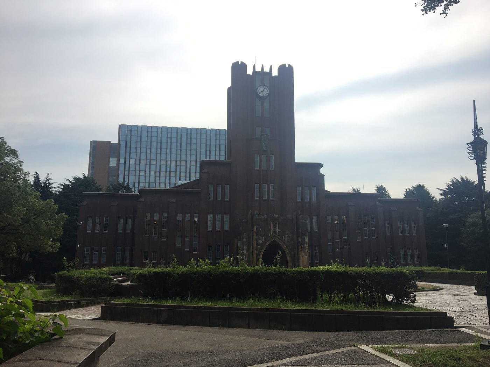
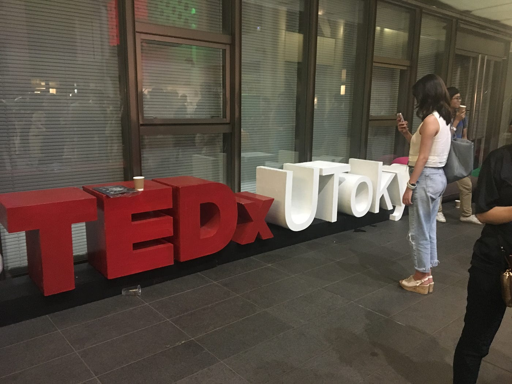
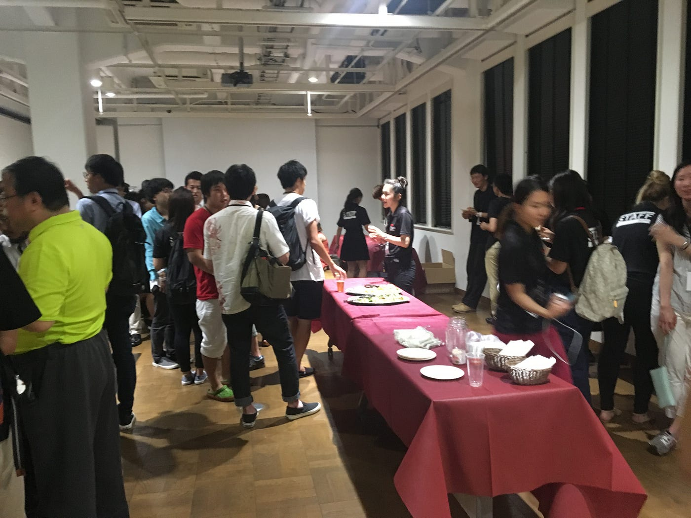

### 他大学TEDxご紹介&プチ宣伝

TEDxに関わるようになり、様々な場所へ勉強させてもらいに行っていくうちに、様々な方とお会いすることができました。
こうした人たちの話を聞くだけでとても刺激になり勉強になるのですが、
みなさんいわゆる意識高い系と言いますか（私はこの言い方が嫌いです）、TEDxや、他のイベントも然りなんですけど自ら目的を持って運営をしにいくというスタンスなので、飲み込みが早いのと仕事ができる人たちで、かつTEDxとは、とか幸せとは、と行った普段なれない概念的な話になれている人たちなんですね。

私はこの感じ好きなんですけど、広く大学生に一般的に受け入れられるようなスタンスではないと思うんです。

私が目指したいのはどんな人も平等な発言の機会がある場所、という意識でのTEDxなので、こう言った話が合う人たちとばかり話していてもこの目標は達成しえないのかな、、、

と悩んだり悩まなかったり、、、

と冒頭で色々わけのわからないことを言っていたのですが、
すごい人たちが集まりすぎて圧倒される毎日です、というのが本音です。

そういう人たちが集まる代表的なTEDxUniversityを今回はご紹介したいと思います。

TEDxUTokyoを今回はご紹介させていただきます。
以前書きましたTEDxTokyoとは違います、TEDxUTokyoです。
東京大学の方がメインで活動されています。

日本の大学の中で一番最初にTEDxカンファレンスを行った団体です。
2012年の第一回目から毎年イベントを開催していました。
しかし今年はカンファレンス開催予定はまだないそうです。

[TEDxUTokyo
TEDxUTokyoとは、大学とTEDがコラボレーションした日本初のTEDxUniversityです。大学が社会に果たす役割である「知」の発信をTEDxという枠組みで行うべく2012年より開催し、大学開催のTEDxの牽引的存在となりました。…tedxutokyo.com](http://tedxutokyo.com/)

私も昨年当日スタッフとして参加させていただいたのですが、
とにかくどんな団体よりも規模が大きかったです。

会場に入ることのできる人数も、使うことができる予算も大きいので、休憩中のアイスブレイクなども楽しい仕掛けがいくつもありました。

スピーカーの方は東京大学出身の方が多く、他に著名な方々も登壇されています。

規模が大きい分、当日スタッフの数もとても多く作業分担がしやすい一方で、管理がとても大変そうでした。

その分TEDxUTokyoのコアメンバーの人たちはミーティングなどをきめ細かく行い、誰がどこのポジションになれていてスムーズに動かすことができるかなどの情報収集もしっかり事前に行っているんですね。

私たちもこれまねしようと思った点その１。

さらにこうしたコアメンバーの方々は今までのノウハウを次に新しくTEDxを立ち上げようとする人たちに教えてくれるべくグループや質問の場を設けてくれたりしています。

こうして次に繋げるためにノウハウを教えてくれる人たちがいるのはなんともありがたいですね。

そして今回のブログは少しだけTEDxAoyamaGakuinUの宣伝もします！

現在、スピーカーの公募を行っています。
期限は７月３１日とあと２日しかないんですけど、、、

SNS上でご連絡さえくれればそこでエントリーは完了となりますので、ぜひ広めたいアイディアがあるという方のご応募をお待ちしております！

詳細はSNS等で⬇︎

[https://www.facebook.com/tedxaogaku17/posts/2174577875917874](https://www.facebook.com/tedxaogaku17/posts/2174577875917874)
