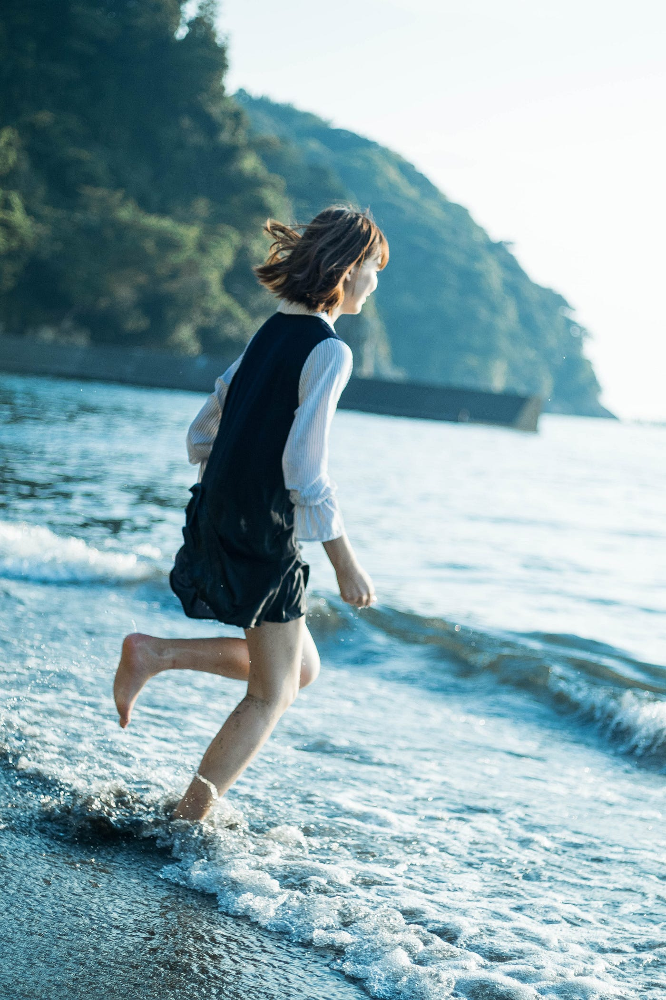
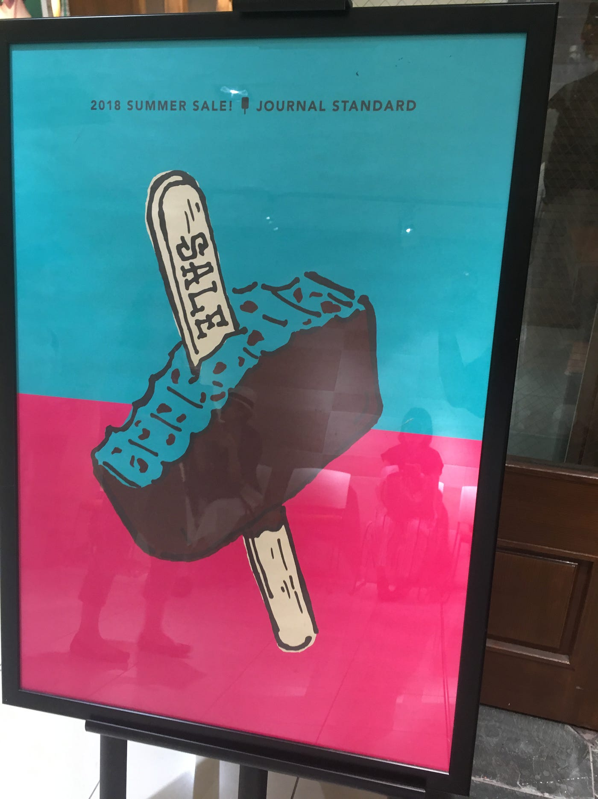
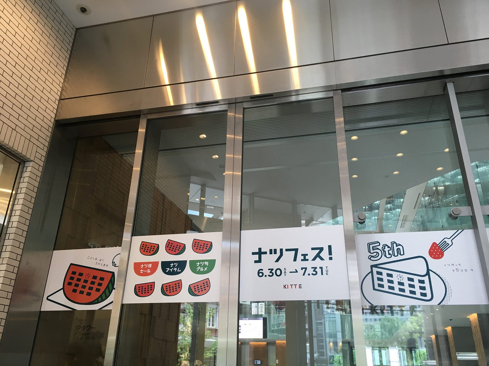
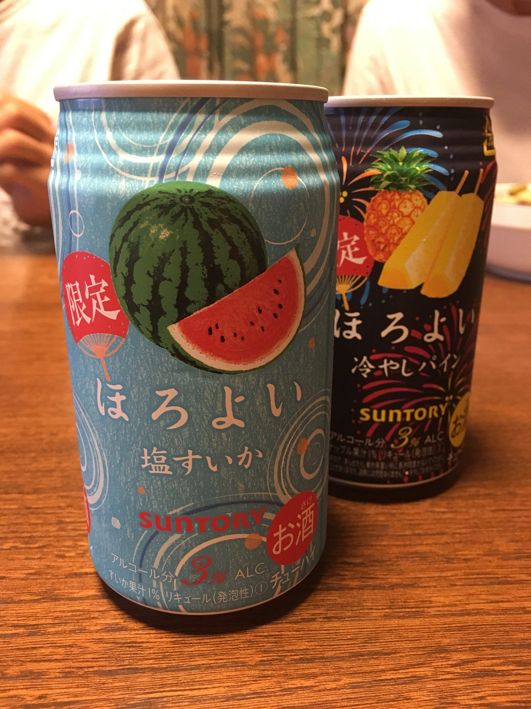
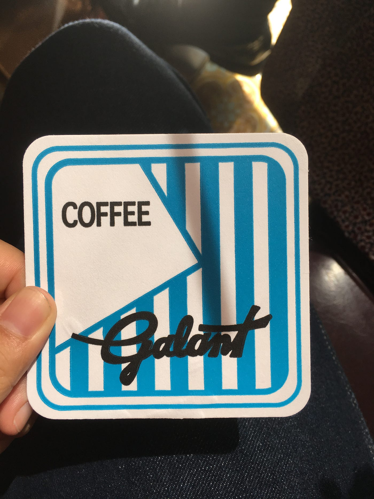
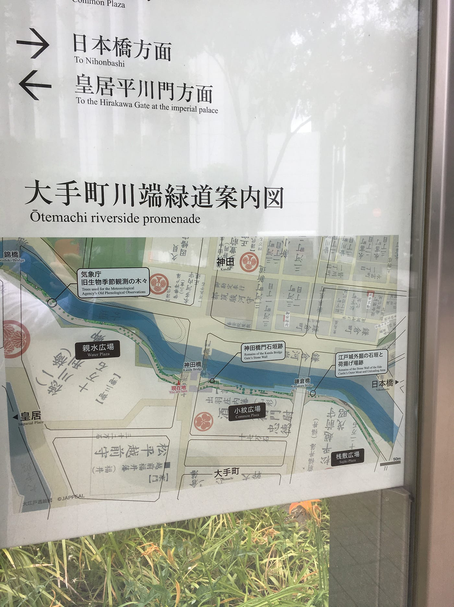

### 「平成最後の夏」はデザイン探検①

卒制テーマ進捗状況 #8

世の中は「平成最後の夏」ってうるさいですねぇー。同じ夏はいつもこないのに、いつだって「最後」なのに…って思いながらタイトルは惹き付けやすくこのフレーズを使ってみました。

今日は自治体のお祭りで、私もレポートあるのに手伝いに駆り出される予定です。（誰か手伝いに来ませんか、夕方からです。）

台風は関東を去りましたが、西日本が心配です。特に被災地。

写真は先日江ノ島で撮影したものです。学生としては最後の夏。夏らしい写真を残せるようにしたいと思います。入道雲が迫ってくるような絵を切り取ってみたいですねー。

さて、地図やイラストデザインのことを考える生活になってきて、町の中のいろんなデザインに目を向けるようにしています。気になるものがあればすぐに写真を撮っておくことが習慣になっています。就活はいろんな土地に行けるので散歩好きな私にとっては非常に楽しい時間！（とも言ってられませんが…）その中で今回は気になったデザインを紹介したいと思います。

### **## JOURNAL STANDARD**

かなりきつめの色使いなのに、全然おかしく見えないのはどうして。むしろレトロポップでかわいいですね。アイスは今年流行りのチョコミント意識でしょうか…地図にこの色使いは難しいけど、補色を使うのは有り。

### **## KITTE**

東京駅の目の前、商業施設KITTEの広告。KITTEは本来、日本郵便がJR東日本と三菱地所との共同プロジェクトとして設計・建築された。東京駅側のエントランスに日本郵便が入っている。この広告、すいかの種が窓になっていて時計の文字盤もあるのですが、これ何を表しているかと思えばKITTEの正面。だと思うのです。

すいかってデザイン的に素晴らしい形と色をしていると思いませんか。誰が描いてもおしゃれに見える。夏季休暇中につくる予定の夏祭り地図ですいかを使った地図づくりに挑戦してみようかな…。

「ことしも、よくうれてます。」というフレーズもいいですねぇ。ちなみにKITTEの内装デザインは隈研吾氏。

### **## ほろよい**

夏の限定フレーバーの2本。注目したのは色味です。すいかで2色あとは背景の水色のみ。文字はすいかの色と合わせてあります。波紋も描かれているのにごちゃごちゃして見えないのが、やはり_**3色の法則_**でしょうか。グラレコでも4、5色使うよりも3色の方が見やすい作品になるので、少なくても2色多くて3色で作成しています。

### **## ギャラン**

今インスタの好きな若者にはレトロブームが来ていて、老舗の純喫茶や喫茶店が大人気。その代表格が上野にある『ギャラン』。コースターのデザインがシンプルなのに存在感がありますよね。青でも濃度によって印象ががらりと変わることがわかります。これが真っ青であったらおそらく私は手に取ってないと思います。

まだまだわたしの就活は終わりそうにないので、まだまだいろんなデザイン探していきたいと思いますよ。

地図関連ではこんなものを見つけました。

### **## 大手町川端緑道案内図**

どうやら昔の地図と現在の地図を合わせているもの。家紋の情報も含まれいるので面白いですね！日本の家紋って、地元でも地主の家や蔵で見かけますが日本の誇れるデザイン文化のひとつですよね。家によっても宗教によっても家紋の意味も異なるでしょうから奥深いものだと思われます。少し調べてみようかな。

今回はこんな感じで。またメモのようになってしまいましたが、デザイン興味ある方はご参考までに。

安藤
