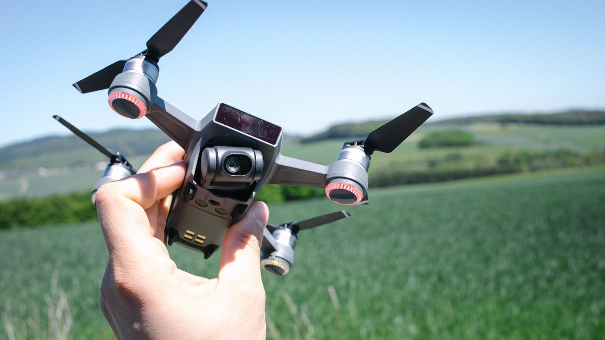

### 海外でのドローンの使い方

こんにちは渡辺ゆうなです！

ネタがないので（ごめんなさい）この前サンフランシスコにいる友人との会話で印象的だったことを書きます笑

私の友人はサンフランシスコの大学に通っていて、動画の勉強をしているのですが、今ドローンを買おうとしているらしく、私が飛ばしたことのあるドローンや、ゼミについていろいろ聞いてきました。

話を聞いていると、どうやらサンフランシスコではラジコンのような感覚でそこらへんでよくドローンが飛んでいる模様 ！自由ですね！一応許可を取らないといけないらしいのですが、御構い無しな人が多そうという話でした。笑

彼の家の近くにはドローンを操縦・空撮の勉強ができる専門学校などもあるらしく、自分で撮った空撮動画を売ってお小遣い稼ぎをしている人たちも多いのだとか。自分ができて周りの人はなかなかできないようなことをすぐにビジネスにしてしまうところに海外の自由さというか柔軟性を感じます。

彼は今djiのスパークを買おうとしているそうなのですが、サンフランシスコは常に風が強いため懸念してるらしいです。

私も卒業するまでにはサンフランシスコに行こうと計画してるので、もし行けたら飛ばしたいなと思いました！
