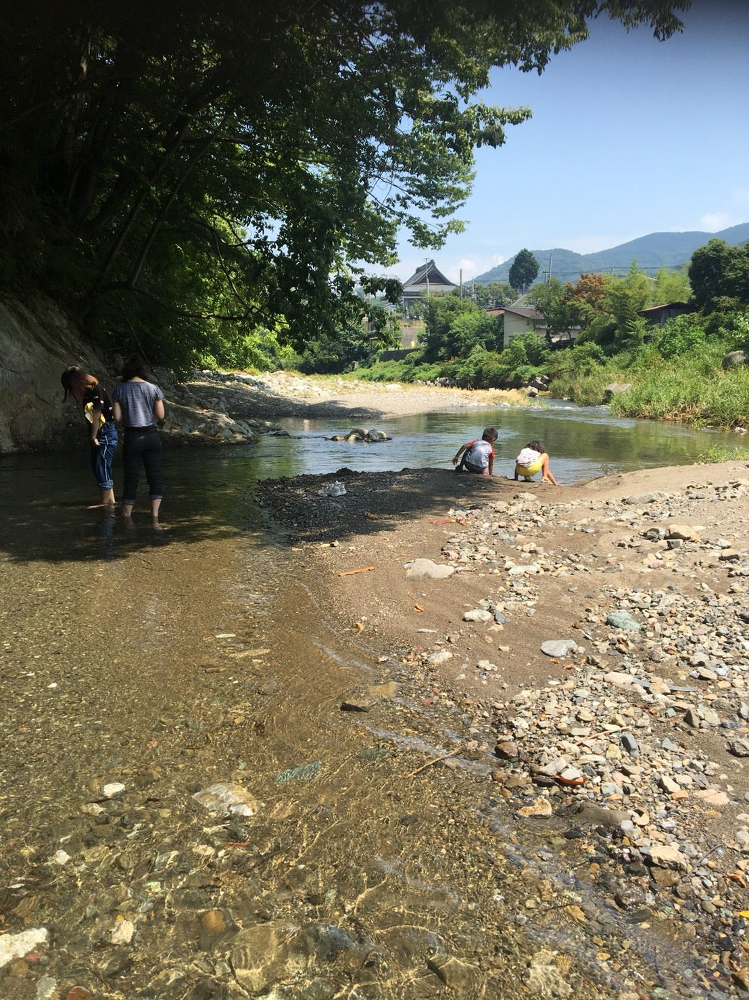
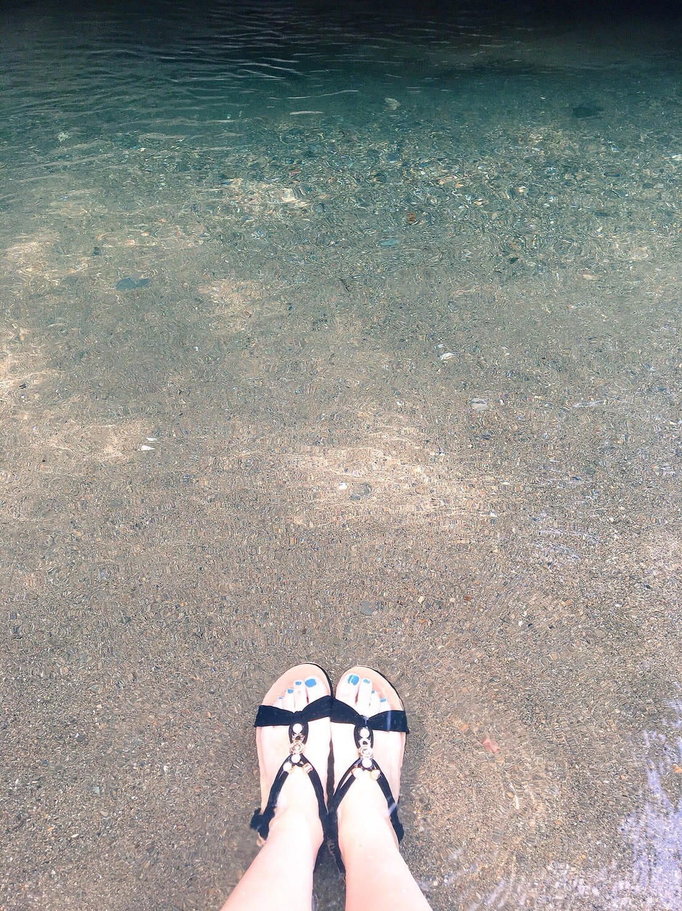
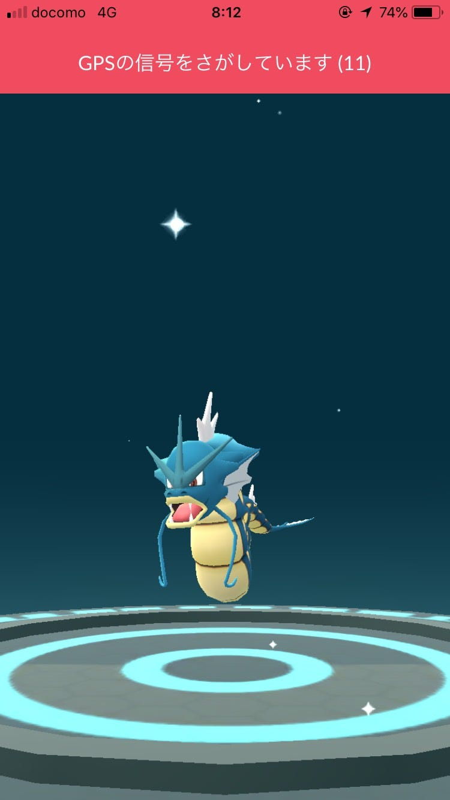
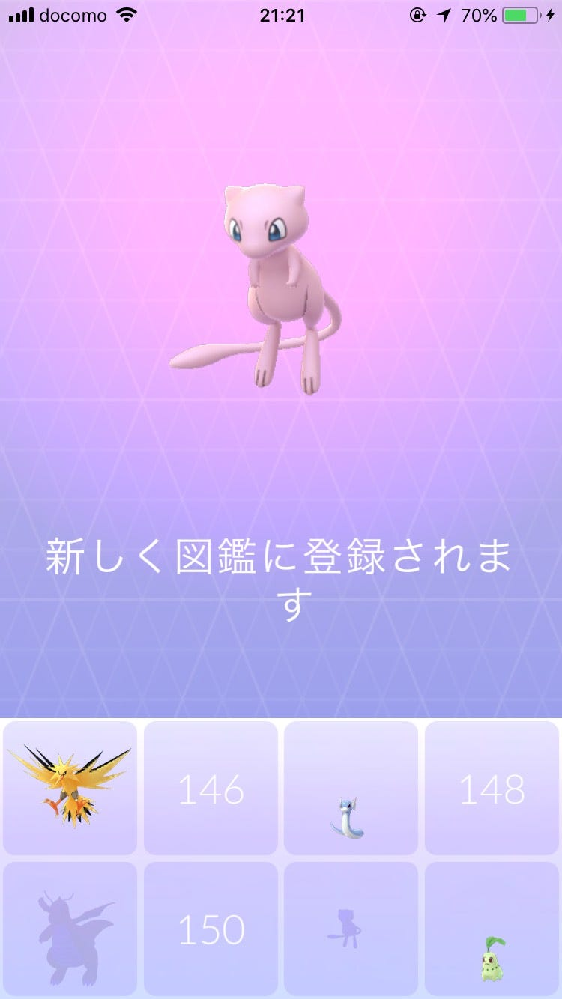

### 8/5~8/7 ゼミ合宿＠横瀬

１年２ヶ月ぶりぐらいに行ってきました古橋邸！三年生が一緒だったため参加人数は２０人！多い！

1日1日の流れは誰かしらが書いてくれると思うので笑 この合宿にきて個人的にいろいろ考えたことを書きます〜

まず、体力がないと何も始まらないということ！１日目のおきうね農園までの道で、猛暑のあまり体調を崩して私だけたどり着けませんでした・・・フィールドワークを行うにあたって、夏バテだからご飯を食べなかったりすると何もできないということ、当たり前だけど今回で痛感しました。

２つめは、このゼミ合宿は古橋先生の子供２人にとってもすごくいい経験になったと思うところ！ 大学生のお兄さんお姉さんと３日間もお泊まりして一緒に行動する経験なんて、私がちいさい頃は経験しませんでした。ほとんどの人はそんな経験なかなかないのでは？２人とも最初は少し緊張していたようでしたが、最終的には多くの学生とじゃれあっているのを見て、子供が大好きな私はなんだかほっこりしました笑

自分より年上の人とちいさい頃から関わることによって、上下関係だとか、人見知りにならない、人懐っこさや可愛がられ方を覚えたりだとか、２人は無意識なのかもしれないけど、人間関係を構築する上で大切だったりすることをたくさん学べている気がしました。

逆に、大学生側も他人の子供とずーっと一緒にいる機会なんて、親族以外に滅多にないと思います。私は全くないです。残念です。 そんな私も２人と３日間ずっと一緒にいることによって、子供に対しての対応の仕方（他人の子供でもダメなものは強くダメと言わないと行けないこととか、わがままをうまくかわすこととか笑）を学べた気がします笑 子供可愛いなあ〜

それと、横瀬のあの家の場所も最高だと思いました。 去年は川に行けなかったので！ 電子機器が発達して、自分の力を使わなくてもいろいろなことがたやすくできてしまう今、人間の「感覚」がだんだん鈍くなっているらしいです。その中で、自然と触れ合うことにより、その感覚を取り戻したりだとか、人間がもともと持っている自然的な感覚を感じることができるそうです。（シェアリングネイチャーライフ 20号 2018年3月号にのってる記事です [http://www.naturegame.or.jp/know/magazine/](http://www.naturegame.or.jp/know/magazine/)）

内容はかなり省略して書いてしまいましたが、ここに載っている「自然体験」が簡単にできるような場所は私たちや子供にとって、東京23区ではなかなかないとてもいい環境なのだと思いました。川気持ちいいしね！

あやめの記事にも私が撮った写真が載ってるので見て見てください！そんなに凝ってないけど！

クーラー扇風機なしの部屋で寝てたので５時半頃に暑すぎて起きて、あやめと一緒に朝から川に飛び込んだのは個人的に１番の思い出です笑 川の水で歯磨きしたり洗顔したりしたの初めて！ バクテリアとかめっちゃいるんだろうな〜笑 寝起き一発目の川は寒かったけどきもちよかった！

2日目のイングレスフィールドアートでは、地元のめちゃくちゃ強いエージェントの方に話しかけてもらいました。恥ずかしながら私はポケモンGOしかやってなかったのでイングレスの話はあまりわからず・・・でも、こういうコミュニケーションの作り方もあるんだなと思いました。 前にもポケモンGOで広がる地域の輪的な記事を書きましたが、それと似たものを感じました。

2日目の夜から本格的なコイキング乞食を開始しました。先生のミラノ産コイキングを含め、いろんな人のコイキングを吸い取りました。夜中の３時ぐらいまで、先生たちとお酒飲みながらコイキング探しまくりました。結果

3日目の朝にはギャラドスにすることができました！いぇーい！ミッションクリアです！

その後ミッションを爆速でクリアし

ミュウゲット！ スペシャルリサーチ終了しました！ 協力してくれたみなさん本当にありがとうございました！満足！！！！！！！！！！

去年も今年もこの合宿に行って感じたことは、やはり人数が多くなれば多くなるほど動きが難しいということですね。その中でリーダーとかを作らないかんじが初めてなのでなんだか新鮮でした。

最後にstravaのログを載せて起きます！ mapillaryはアップロード完了したのですがまだ反映されてないのでされ次第載せます。

1日目

[朝のランニング - YUNA WATANABE's 4.8 mi run
Yuna W. ran 4.8 mi on Aug 5, 2018.www.strava.com](https://www.strava.com/activities/1755216096/shareable_images/map_based?hl=ja-JP&v=1533620479)

2日目

[朝のランニング - YUNA WATANABE's 5.8 mi run
Yuna W. ran 5.8 mi on Aug 6, 2018.www.strava.com](https://www.strava.com/activities/1755216194/shareable_images/map_based?hl=ja-JP&v=1533620483)

3日目

[午後のランニング - YUNA WATANABE's 0.8 mi run
Yuna W. ran 0.8 mi on Aug 7, 2018.www.strava.com](https://www.strava.com/activities/1755216044/shareable_images/map_based?hl=ja-JP&v=1533620476)

夏休み一発目のいい合宿でした！おわり！
