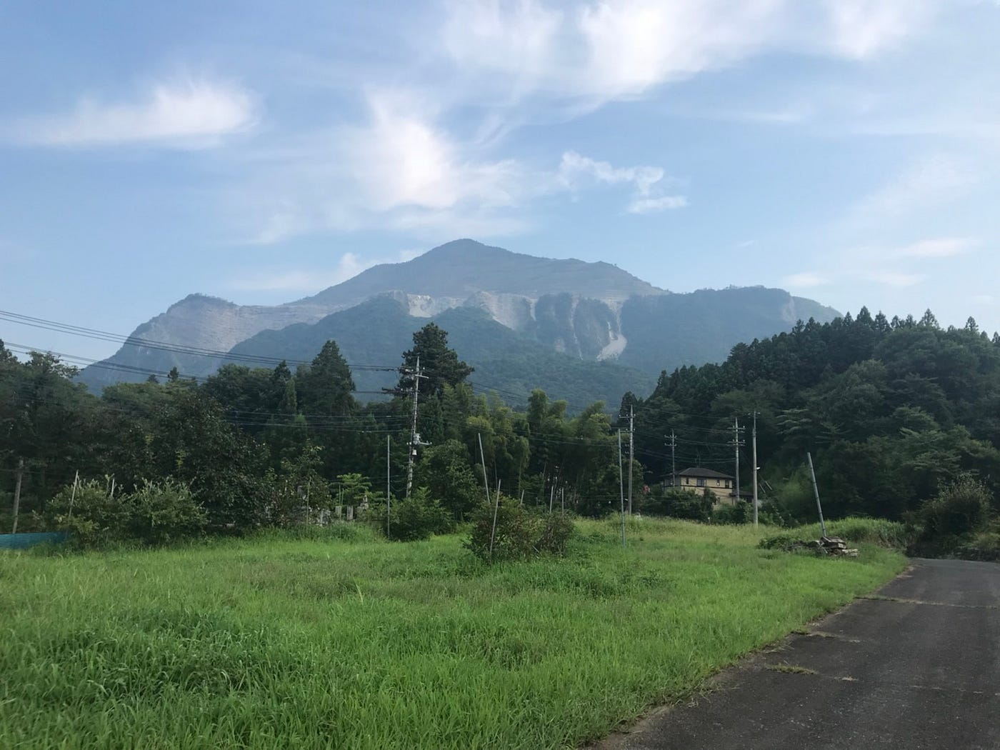
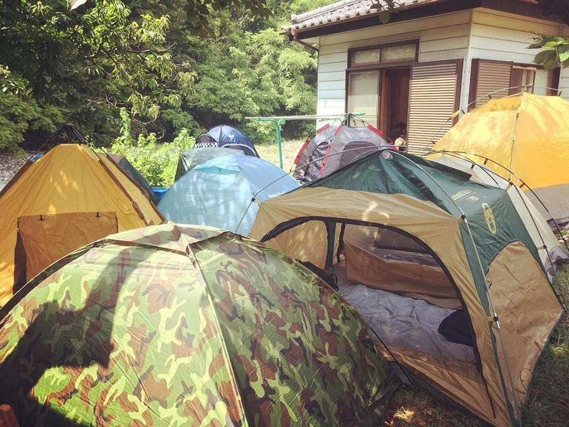
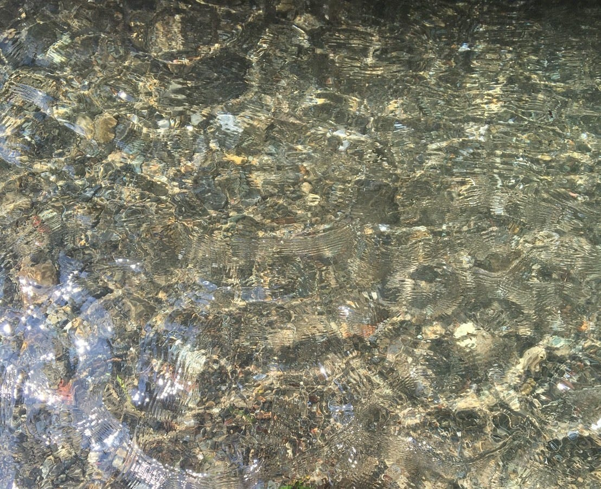
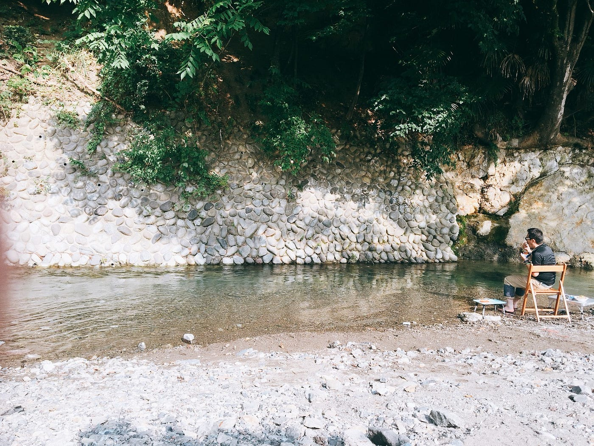
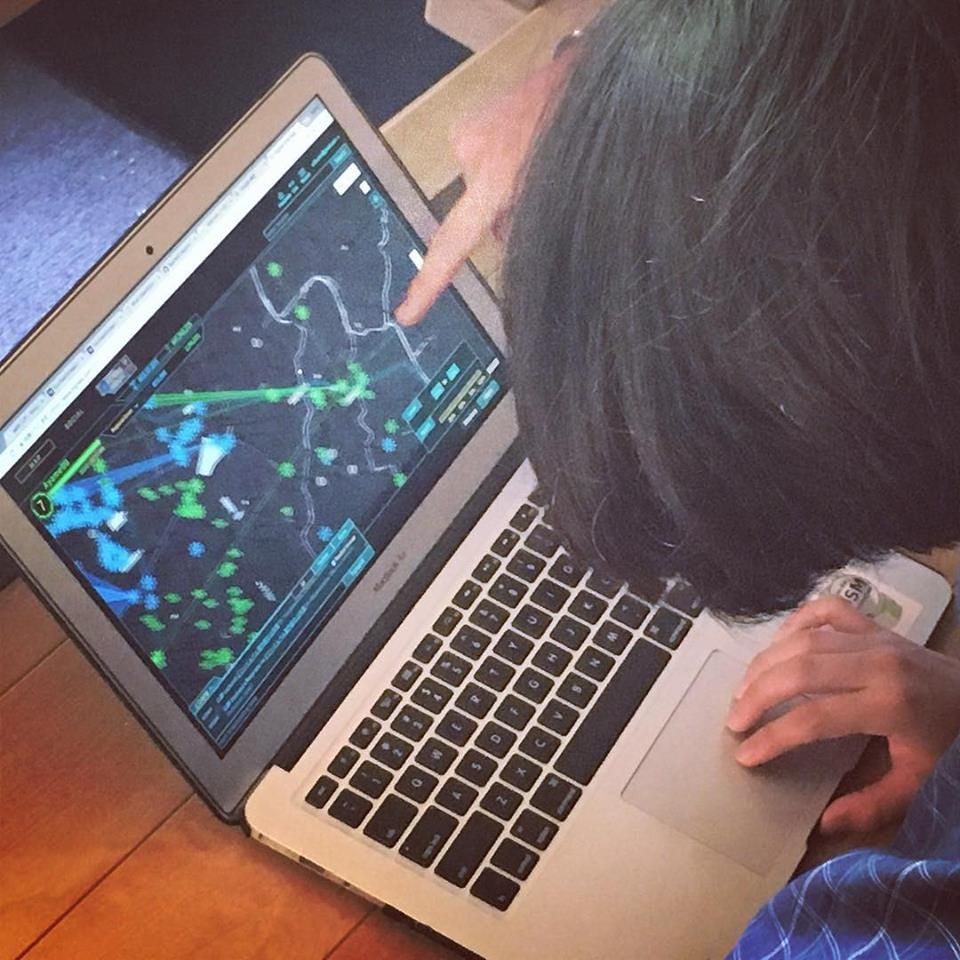
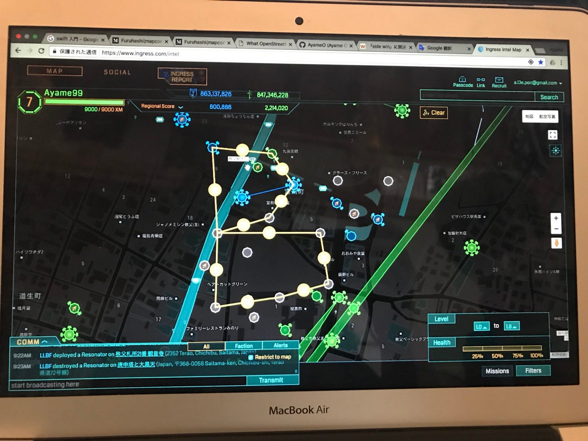
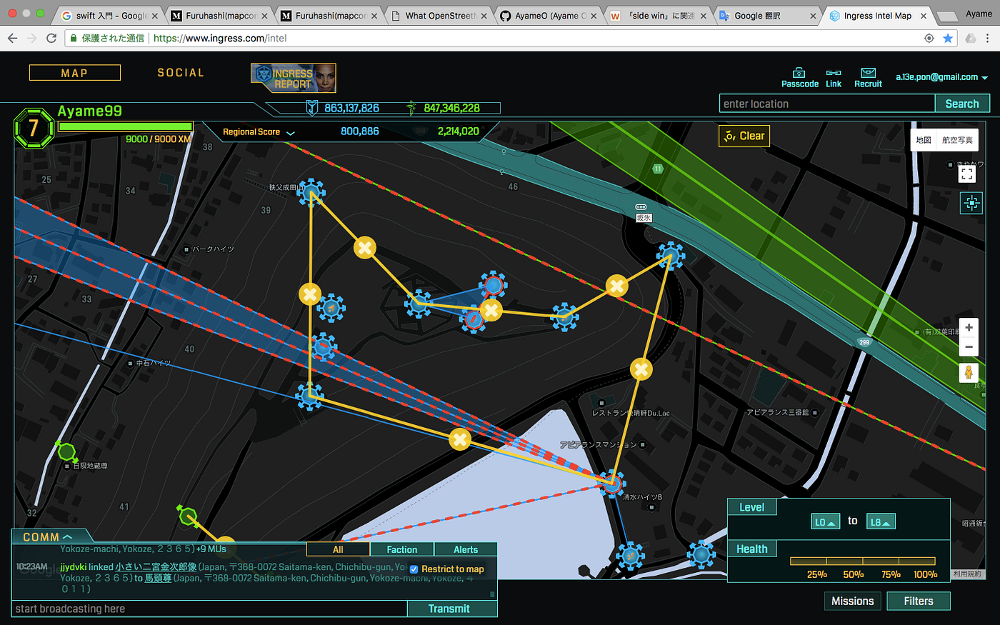
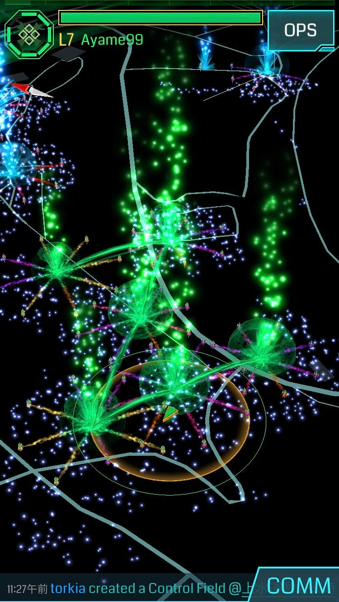
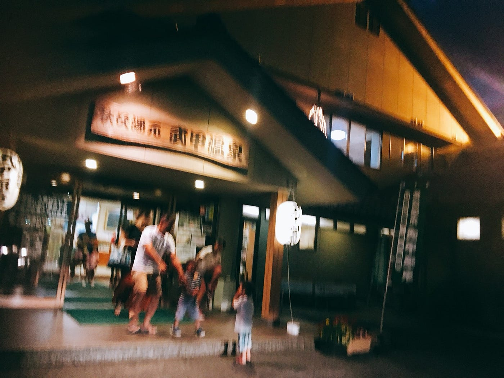

### ゼミ合宿＠秩父

埼玉県秩父郡横瀬町へ8月5日から7日、２泊３日でゼミ合宿行ってきた〜。横瀬町は約１ヶ月半ぶりに行きやした！

2日目の夜から雨が降ってしまったけど、1日目にBBQしたり、横瀬町の旧道や旧橋を学んだり、川で遊んだり、ドローン飛ばしたり、温泉入ったり、Ingressでフィールドアートを作ったり、古橋先生と今後のOSMについて語ったり、捻挫して足首痛めたり、、笑

あと今回はなんといっても3年生がたくさんいて、ゼミは3年後期から始まるため、たくさんの後輩たちと初めましてができた！

3年生たちはテント持参で、テント生活していた！

1日目は10時に横瀬駅に集合し、古橋邸に移動、川がすぐ近くにあるので川遊びからはじまり、午後はおきうね農園まで歩きジェラートを食べて、道中Mapillaryでストリートビュー撮影。武甲温泉に入り、夜は川辺でBBQ。初日はたくさん歩いた。１５km！！

下記のURLは1日目のGPSログとMapillaryにあげた画像データです！

[横瀬1日目 - Ayame Otsuki's 15.4 km run
Ayame O. ran 15.4 km on Aug 5, 2018.www.strava.com](https://www.strava.com/activities/1751271834)

[Japan, image by ayame
Mapillary - Street-level imagery, powered by collaboration and computer visionwww.mapillary.com](https://www.mapillary.com/app/?lat=35.98610219931753&lng=139.09608720878555&z=14.323537059248652&username%5B%5D=ayame&pKey=CWPasZ0qDZLOA_GFaiiUuA)

2日目は雨を警戒し、早朝にMavicAir(ドローン)を川辺で後輩たちが飛ばす練習をしているのを朝ごはんを食べながら眺め、グループに別れてIngressでフィールドアート作成！午後は自由行動ということで川で遊んだり昼寝したり。寺坂棚田に行きたかったのですが夕方から天気が悪くなってきたので諦め、温泉、室内でケララカレー作り。

こちら2日目のGPSログ。

[横瀬合宿2日目 - Ayame Otsuki's 7.0 km run
Ayame O. ran 7.0 km on Aug 6, 2018.www.strava.com](https://www.strava.com/activities/1753435819)

3日目、最終日は雨が降っていたので室内でトイドローンのレクチャーをみんなにした！今度後輩たちが、ドローンワークショップに参加するということでただ飛ばせるようになるだけではなく、ドローンの設定方法や子供にドローン操縦を教える時のノウハウを共有。3年生は雨の中テントをしまい、、解散！

3日目のGPSログ。

[横瀬合宿3日目 - Ayame Otsuki's 1.3 km run
Ayame O. ran 1.3 km on Aug 7, 2018.www.strava.com](https://www.strava.com/activities/1755224209)

[What OpenStreetMap can be.
Over the past two years, the biggest buzz among the geo chatterati has been Justin O'Beirne's meticulously argued…blog.systemed.net](http://blog.systemed.net/post/15)

上記の記事について先生と夜な夜な語りながら、OSMについて議論。
次回のブログはこの記事について触れる。
