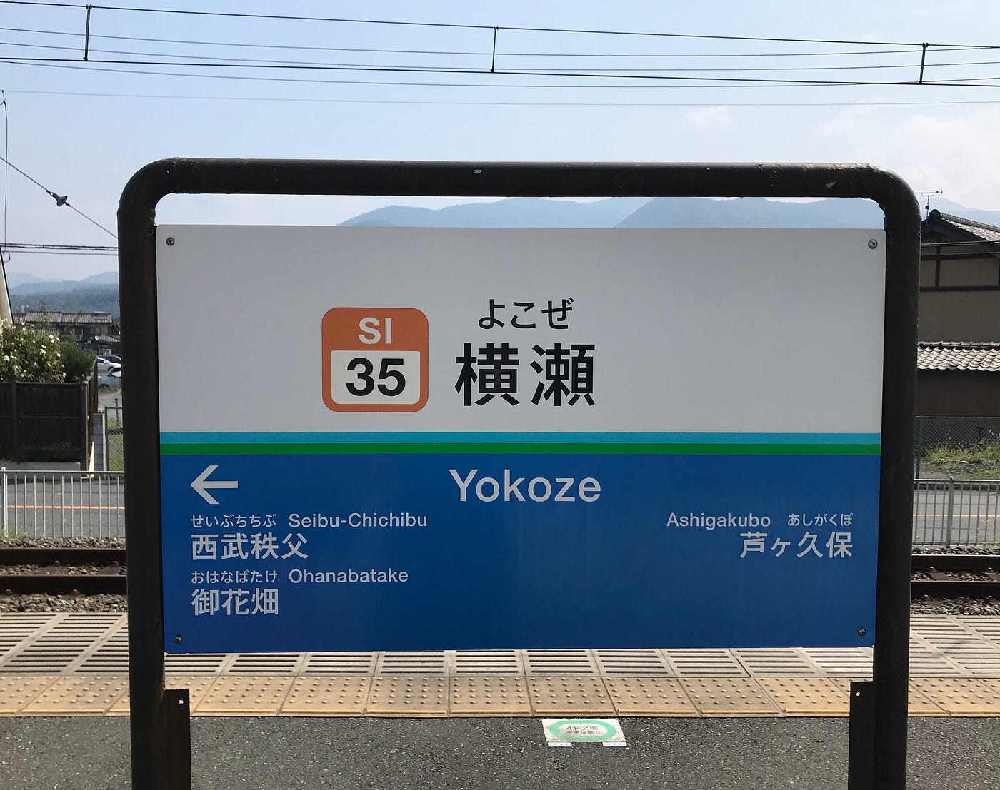
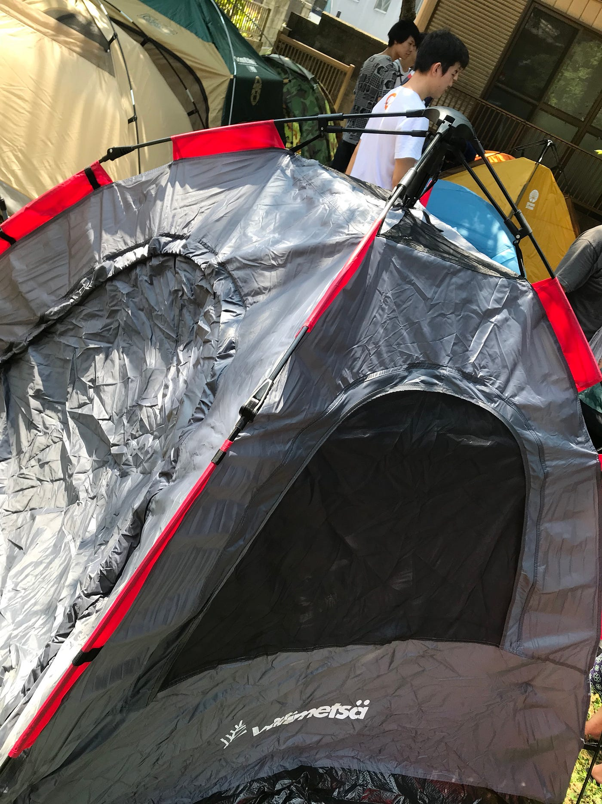
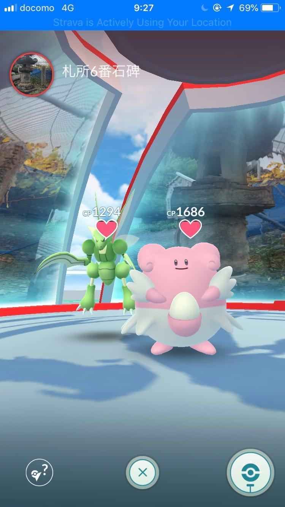
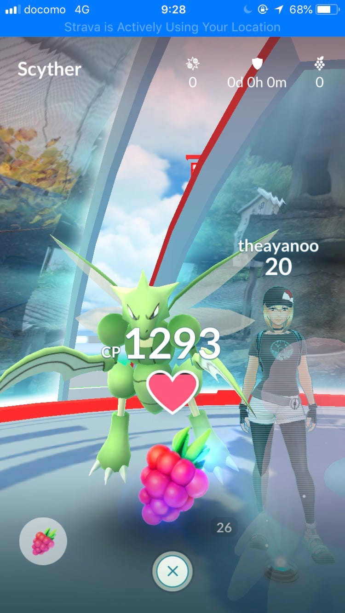
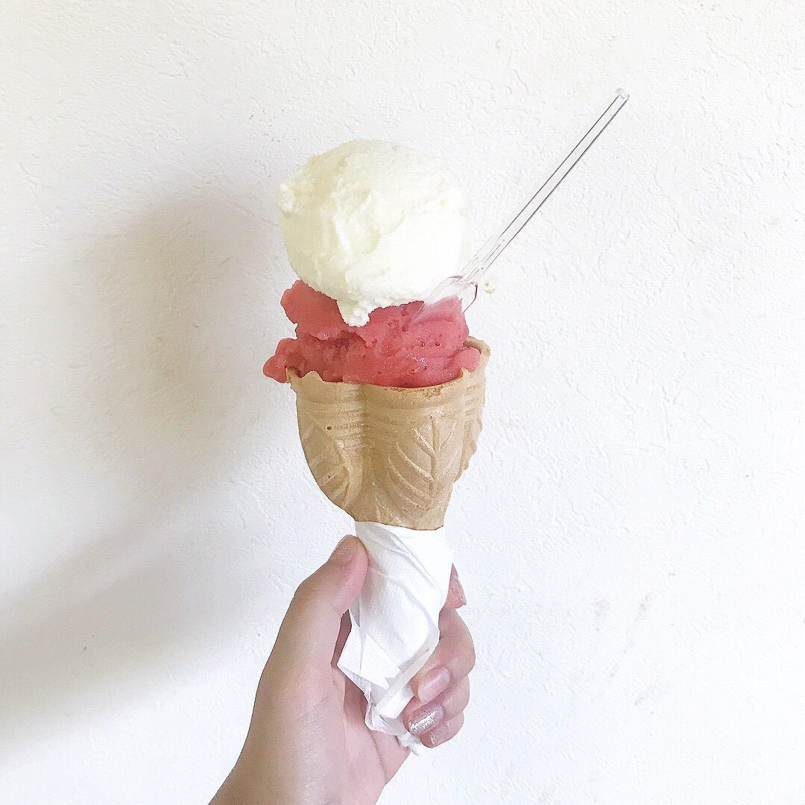
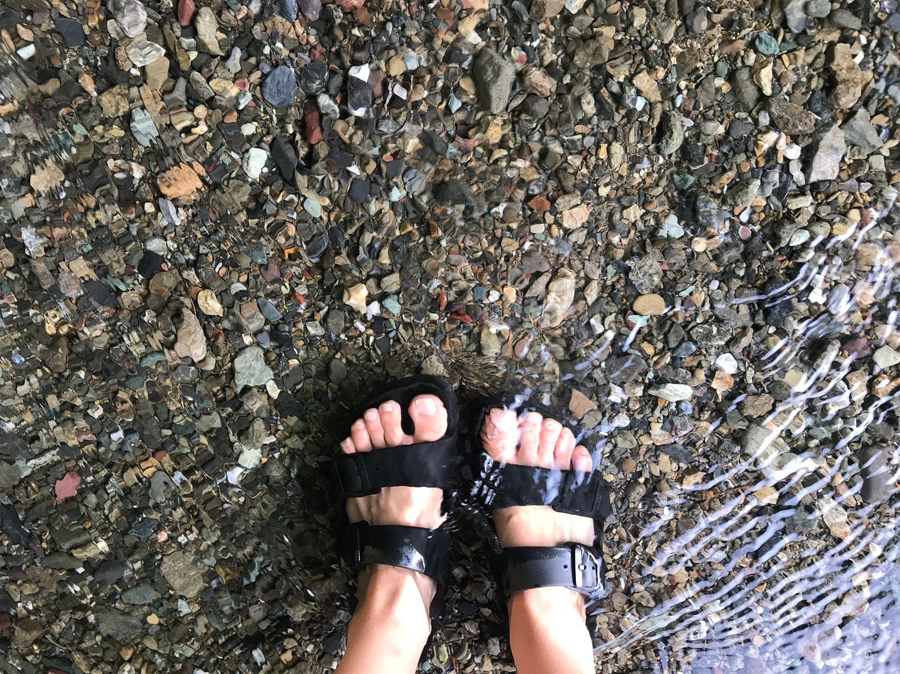
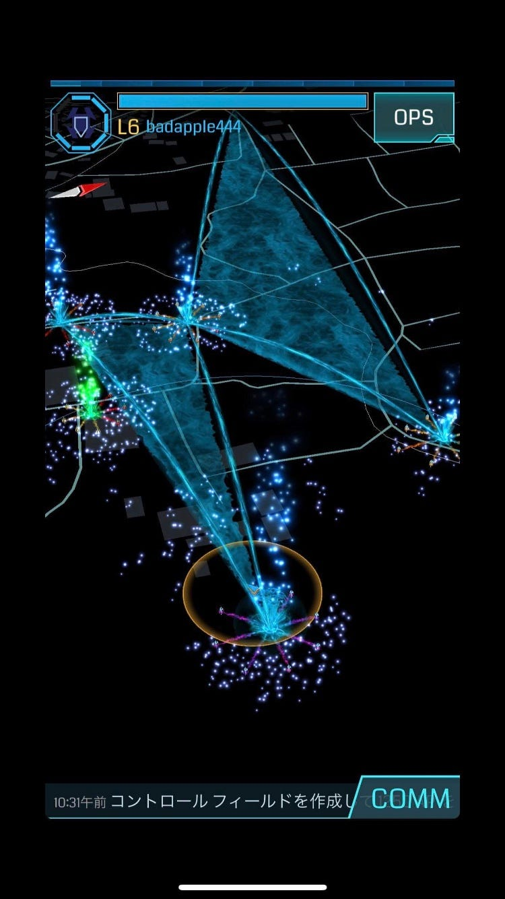
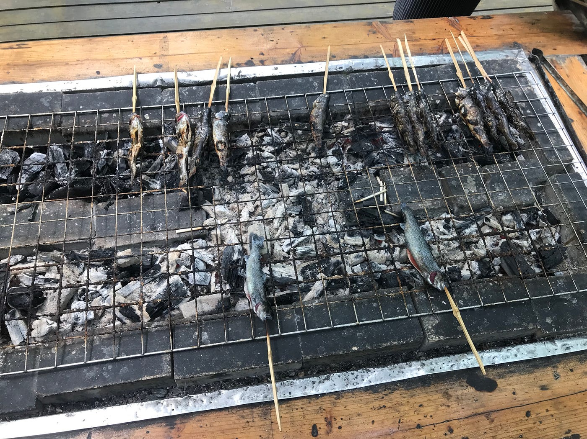
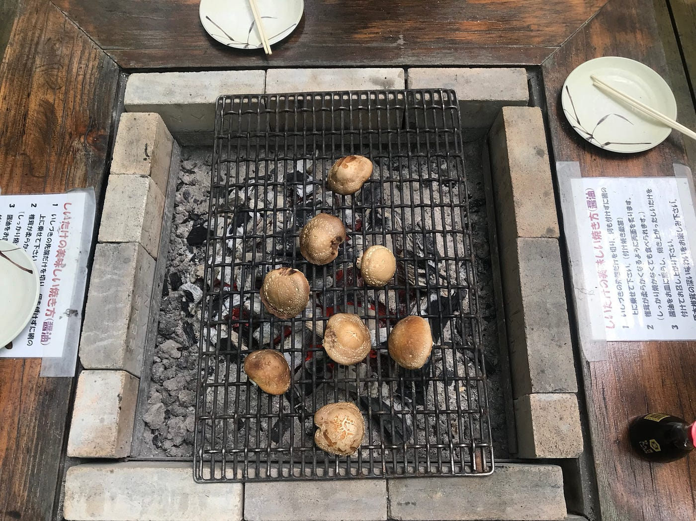
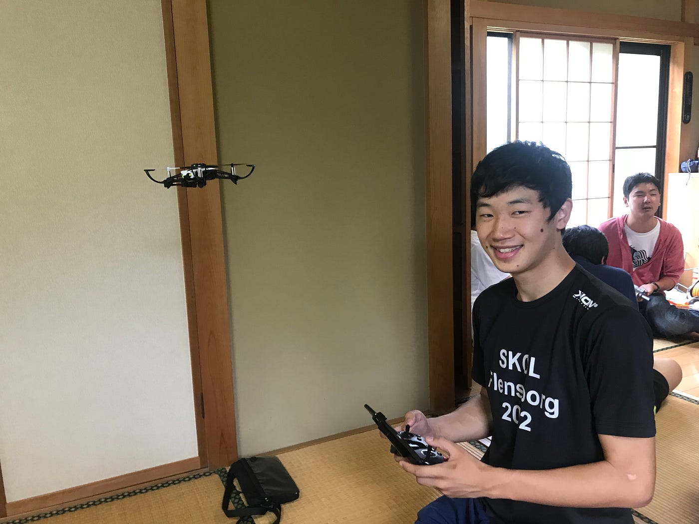

### _**おおつあやののはじめてのきゃんぷ_**

今回私のはじめてのきゃんぷが行われた舞台は、アニメファンが数々訪れることでも有名な埼玉の横瀬。ここ横瀬でも、「心が叫びたがってるんだ」のアニメの舞台地として人気。そんな横瀬で、8/5–8/7に古橋ゼミキャンプ合宿を行ってきた。

私自身、キャンプ自体は人生初体験。なので、はじめてのおつかい風のタイトル(笑) テントも寝袋も購入するとき、基準がわからないので、取り敢えず、1万以下でレビューのいいものを購入。そのテントがこちら。

7000円くらいで大人2人が余裕で入るもの。1日目は天気も良くて、テント生活も快適でしたが、2日目の夜は、生憎の雨。そのせいで、テントに雨が入ってきて、地獄かと思った…。でもなんとか寝ることは出来ましたが、次あるキャンプに備えて、2万円くらい出してもっと良いテントを買おうと決意(笑)

そんなこんなで1日目に行ったことは、ひたすら歩きまくって、ingressとポケモンgoのレベル上げ。札所6番石碑のジムに自分のポケモンを置いてみたり…。

歩きまくって、着いた場所はおきうね農園。ジェラートやイチゴが美味しいことで有名だそう。なので、イチゴ味のと、ミルク味のジェラート。歩きまくっていて、火照った身体にはちょうど良い食べ物。本当に美味しかった‼︎

この日どれだけ歩いたかが分かる記録はこちら。

[Morning Walk - Ayano Otsu's 11.1 mi walk
Ayano O. completed 11.1 mi on Aug 5, 2018.www.strava.com](https://www.strava.com/activities/1751276290)

夜は、キャンプをして、お肉をたくさん食べられ幸せ‼︎ そして、2日目の朝は、6時起きとめちゃくちゃ早くって、起きれるか不安だったけど、5時半くらいに太陽の眩しさで勝手に目覚めた…。あとテント内も暑すぎて、二度寝したくてもできなかった。川で朝ごはん食べて、川の中にも入ったけど、涼しかったなー。

そして、午前中は、グループに分かれてフィールドアート作り。一班である私たちは、真実をお題に作った。スクショし忘れていたので、武末くんのを拝借。

そのフィールドアートのために立ち寄った小松沢レジャー農園がすごく良かった。マス焼き体験やしいたけ焼きを体験。美味しかったなー。

この日歩いた記録はこちら。

[Morning Walk - Ayano Otsu's 7.1 mi walk
Ayano O. completed 7.1 mi on Aug 5, 2018.www.strava.com](https://www.strava.com/activities/1753417865)

3日目は生憎の雨。そのため、古橋先生の家でドローン飛ばし。操縦が難しい。これを子供に教えるには、もっと自分がドローンについて詳しくならなきゃと思ったので、自分でも勉強しようと思った。写真は増田君が操縦しているシーン。カメラ目線ありがとう‼︎

Mapillaryのデータはこちら。

[Map data from street-level imagery, powered by collaboration and computer vision
Mapillary is a collaborative street-level imagery platform for extracting map data at scale using computer vision.www.mapillary.com](https://www.mapillary.com/app/user/theayano)

はじめてのきゃんぷ で学んだことは、テントに出すお金にはケチらないということと、フィールドアートは1人ではできないということ。

以上、おおつあやの の はじめてのきゃんぷ をお送りしましたー‼︎
