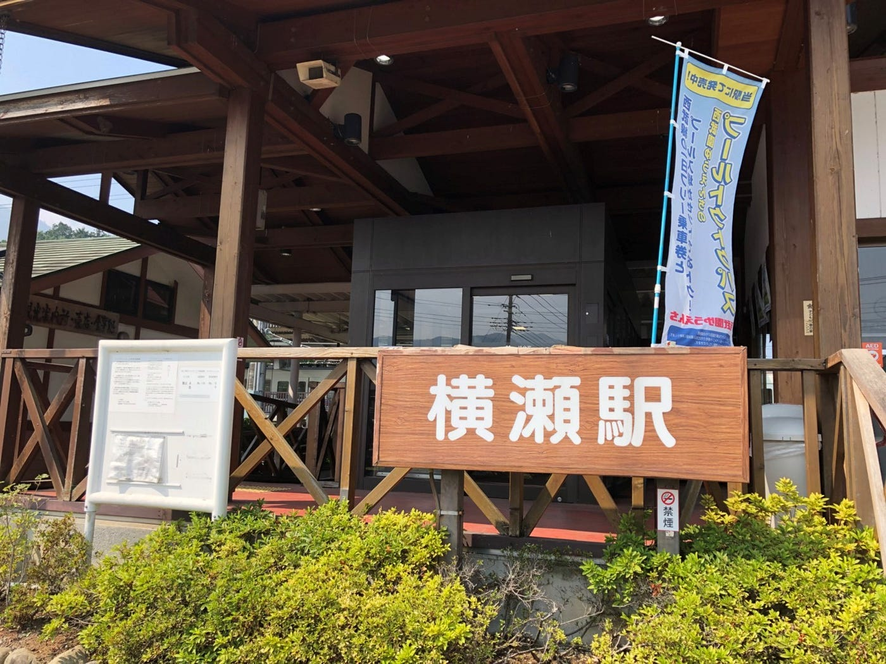
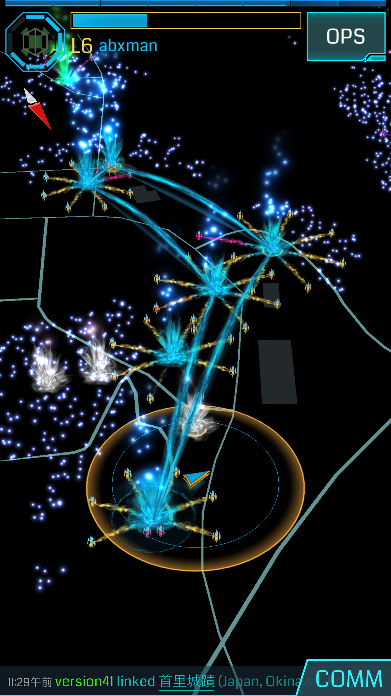

### 古橋ゼミ合宿秩父8/5~8/7

今回が古橋ゼミの合宿初参加そして秩父に足を運ぶのもこれが初めてとなります。

[Japan, image by gx324
Mapillary - Street-level imagery, powered by collaboration and computer visionwww.mapillary.com](https://www.mapillary.com/map/im/o4VT_13d-NYV3I0x_UZLYQ)

[合宿初日 - 恭一朗 北野's 11.6 mi run
恭一朗 北. ran 11.6 mi on Aug 5, 2018.www.strava.com](https://www.strava.com/activities/1752891462)

上の２つはＭapillaryと初日のstravaの記録です。starvaの記録は初日は動いいてない時間や眠っている時間の記録もとってしまうというミスもありました。

普段運動をしない人間なので初日は暑さと移動距離の両面で非常に疲れました。キャンプの経験もなくテントを張るということは新鮮な体験でした。

手作りジェラートの店にいくまでにMapillaryを使いながら歩いたのですが普段気にしないような風景にも目が行くようになりました。また普段地図を使う時は駅からすぐ近くの場所に行くときにしか使わないのでこれもまた新鮮でした。ジェラート店に行くのは非常に疲れましたがその分冷たい水とジェラートが体に染み渡るようでした。

その後銭湯に行った後は待ちに待ったＢＢＱでした。これほどの大人数でもＢＢＱは初めてのので美味しく楽しませてもらいました。

[合宿2日目 - 恭一朗 北野's 4.3 mi run
恭一朗 北. ran 4.3 mi on Aug 6, 2018.www.strava.com](https://www.strava.com/activities/1753065572)

二日目はイングレスを使ってのフィールドアートと水遊び兼ドローンの飛行体験でした。

当初の予定としては羊山公園できのこを作る予定だったのですが思ったより距離があったのとレベル差、他のイングレス勢の存在によって中々進まずブーメランに変更となりました。この辺りにもイングレスをやってる人がいるのかと驚きました。

ドローンはアプリのダウンロードが進まず操作することはできませんでした。これについては3日めで解決しましたが。ドローンの実物が飛んでいる光景を見るのは初めてなので想像より精度が高いと感じた。

夕方からは雨なので大人しくしていました。雨が降るのを見越して早めに風呂に入りにいったのは正解でした。

[合宿3日目 - 恭一朗 北野's 0.8 mi run
恭一朗 北. ran 0.8 mi on Aug 7, 2018.www.strava.com](https://www.strava.com/activities/1755204876)

3日目のstaravaは部屋でのドローンの講習と帰り支度と帰宅だったのでキャンプ地から横瀬駅までの記録です。

ドローンの起動や操作については思っていたよりは複雑ではありませんでしたが練習は必要であると感じました。特にこれからのワークショップのために安全面についてはしっかりと把握しておくべきであると感じました。

帰り自宅でしたが雨は降っていましたがその分涼しかったので用意よりは楽でした。

天候によって予定通りとはいかなかったようですが実りはあった合宿であったと思います。
