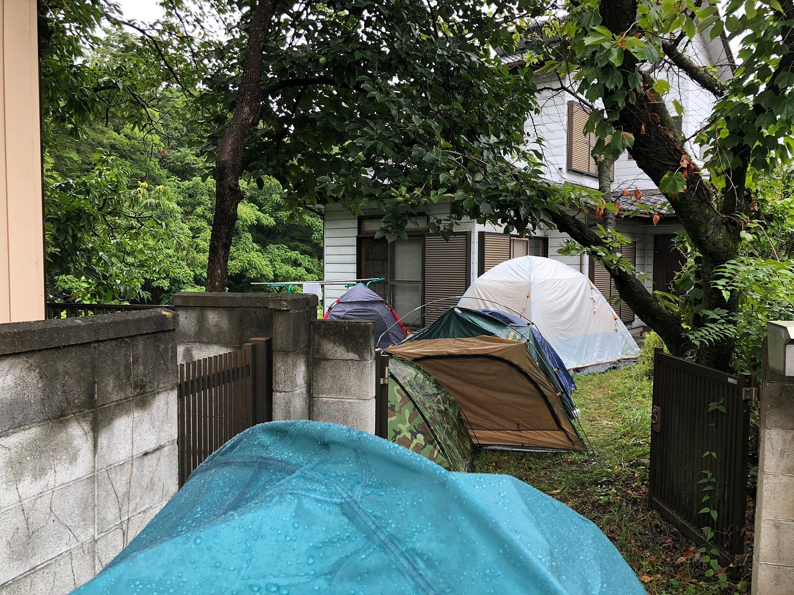
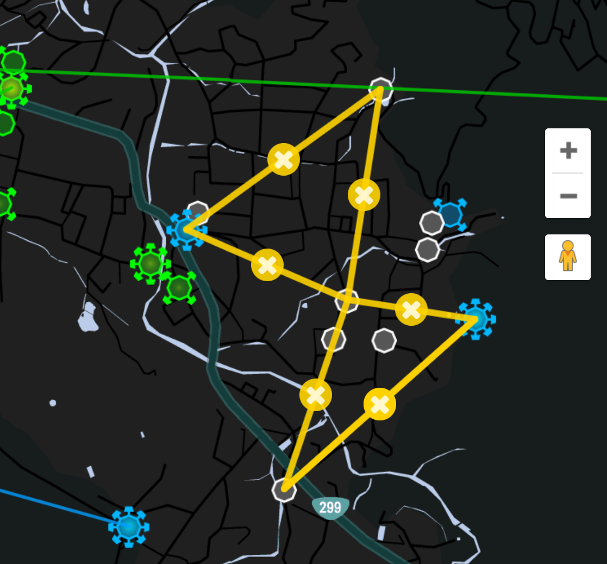
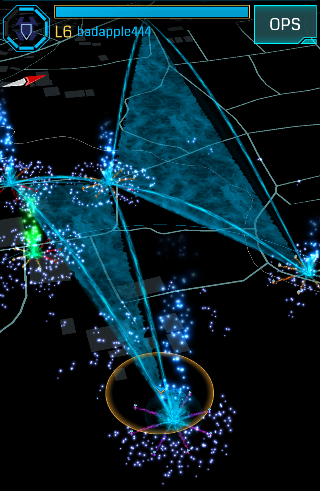
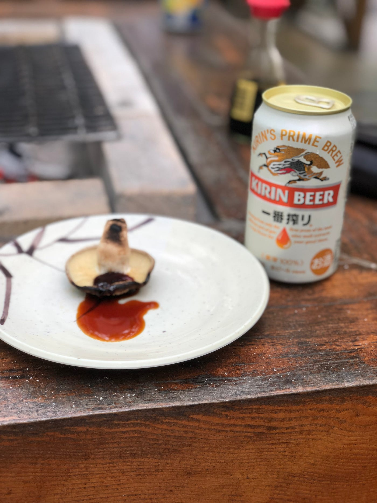

### 古橋ゼミ夏合宿in秩父

### まずは三日間、皆さんお疲れ様でした！

初合宿で色々心配事の多いまま参加した合宿でしたが、多くの同級生や先輩方に仲良くして頂いたおかげで充実した三日間となりました。まずは前文として、皆様に感謝申し上げます。

### # 活動報告

[合宿1日目 - Kouki Takesue's 12.5 mi walk
Kouki T. completed 12.5 mi on Aug 5, 2018.www.strava.com](https://www.strava.com/activities/1751860807)

[合宿二日目 - Kouki Takesue's 6.6 mi walk
Kouki T. completed 6.6 mi on Aug 6, 2018.www.strava.com](https://www.strava.com/activities/1753309448)

[合宿三日目 - Kouki Takesue's 0.9 mi run
Kouki T. ran 0.9 mi on Aug 7, 2018.www.strava.com](https://www.strava.com/activities/1755204294)

[Japan, image by kouki_t
Mapillary - Street-level imagery, powered by collaboration and computer visionwww.mapillary.com](https://www.mapillary.com/map/im/NTCmVmrPAx32GA5PCrmMsQ)

### # はじめてのテント張りでの学び

キャンプというアクティビティに関しては人生で何度か経験したことはありましたが。、実際に自分の手でテントを張ることは非常に難しく、考えることが色々ありました。今後の発展に生かすためにこの場で簡単にまとめておきたいと思います。

まずテントはスペース取りが大事。風の吹く方向、日の差し方、道の狭さなどを考慮して場所を選んだり、入り口の向きを決めたりします。今回は自身のテントが大きすぎて場所を選べなかったのですが、玄関の位置や水場の場所を考慮して入り口の向きを選びました。

そして今回雨が降ったことで学んだ大事なこと。それはカバーの張り方。雨避けとなるカバーはテントに密着して張ってはあまり意味が無いということ・・・。最初は風の入る穴さえ塞げば問題ない、そう考えていたのですが、実際に濡れてみるとテントって結構水吸うんですよ。

結果雨が垂れて、おまけに風向きもいい感じに入り口のカバーを巻き上げる形となり中の三分の一が浸水・・・PCや着替えは奥の方にあったので無事だったのが不幸中の幸いでした。

ご教授頂いたお話から、このようなカバーはテントの屋根になるようにピンと張ってテントと密着しないようにするようです。事前学習が足りなかったなと反省する一瞬でした。

### # フィールドワークで学んだIngress

授業でもおなじみのIngress、僕自身LV.6まで順調にレベルが上がり、一通りの機能は使いこなしていたつもりでした。

> 「リンクが張れない・・・？」

フィールドアートとはIngressの機能であるリンクを使い、絵や文字などを表現する活動。今回は夏、というのもあり戦争を意識したテーマとして「真実」を作成することにしました。

その際一番北にあるポータルから対角である交通安全観音菩薩にリンクを引こうとした時、問題が発生。そう、リンクが張れない。実はIngressのリンク機能には制約があり、他のリンクと被らないようにしなければならない。よく見ると上のポータルにはリンクが被っている。これでは使い物にならない・・・。仕方なくここから一番近い卜雲寺に変更したのでした。

その後も置いたレゾネーターのレベルが足りなくて観音菩薩まで届かなかったり、馬頭観音の場所が民家の中にあったりと当初の予定よりはるかに苦労したアートでしたが、様々な変更を経て二時間ほどで完成しました。

当初とはだいぶ形が変わってしまいましたが、このように現地での活動は常にトラブルとの戦いなのでそこをどのように対処するのか。そこを学ぶ良いきっかけになったのではないかなと思いました。

### # まとめ

非常に暑い気温の中、みんなと協力してなにかを成し遂げると凄く達成感があります。ここ横瀬は道に自動販売機が無く、水分管理をどのように行うのか、というのが一番の課題だった気がしてなりません。データの撮影中に端末がオーバーヒートしてしまったり、充電が切れそうになったりと体調管理のみならず機器の調子も管理せねばならず、このあたりが次回の課題かなと思います。

自然が多く残る横瀬は非常に新鮮で、課題のみならず自由時間での思い出も自分は嬉しかったです。野菜や地酒も本当においしくて、このような魅力を発信するためにはどうしたらいいのか？と考えることもありました。

このようなフィールドは横瀬だけではないと思うので、この先の研究を通じて沢山の魅力に触れていきたいなと思いました！

