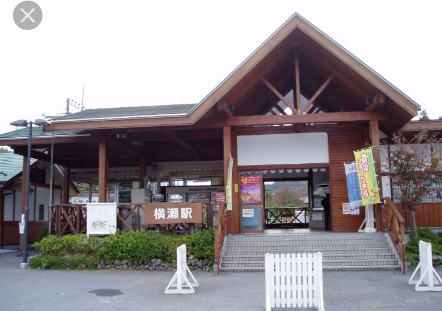
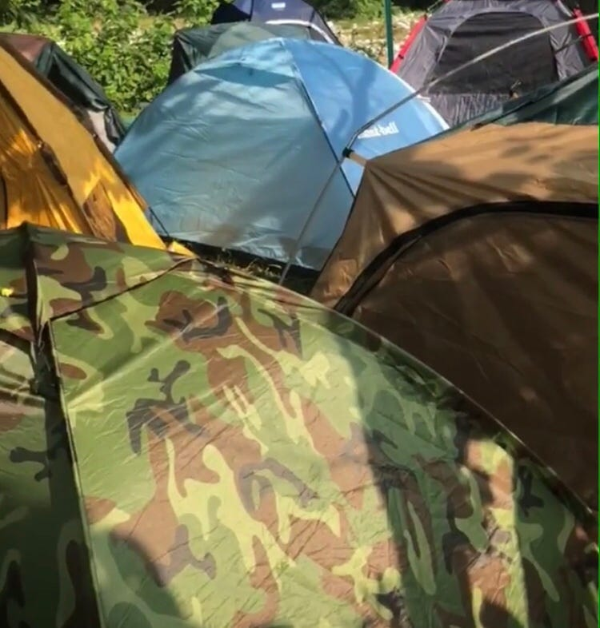
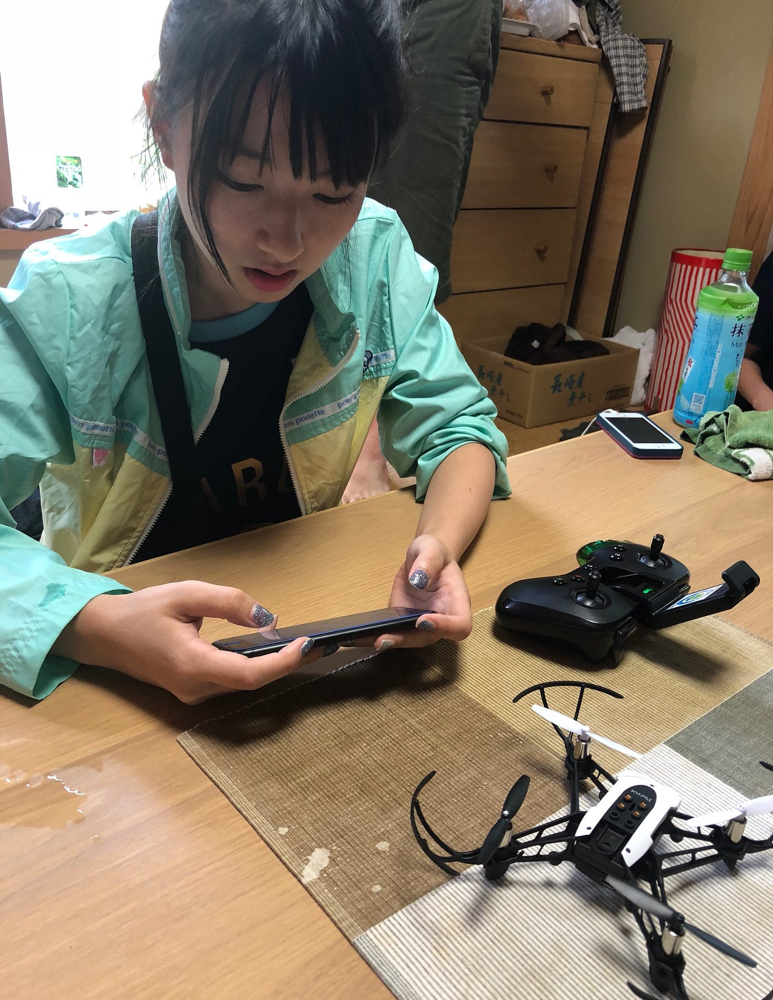
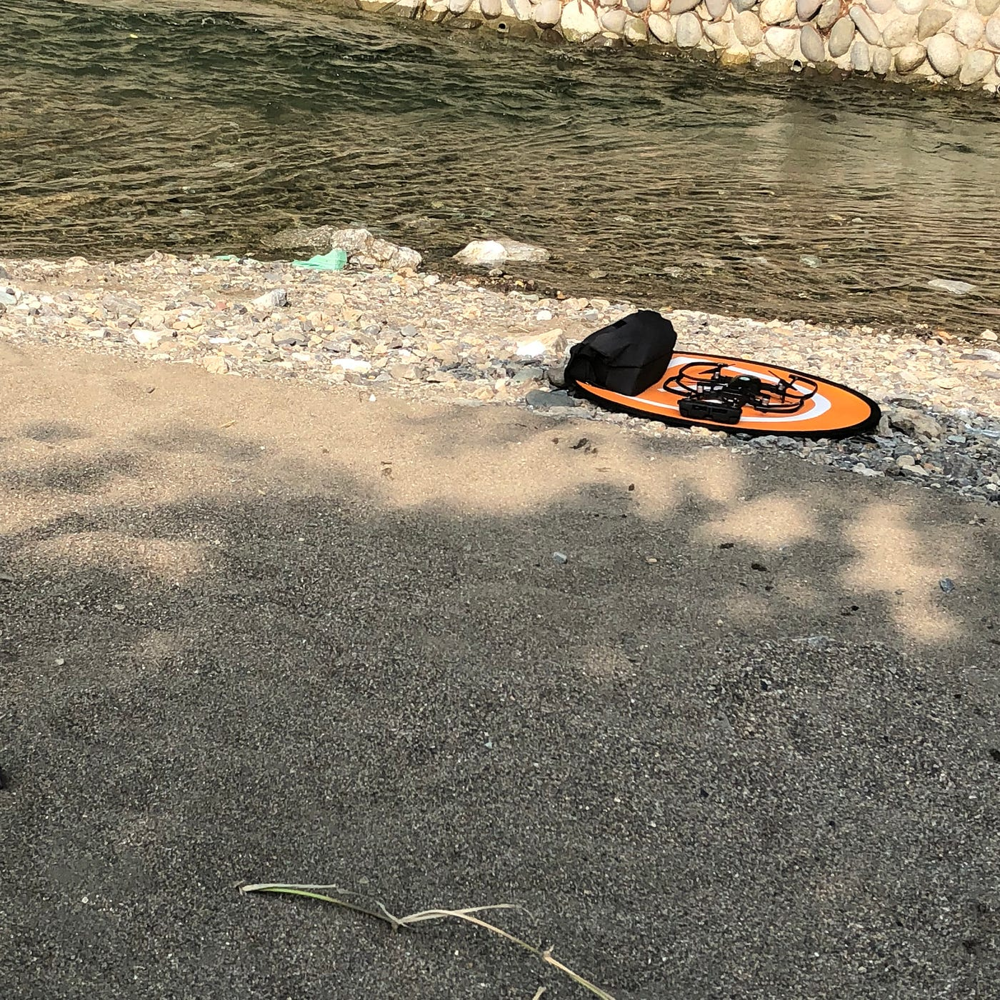

### 大雨のテント体験

8/5–8/8 ゼミ合宿＠秩父

こんにちは！

秩父のゼミ合宿について書きたいと思います！！

到着後お昼を食べて、フィールドワークスタート！今日のゴールは手作りジェラートということで、灼熱の中アイスを目指してたくさん歩きました！！

涼みポイントとした、猿田彦神社参道で先生によるクイズ「どこが参道か？」

参道といえばまっすぐな道！と言う知識を基に周辺を見回してみましたが、あたりには見つけられず、、、

国道の場所が違ったらしく、昔、その猿田彦神社の参道入口に橋がかけられ、そこが参道の入り口になっていたようです！

Pokémon GOやIngressなど、ついゲームに夢中になりがちですが、気づかなかったことに気づけるような観察眼を養って行きたいと思います！！

[合宿1日目 - Misato Tagaya's 9.2 mi walk
Misato T. completed 9.2 mi on Aug 5, 2018.www.strava.com](https://www.strava.com/activities/1751388887)

※mapillaryのデータはアップデート完了してますが、反映がまだなので、され次第至急載せます！申し訳ありません

無事にテントで朝を迎え、2日目は河原でドローンを飛ばすことができました！

ドローンを飛ばすのは初めてで緊張しましたが、コツを覚えて行きたいです！

フィールドアートを作りにたくさん歩いた2日目でした。

[合宿2日目 - Misato Tagaya's 4.7 mi walk
Misato T. completed 4.7 mi on Aug 5, 2018.www.strava.com](https://www.strava.com/activities/1753470714)

最終日！

雨のため、室内でドローンの操縦！回転させたり、面白かったです！

ただ、ヘリポート？すみません名前忘れてしまったんですが、ドローンの着地場所の丸い円のシートをしまうのがすごく難しくて、終わるころには手が真っ赤に！なんとかできるようになったと思うので、近々、研究室に復習しに行きます！

暑い中歩いた時は高校時代の部活を思い出しました！

夏バテが心配でしたが、ドローンの操縦を学べたり、歩きながら街の変容を知ることができたり、充実した合宿生活でした！次回はもう少し細かいみじん切りができるように練習したいと思います！！

今回感じたことを１つに絞るならば、「アクティブに動く」ことの楽しさです。

私はアウトドア派ではないし、散歩もあまりしない人でした。今回活発すぎるほど動く古橋先生にびっくりするとともに、生きている時間を有効活用するために、どう動くか、だと思うし、実際やってみてすごく楽しかったです！何もかもわからない3年生に指示出ししてくださったり、水びたしテントから救ってくださった四年生の先輩方ありがとうございました🙇‍♀️
