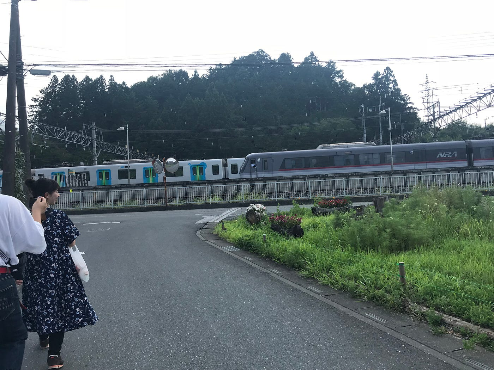
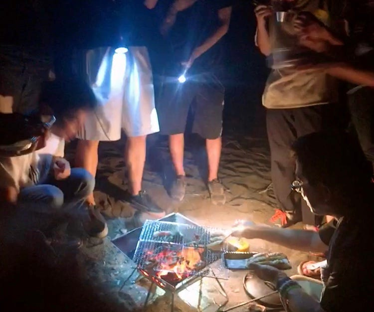
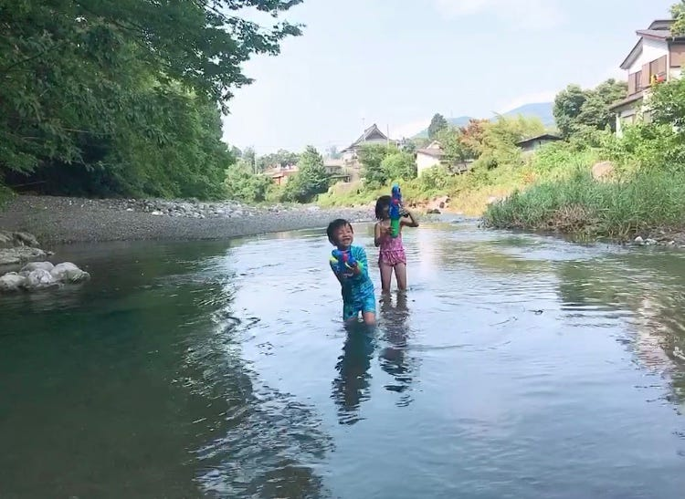

### 横瀬のゼミ合宿(8/5.6.7)

３年の城田です。2018.8.5~7秩父の横瀬でゼミ合宿に参加しました。この合宿で苦労したことや反省点を中心に書こうと思います。

横瀬駅に集合して、徒歩で古橋邸に向かいましたが、気温が高くそれだけでなかなか大変でした。小学生の頃、夏休みは毎年家族でキャンプに行っていたので、キャンプ自体には慣れていたものの、一人で、さらに電車で行ったのは初めてだったので大変でした。

古橋邸について、テントを建てました。今まで家族に任せていたため一人ではうまくできず、先輩や友達に手伝ってもらいながらなんとか建てられました。（説明書をちゃんと読むこと！）

川で遊んだ後、横瀬を歩いて回りました。初めて使うMapillaryとStravaを使いながら途中ではPokemon GoやIngressも起動したり、位置情報に関するアプリをこんなに駆使しながら歩いたのは初めてでした。とても暑かったですがそれ以上にiphoneが熱くなっていました...笑

気づけば15kmも歩きました。

[2018.8.5 - yukino shirota's 10.3 mi walk
Yukino S. completed 10.3 mi on Aug 5, 2018.www.strava.com](https://www.strava.com/activities/1751271965)

夜は温泉に入り、バーベキューをしました。楽しかったです！寝るとき、テントの中は少し暑かったです...

２日目は朝６時に起きて、ドローンを飛ばして、フィールドワークをしました。Ingressを使ってマークを作るのは、以外と大変で、道中に作戦を変更したり、初日並みに歩きました。私はPokemon Go はレベルをコツコツ上げていましたが、Ingressはまだレベル2で、フィールドワーク中も幾つか苦労したので、これからレベルを上げないといけないなと思いました。あとは地図が苦手なことでポイントとポイントの距離感がうまくわからず遠いのか近いのか判断することが難しかったです。

Mapillaryでは、自分より前に歩いている人がいて、写真にたくさん写り込んでしまっていて、うまく撮影できなかったものがあったのでそこが反省点です。

暑い中たくさん歩いてとても大変でしたが、子供達との川遊びが楽しすぎました〜

温泉の帰りから雨が降り出してしまいましたが涼しくなったのでそれはそれでよかったかなと思いました。私のテントはなんとか浸水せずに済みましたが、古橋先生のアドバイスで気づきましたがテントとタープの間に隙間を入れなかったため、内側に少し染み込んでいる部分があったので次からはそこを改善しなければならないと思いました。

[2018.8.6 - yukino shirota's 4.2 mi walk
Yukino S. completed 4.2 mi on Aug 6, 2018.www.strava.com](https://www.strava.com/activities/1753066021)

３日目の夜中から朝にかけて気温がとても低くて、寝袋に入ってちょうど良いくらいで、前日との気温の差が激しくて、寝袋や洋服はいろいろ準備しないといけないんだなと実感しました。

ドローンのことを教わって初めてドローンを操縦しました。まだうまく操縦できなくて、練習が必要だなと感じました。でも、ヘリパッドをうまく畳めるようになったので嬉しかったです！笑

テントの片付けも雨が降っていることもあって大変でした。日焼けをしたり、たくさん虫に刺されたりしましたが、それもキャンプならではだと思って楽しめました！ありがとうございました！！

[Map data from street-level imagery, powered by collaboration and computer vision
Mapillary is a collaborative street-level imagery platform for extracting map data at scale using computer vision.www.mapillary.com](https://www.mapillary.com/app/user/yukino999?lat=20&lng=0&z=1.5)
