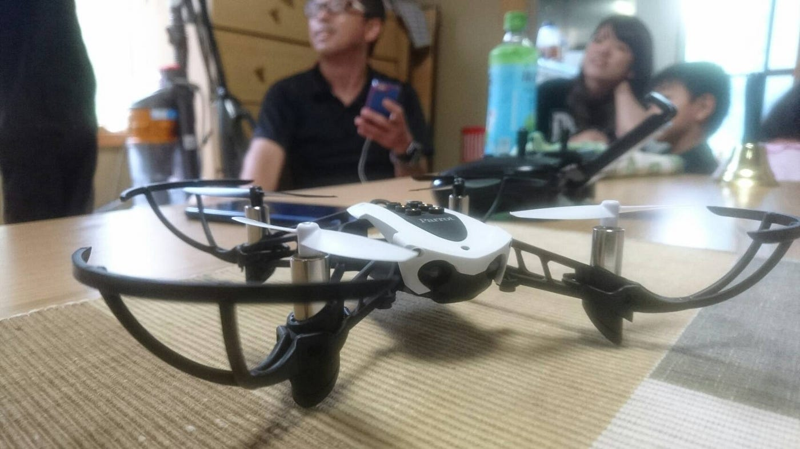

### 大丈夫？俺、溶けてない？

溶けました。
濡れました。
痩せました。

どうも、こんにちは、皆さん。
横瀬町なる所へゼミの合宿で行ってきました。
いや、横瀬町ってどこよみたいな。埼玉県の秩父郡のなかだよ。いや、それもどこよみたいな。

正直、横瀬に行く前は「横瀬ってどこよ？コンビニある？電気通ってる？」みたいな、今思えば酷い偏見を持っていましたが、ちゃんと電気も通ってましたし、コンビニもありました。影はないけど。のどかなとても良い所でした。恐らく、皆さんが想像している1.7倍くらいは良い所です。影はないけど。

今回の合宿では、テントに泊まり、バーベキューをして、川遊びをし、川辺で昼寝をしたりしました。影はないけど。

これでは完全に遊びに行っているようにしか聞こえないかもしれませんが、ちゃんとやることはやりましたよ。影はないけど、ingressもしたし、ポケモンGoもしたし、ドローンも飛ばしたし。いやいやそれも遊びでしょって思ってるそこのあなた、違うんだなこれが。何が違うかは、古橋ゼミに入らないとわからないのよ。みんなおいでよ古橋ゼミへ。

さて、よくわからんことをつらつらと書いてきましたが、今回僕が伝えたいのは、**影がない**のはやばいってことです。先ほども少し書きましたが、今回の合宿では、横瀬町がどういう所なのかを知る為、ingressでフィールドアートを作る為に歩きに歩きました。

単純に気温が高かったということもありましたが、とにかく影がなく、常にギンギンの陽射しの下でした。９月末頃から５月頃までずっとヒートテックを着る暑さに鈍感な僕ですがあの暑さは、影がないのは大変でした。体のどっか溶けたんじゃないかってずっと心配でした。スマホがオーバーヒートして一時使えなくもなりました。怖ろしき、陽射し。

そんな中、三日間で30km近く歩いた僕たち凄い。誰か褒めて。パチパチ。

> 炎天下の中でフィールドワークするときは、スマホのオーバーヒートに気を付け、自販機の位置を確認しておく。

これを胸に刻んで今後も生きてまいります。

大変暑かったり、雨が降ってテントに浸水したりと大変なことも多くありましたが、とにかく楽しかったです。影なかったけど。

最後に、
↓に今回の合宿での移動記録を載せておきますね。

[古橋ゼミ合宿@秩父 - 勇渡 板垣's 16.8 km walk
勇渡 板. completed 16.8 km on Aug 5, 2018.www.strava.com](https://www.strava.com/activities/1751185003)

[秩父合宿@2日目 - 勇渡 板垣's 14.2 km walk
勇渡 板. completed 14.2 km on Aug 6, 2018.www.strava.com](https://www.strava.com/activities/1753644798)

[秩父合宿@3日目 - 勇渡 板垣's 90.4 km walk
勇渡 板. completed 90.4 km on Aug 7, 2018.www.strava.com](https://www.strava.com/activities/1755923576)

と、思いきやまだ終わりません。

この写真がなんだかわかるでしょうか。
これはMapillaryの写真のアップロード画面です。
何もありませんでした。撮った写真は溶けてしまったようです。
僕のゼミ合宿はまだ終わってないようです。幻の４日目へ、近日中へ行ってきます。
