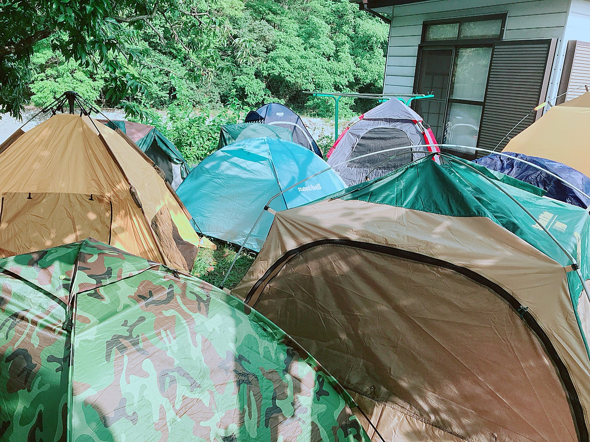
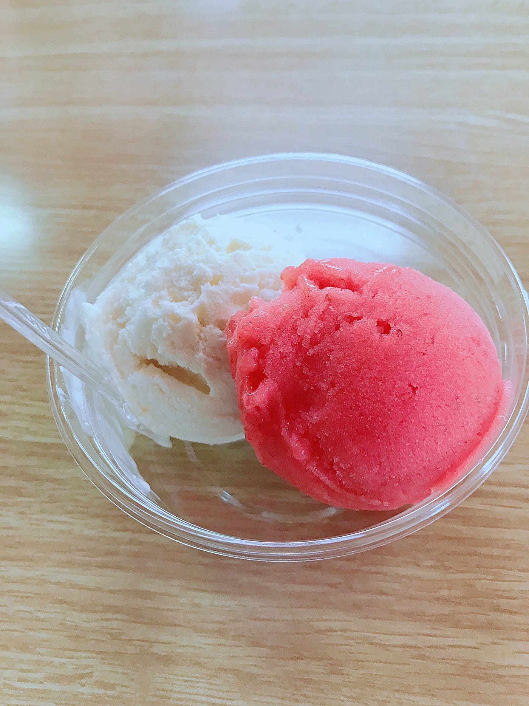
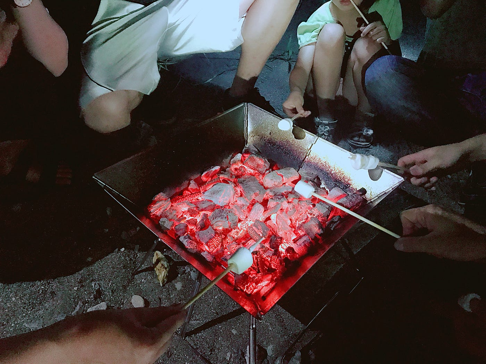

### 灼熱と大雨のフィールドワーク 〜Ingress戦闘合宿〜

みなさんこんにちは、古橋研究室3年の末光です。

今回2018年8月4日〜6日の2泊3日で古橋先生のご実家である埼玉県秩父市横瀬町へ夏合宿に行って参りました！！

3年勢は家の庭にてテント泊というなんともシュールな状況(笑)。それがこちら↓

初めてのテント泊ということもあり先生や先輩方に組み立ての基本から教わりました。ありがとうございます！

今回の合宿、2日目夜から台風によりテントが浸水し実際テント生活出来たのは1泊のみでした(泣) 暑かったものの想像以上に楽しかったので残念です。

次回はタープを持って来たりして雨ニモ負ケズに生活してみたいものです。(大雨の中キャンプはやるものではないですが。笑)

長くなりましたがここからが本題となります。

#### 1日目は本当に暑かった！！暑過ぎて死ぬかと思った！！！

Mappillaryで道中の写真を撮りながら、

Ingressでポータルをハックしながら、

参道の石碑が思いがけないところにある理由は何かを考えながら、

昼食後のデザートとしておきうね農園の手作りジェラートを求めて歩き続けました。暑さ限界の中食べたジェラートは絶品で本当はあと2個くらいいけたかも、、、笑

何度も言いますが本当に暑かったです。でも古橋先生のお子さん2人も一緒だったこともあって「こんなに幼い子をが頑張って歩いてる姿を見て私も負けていられまい！！」と私も最後まで初日をやり遂げることができました。ありがとう古橋チルドレン！！

そして待望の夕飯！、、はまさかの21時過ぎ(笑)

近くの川辺で闇BBQ。肉を焼きまくりました。

最後に焼きマシュマロもやって楽しかった！

1日目の成果がこちら↓

[古橋ゼミ初合宿灼熱のフィールドワーク - Kaori Suemitsu's 17.6 km walk
Kaori S. completed 17.6 km on Aug 5, 2018.www.strava.com](https://www.strava.com/activities/1751358482/shareable_images/map_based?hl=ja-JP&v=1533473737)

う

#### 2日目はなんと6時起き。

久々に早起きしました〜。

でも起きてよかった！末光初のドローン飛行に成功致しました！！ドローンから見える風景が綺麗過ぎていつか私も空撮やってみたい、、と大まかではありますが密かな目標ができました。(ガチ勢なので頑張りますよ！！)

そのあとはチームに分かれてIngressにてフィールドワークを行いました。これも暑くて大変でした。

Ingressに関しては当時レベル1でやり方もよく分からなかったのですが、チームメイトが優しく教えてくれたので無事遂行する事が出来ました。

台風も近づいて来たところで、古橋邸で2日目の夕食カレー作りに突入。

玉ねぎ6玉、人参、セロリ、にんにくをみじん切りにしまくりました。はい、号泣です。途中から目が開かなくなりました。

この合宿で得たことはみじん切りですかね。(笑)

アルバイトでやっているキッチンの技術が始めて活かされたと感じた夜でありました。これからみじん切りするならお任せあれ。とは言い難い。(笑)

そんな二日目もそこそこ歩きました。↓

[古橋ゼミ2日目 - Kaori Suemitsu's 9.2 km walk
Kaori S. completed 9.2 km on Aug 5, 2018.www.strava.com](https://www.strava.com/activities/1753422151/shareable_images/map_based?hl=ja-JP&v=1533548383)

3日目はずっと雨で室内でドローンを飛ばしました。

イオンモールでのイベントに向けてドローンの仕組みや設定の仕方、子供への説明の仕方を教わりました。楽しかった！

ヘリパッドのたたみ方テストも楽しかった笑笑

マレーシア留学中に使ってた洗濯カゴのたたみ方に似てたのか思ったよりすんなりとできました。

そんなこんなで初めての古橋研究室夏合宿。

肉体的疲労が凄かったですが、4年生方や話したことなかった同期と話す事ができたのでとても良き3日間になりました！！

初日の参道の話で私のお気に入り番組の一つブラタモリが出てきましたが録画が溜まっていることを思い出しました、、。また見始めたいと思います。

そしてこの合宿からIngressにハマり、合宿後3日でレベル2から4まで上げることに成功致しました！自宅がまさかの敵チームのリンクで囲まれていたのでいつか破壊してやります！！笑

[Japan, image by kaorisuemitsu
Mapillary - Street-level imagery, powered by collaboration and computer visionwww.mapillary.com](http://www.mapillary.com/map/im/xUQ0BDa-3vCVbkWqLZeeng/photo)
