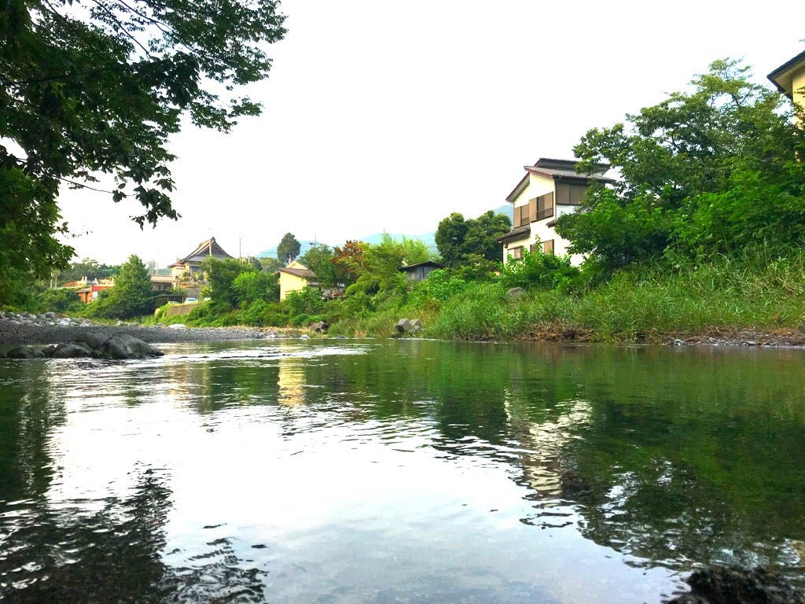
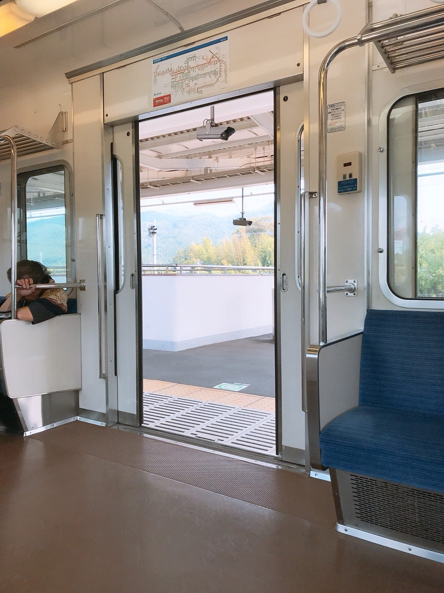
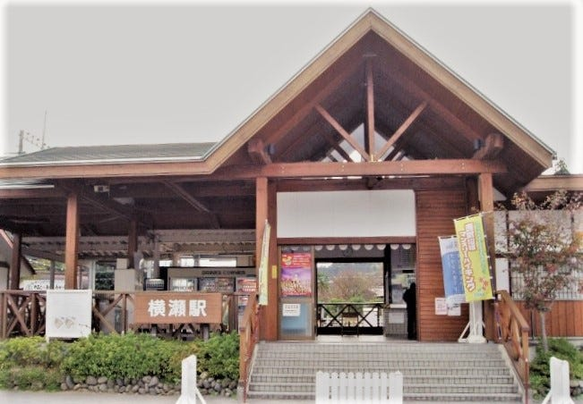
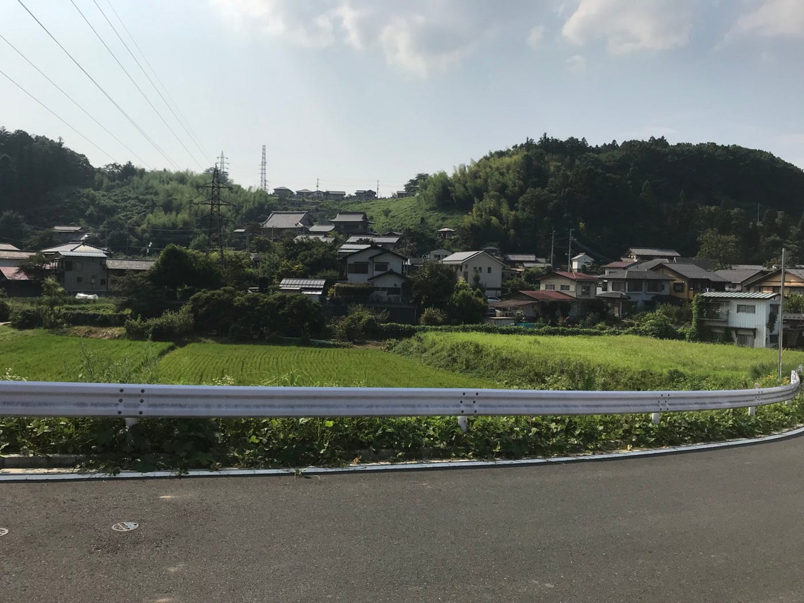
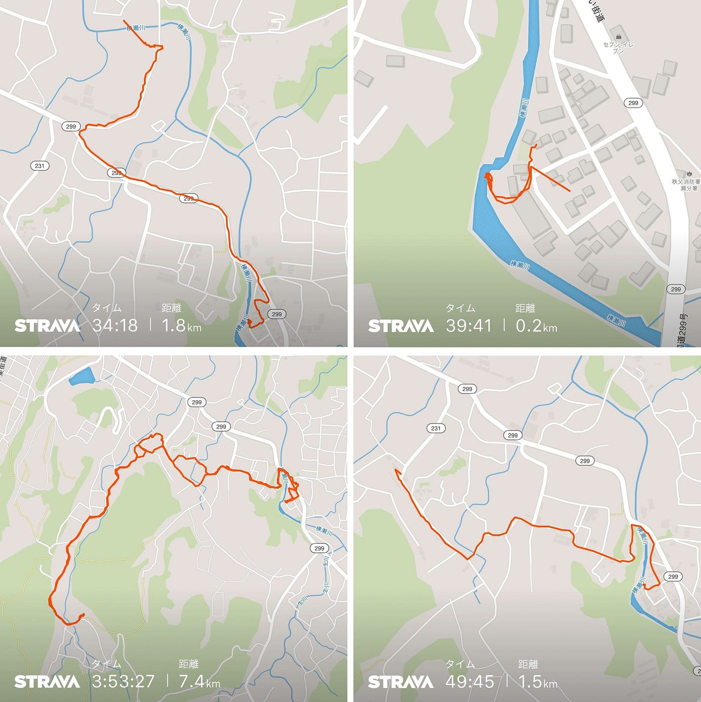
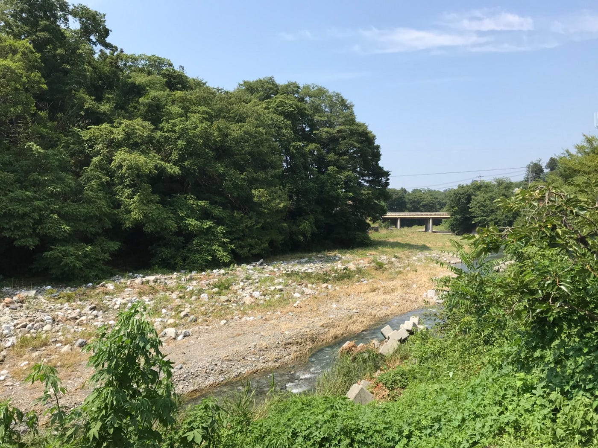
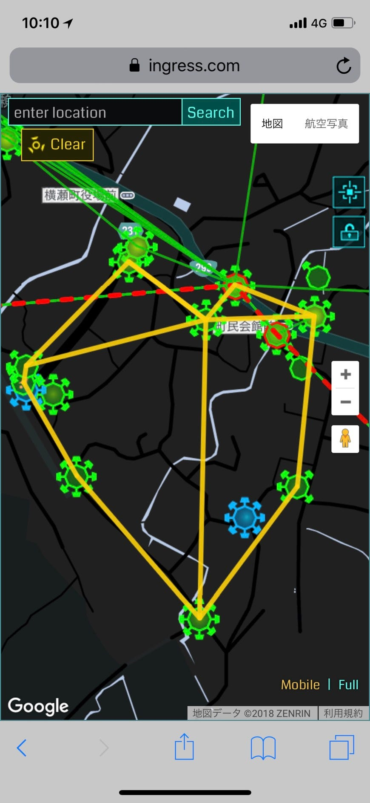
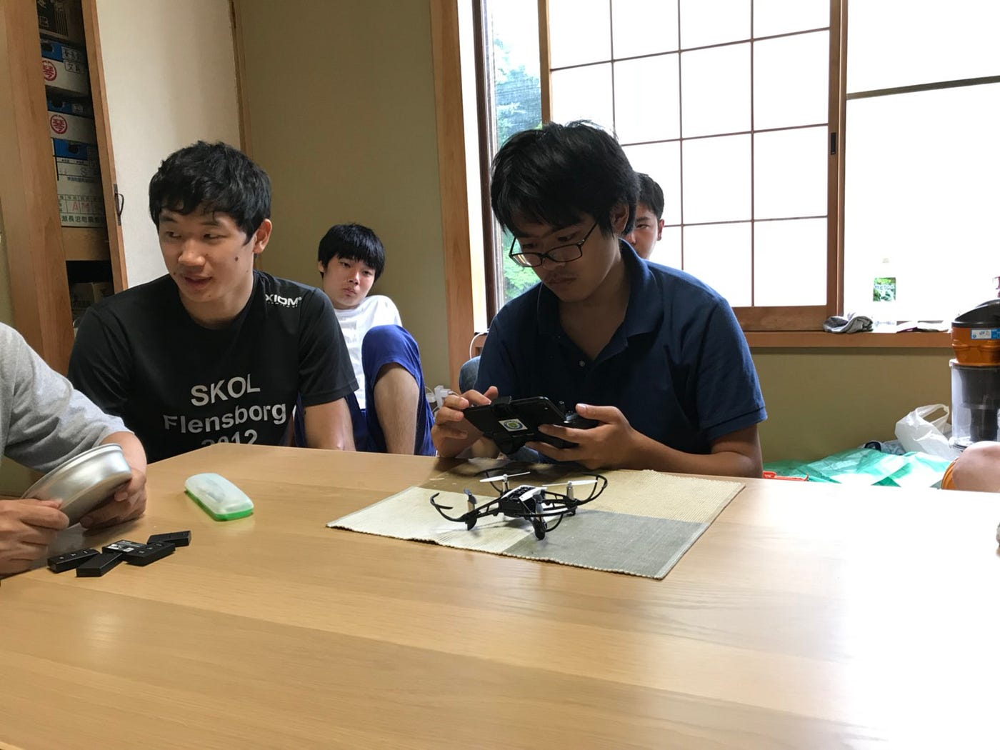

20㎞以上歩いても痩せも太りもしなかった自分の体って一体…

**こんにちは。**青山学院大学 地球社会強制学部 3年の渡辺です。8月ということもあり、秩父ということもあり、少しは涼しいんだろうな、そんな甘い考えを持って今回のゼミ合宿に参加しました。そもそも秩父の場所を知ったのは前日。その前まで長野だと思ってました。

### 1日目

東京から電車に乗ること約2時間30分。到着まであと30分くらいのところでパシャリ。「田舎だな」

電車に乗りながらいろいろと物思いに耽っていました。

古橋邸・・・大邸宅？

持ち物トイレットペーパー・・・野外トイレ？

何するの？

そんな中、古橋先生から位置情報をリアルタイムで発信しなさいとの事。空間情報のゼミ合宿っていう感じがヒシヒシと伝わってきました。

古橋邸のある横瀬駅に着きました。風情のある駅舎だなという印象。ここから約20分の徒歩の距離に古橋邸がありました。肝心の邸宅の写真は取り忘れてしまいました。イメージとしては昔からある白い2階建ての一軒家です。

先ほどまでのほほんと過ごしていたのもつかの間、尋常じゃない暑さが襲ってきました。結局この中、1日で約10km以上も歩きました。道中でIngressやPokemonGoをしながらMapillaryでマッピング。空間情報のゼミという感じが身に沁みました。たくさん歩いた暁にはおいしいアイスクリームが待っていました！２つで350円！２つで350円！！迷うことなく２つにしました。選んだフレーバーはくりといちごみるく。くりは素朴でほんのりとした甘いくりの風味が口いっぱいにふわ～っと広がってとてもおいしかった。いちごみるくは食べる前は甘いのかな？なんて思ってたけど、全然そんなことはなかったです。Theいちご。まさにそんな感じです。口に入れた瞬間にいちご本来の酸っぱさが疲れをパッと吹き飛ばしてしまいました。人工的に加えた甘さじゃない、いちごの甘さと酸っぱさ。とてもおいしかったです。もちろん写真は忘れてしまいしました。

この後は古橋邸にゆっくり帰宅し、各自お風呂へ。武甲温泉という場所に向かったのですが、炭酸泉で有名とか聞いたいたのですが、実際入ってみたらどれが炭酸泉かわかりませんでした。もはや意識すらしてなかったと思います。それでも温泉は気持ちの良いものでその日の疲れはすっきりと取れてしまいました。

温泉から戻ると今度は古橋邸の近くにある川でバーベキュー。真っ暗な川辺にライトやテーブル、いすなどを置いてみんなでワイワイと楽しみました。バーベキューではずっと手元を照らしたり焼いたりしていたのであまり食べてないので、昼間たくさん歩いたこともあり少し痩せたかな？と思いました。

少し静かになったあたりで、夜の川というものはあまり見たことがなかったので、いい機会だと思い結構な時間見ていました。めだかやカニ、アメンボなどの生き物がゆっくりと水の中を移動していました。めだかに光を当てるとそこから離れていくという習性？を見つけたりといろいろな楽しみ方をこのゼミ合宿で学びました。

### 2日目

2日目が一番激動の一日だったと思います。酷暑、朝4時のセミの目覚まし時計、Ingressハプニング、豪雨。

IngressやIntelmapを使い、フィールドアートを作ろうという課題が出ました。私たちは左図のようなハート型を作ることに決めました。順調にいけば1時間ぐらいで終わるのかな？なんて思ってました。歩いていくうちに酷暑のせいで飲料水が尋常じゃない速さで減っていきました。5ポータルごとに1本の勢いで新しいペットボトルを買っていました。道中には傾斜がえげつない坂があったり、郵便局付近にIngressの猛者がポータル狩りをしていたりと様々なハプニングに見舞われ、近くにあったJA共済で少し涼ませてもらったりと、古橋邸には最下位で戻ってきました。とりあえず右図のような形を完成させることができたので良かったです。それなりの達成感も得られたのでなんだか嬉しかった気がします。2日目の午後から雨が降る予報だったので、このIngressの課題が終わったら後は基本的に自由行動という感じでした。お昼を食べ、お昼休憩を取り、お風呂に行って夜はカレーをいただきました。作れる料理と言ったら冷凍食品やカップヌードルだけだったので、ジンジャエールを片手に応援することで精一杯でした。包丁を使ってる方々を見るとすごく勇ましい姿に映っていました。かっこいいなと思うと同時にこれからを生きていくうえで料理を学ばなくてはという焦燥に駆られました。

カレーはとてもおいしかったのですが、前々から気になっていた近くのラーメン屋に行きたかったので、少しお腹に余裕を持たせておきました。その後、先輩や友達と一緒にラーメン屋に向かったのですが、暖簾がしまわれていました。今やらずにいつ営業するのだろうと不思議に思いました。やむなく古橋邸に戻ってきた後は居間で先生や先輩方、友達と他愛のない話をしました。PokemonGOの話が主でしたがなかなかに盛り上がっていた気がします。その後、とある先輩にコイキングを持っているか？と問われたので持っていると答えたら先輩にコイキングを捧げることになりました。僕のコイキング元気にやってるかな？親として少し心配です。そんな感じで2日目は12時くらいに床に就きました。お腹は若干空いていましたが難なく寝てしまいました。今日もセミのストレスとたくさん歩いたこと、食事は少なめだったことから少し痩せたかな？と感じました。

### 3日目

今日は帰る日です。午後から雨が降る予報だったので午前中に川で少し遊んだりしてドローンの操作の練習を行いました。最初は先生や先輩方がわかりやすくレクチャーを行ってくれました。自分自身、ドローンに触れたことは何度かあるのでそこまで感動はありませんでしたが、いざ触ってみると思いのほかラグがあったりと操作が難しく感じられました。

また、着陸マット？のしまい方も同時に練習しました。周りの方々がうまくいかない中、増田将馬プロが難なく一発で収めることができました。その後わかりやすくボディーランゲージを伴ってわかりやすくレクチャーしてくれたおかげで自分も一発でうまく着陸マットを収めることができました。感謝の気持ちでいっぱいです。

一通りドローン練習が終わったので掃除や身支度をし始めました。昨夜の料理の支度は実質何もお手伝いすることができなかったので、お掃除は積極的に取り組ませていただきました。古橋先生の息子さんや娘さんも掃除を手伝ってくれました！その姿を見ているとすごくのほほんとした気持ちになりました。

掃除が終わり身支度をして駅に向かい、長いようで短かった3日間の合宿は幕を閉じました。ここで学んだことは多岐に渡ります。ドローンの難しさ、秩父の暑さ、位置情報のアプローチの仕方、子供のかわいさ、子供への接し方、仲間とのコミュニケーション。ひたすらに”つらい”感じはありましたが、どれもよい機会、良い経験になったと後から気付きました。なんだかんだで合宿は楽しかったです。

家に帰ってから、さすがにあんなに歩いたんだから痩せているだろう！と意気込んで体重に乗ってみると、

### なんと

体重は全く変わっていませんでした。別にダイエットをしていたわけではありませんが、なんとなく虚しさがこみ上げてきたと同時に人間って難しいと思いました。

### 終わり

Mapillary

[Japan, image by taksea
Mapillary - Street-level imagery, powered by collaboration and computer visionwww.mapillary.com](https://www.mapillary.com/app/user/taksea?pKey=JHaHox9yHMYYWUzJ8EY39g&lat=35.567107424173116&lng=139.40121615318526&z=17)

[Japan, image by taksea
Mapillary - Street-level imagery, powered by collaboration and computer visionwww.mapillary.com](https://www.mapillary.com/app/user/taksea?pKey=uGen-9QICSKydkgAwsOxHw&lat=35.567107424173116&lng=139.40121615318526&z=17)

[Somewhere On Earth, image by taksea
Mapillary - Street-level imagery, powered by collaboration and computer visionwww.mapillary.com](https://www.mapillary.com/app/user/taksea?pKey=e_MXqSyylgI-gMxMNJpXMg&lat=35.567107424173116&lng=139.40121615318526&z=17)

[Japan, image by taksea
Mapillary - Street-level imagery, powered by collaboration and computer visionwww.mapillary.com](https://www.mapillary.com/app/user/taksea?pKey=0B855d2zFE4zN8hRdQjscw&lat=35.567107424173116&lng=139.40121615318526&z=17)

Strava

[朝のウォーキング - 匠 渡邉's 1.5 km walk
匠 渡. completed 1.5 km on Aug 5, 2018.www.strava.com](https://www.strava.com/activities/1750293918/shareable_images/map_based?hl=ja-JP&v=1533433904)

[昼のウォーキング - 匠 渡邉's 0.2 km walk
匠 渡. completed 0.2 km on Aug 5, 2018.www.strava.com](https://www.strava.com/activities/1750366196/shareable_images/map_based?hl=ja-JP&v=1533439380)

[午後のウォーキング - 匠 渡邉's 7.4 km walk
匠 渡. completed 7.4 km on Aug 5, 2018.www.strava.com](https://www.strava.com/activities/1751070513/shareable_images/map_based?hl=ja-JP&v=1533467124)

[夕方のウォーキング - 匠 渡邉's 1.8 km walk
匠 渡. completed 1.8 km on Aug 5, 2018.www.strava.com](https://www.strava.com/activities/1751161919/shareable_images/map_based?hl=ja-JP&v=1533469213)
