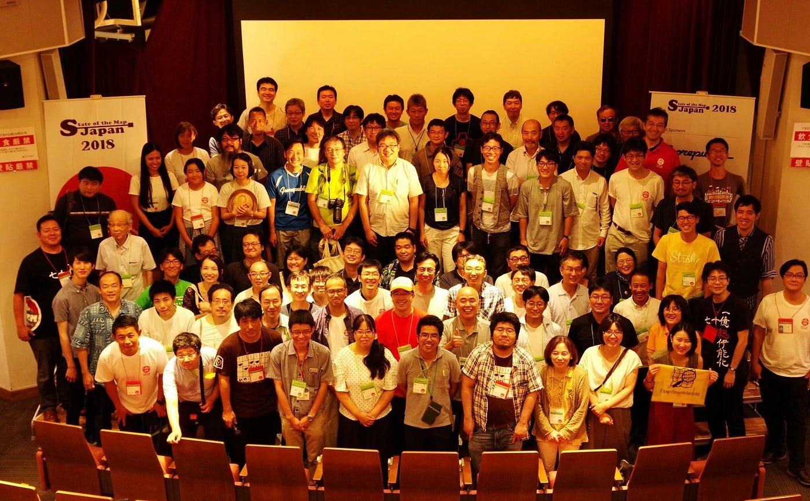
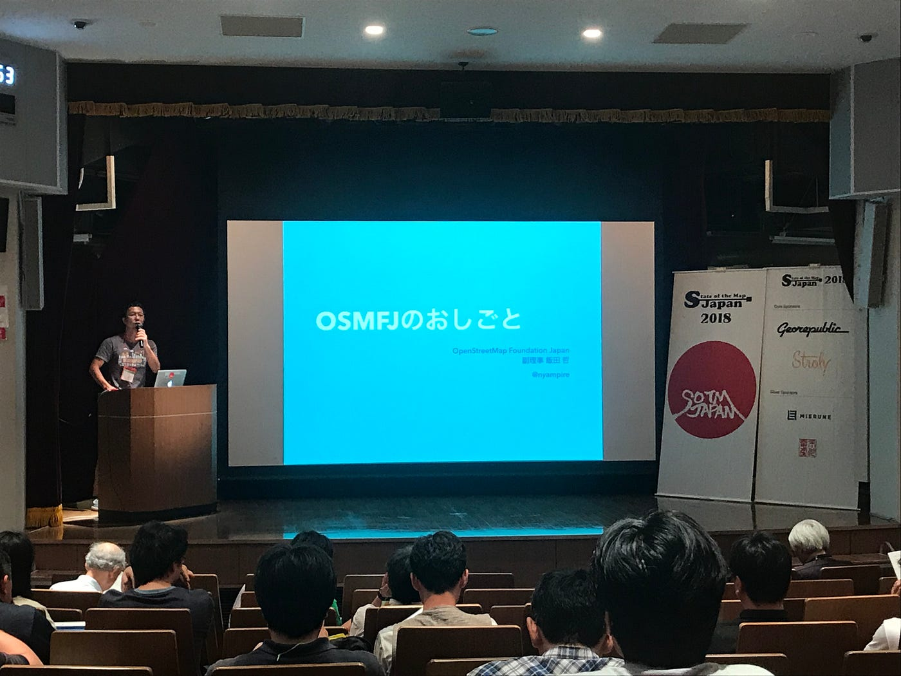
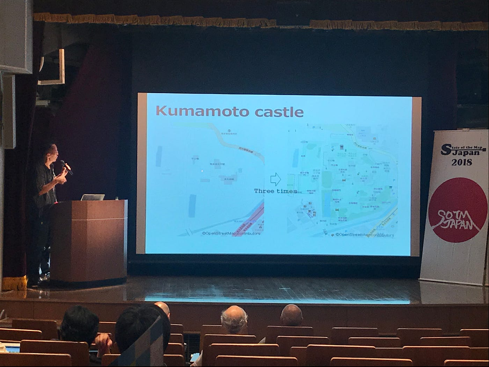
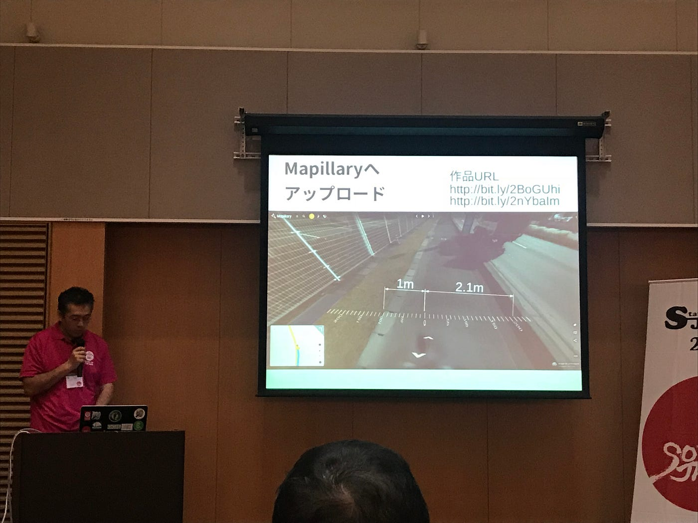
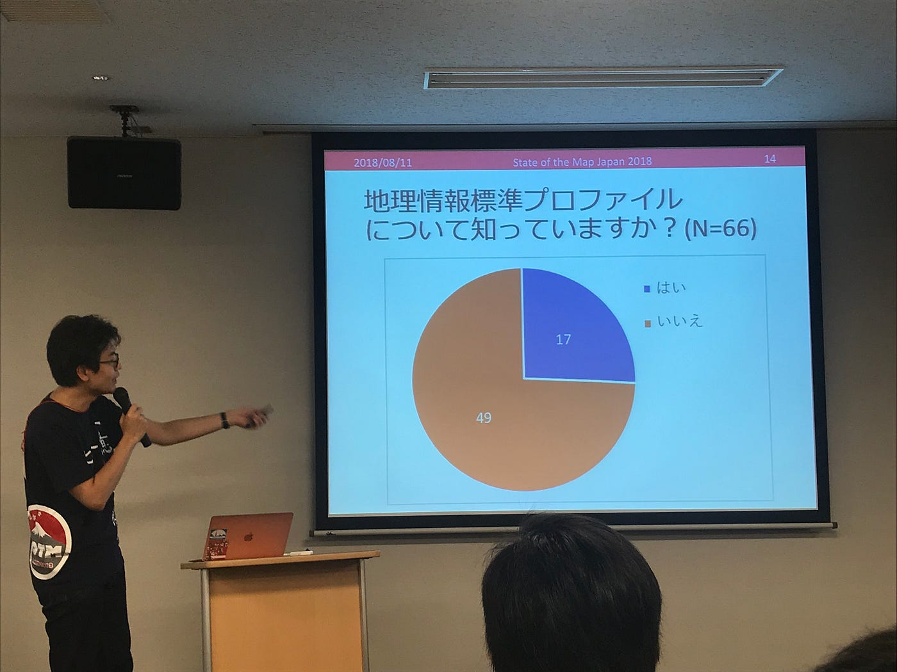
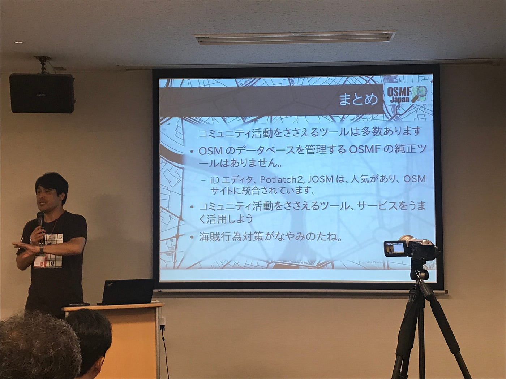
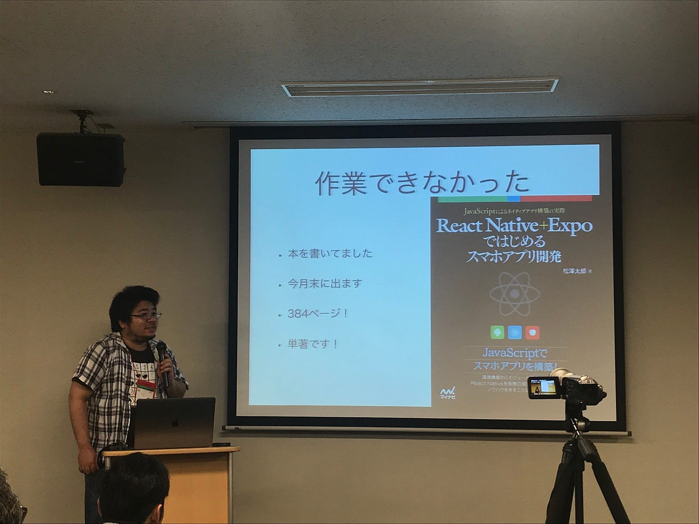

### OSMについて熱く語ろう

OpenStreetMap(以下OSM)の意義や今後について熱く語ろうではないか。昨日SotMJP18という日本版OSMのカンファレンスに参加して、日頃聞けないようなOSMの話を聞くことができた。

実はカンファレンスの前日と前々日で富士山(須走ルート)登頂に不眠で挑んでいたため、疲れて朝起きれず、午後からカンフェレンスに参加。全身筋肉痛で階段をまともに降りれない状態だったが、会津若松(1年)ぶりに会えた方達もいて、楽しかった〜。

↓ こちら富士山登山(須走ルート)でGPSログを取ってきたやつ。ログをとるとほんとに登ったんだな〜って実感する。。

[富士山登頂2018/08/9-10 - Ayame Otsuki's 14.3 km run
Ayame O. ran 14.3 km on Aug 9, 2018.www.strava.com](https://www.strava.com/activities/1761855146)

SotMJP18で知ったこと。まずはOpenStreetMap Fundation Japan(以下OSMFJ)の活動を知った。法人格を取得することで新たな繋がりや、OSM日本人マッパーを代表して様々な活動ができること。またJapan、日本支部を作ることでローカルな決断や貢献が可能だということ。

OSMFJの副理事、飯田さんがわかりやすく、めちゃめちゃわかりやすく「OSMFJのおしごと」について語ってくれた。

OSMFはマッパーがたくさん入ったカゴとして支えたり、支えられたりして活動している。半年ほど前にOSM Japanコミュニティが日本地図学会から特別賞をいただいた話も記憶に新しかった。

.

いちOSMマッパーの和田さんによる、お城についての熱いお話。日本のお城の防衛に対する豆地域や、お城愛があるからこそ、しっかりと城を地図におこしたいという気持ちが強く伝わった。

いろんな形でOSMは利用されているな〜と感じる内容だ。城の面白さを伝えたいから地図を描く。すてきな趣味だな〜。

.

目黒さんによる、福島県で行った歩道調査のお話。毎度、歩道を実際に訪れて現場で距離を測るのは、データとしては精確だけど時間がかかるな〜といったとこからスタートし、自転車に全天球カメラをつけMapillaryで撮影し、その画像を元に歩道の幅を測る。パノラマの写真に定規を合成して測るには一工夫必要でその話がおもしかった。他の地域でも活用できるようにやり方を公開してくれている。

我らが青学の非常勤講師も勤めてくれている瀬戸さん。時間がめっちゃ押してしまっていてハイテンション瀬戸さん、楽しそうだった。笑
OSMのデータ品質についてのアンケート分析。私はここで測位と測量の違いについて知った。OSMにおいてのデータ品質についてはしばしば議論されるが前提として、OSMは測量ではなく測位。質より量なのだ。しかし質を磨くことも決して無駄ではない。

OSMFJの代表理事、三浦さんによるコミュニティ支援サービス紹介、つまりはツール紹介。

スマホで完結するモバイルマッピング用アプリ紹介や、画像の活用、OSM上においてのコミュニケーションツール。OpenStreetCamやNeis Toolsなど私も知らないツールをたくさん知ることができ、挑戦してみようと思った。

.

松澤さん。会津若松ぶりだった。忙しそうだったから挨拶できなかったな〜。新規タイルサーバの話難しくて全然わからなかった。。唯一わかったことは、さくらインターネット様がサーバーをくれた？貸してくてた？といこと！

あと松澤さん単著の本出すってよ！！本の紹介している時、観客から笑いの声が上がっていたのできっと面白い本！難しそうだけど！！笑

とまあ、カンファレンスの話はこのぐらいで。

[What OpenStreetMap can be.
Over the past two years, the biggest buzz among the geo chatterati has been Justin O'Beirne's meticulously argued…blog.systemed.net](http://blog.systemed.net/post/15)

こちらの記事について。OSMにおいて、非商用とローカルの力を全面的に押している記事。自動運転用にばっかり力を注いだ地図や、CrisisMappingつまりは遠隔でのマッピングに対して悲観的な意見を持つ筆者に対して、ゼミ合宿中に夜な夜な古橋先生とお酒を片手に語り合った。

SotMJP18で感じたことを踏まえると、私としては、個人が活用するため、楽しむための地図としてのOSMの顔。行政や企業、NGOが利活用するためのOSMの顔。どちらも正しくて面白い。データ品質について、品質が高いことに越したことはなかったとしても、OSMの意義はそこじゃない。人道支援、クリエイティブ、独創性、協力、情弱是正。様々な意義が混ざっているそれがOSM。まさに民主主義でなはく多数決の世界ではなく、多様性の世界だ。多種多様なOSM。みんな違ってみんな良い。以上！笑

来週は石巻ハッカソンに参加するので石巻からブログ書くよ〜〜
