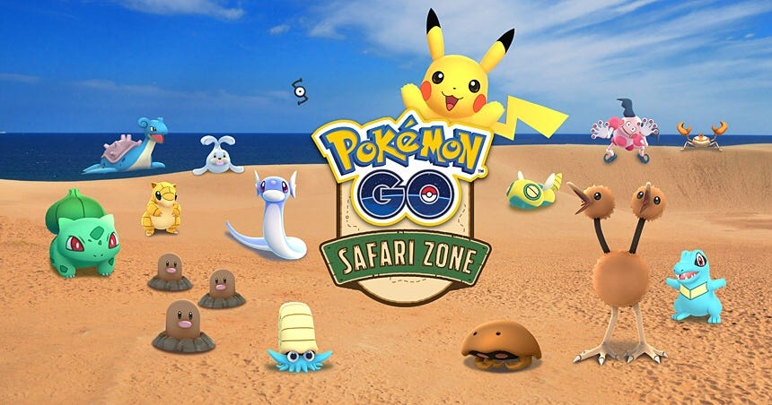
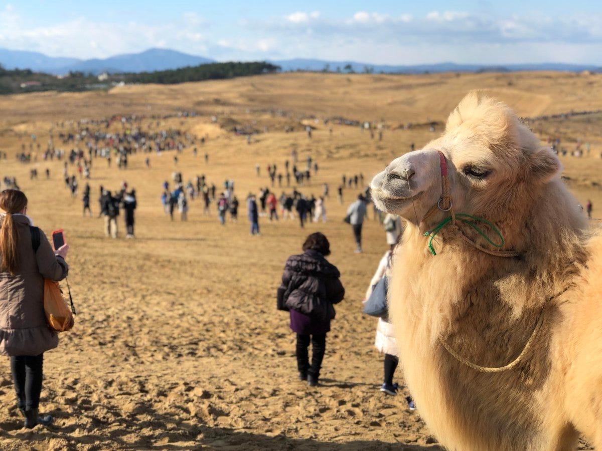

PokémonGO×鳥取県×観光

私は今鳥取に来ています。

というわけで、今回は位置情報ゲームと観光について取り上げようと思います！

2017年11月24日〜26日の期間、鳥取県とNianticがコラボし、鳥取砂丘で「Pokémon GO SAFARI ZONE」というイベントを開催しました。

当初、県は3日間で3万人の来場者を見込んでいましたが、なんと初日だけで約1万5000人が鳥取砂丘へ訪れました！

2日目には、砂丘周辺の混雑解消のため、レアポケモン出現エリアを鳥取砂丘から県東部全域まで拡大したそうです。

鳥取県に混雑なんて言葉は無縁だと思っていましたが、ポケモン効果は絶大ですね。

参加者数は3日間で約8万9000人にのぼり、約18億円の経済効果を生んだそうです。

> 鳥取砂丘の様子 PokémonGO公式Twitterより

何度か砂丘に足を運んだことはありますが、私はこんなに人が砂丘を歩いている姿を見たことがありません。すごい。

県職員は県内からの来場者が多いだろうと予想していたそうですが、実際は県外からの来場者の方が多く、消費行動に繋がったと話しています。

しかし、砂丘付近では期間中交通渋滞が発生する、レアポケモンが出現した場所で一部のユーザーが路上駐車するなどのトラブルが発生しました。

県外からの来場者は公共交通機関を利用していたようなので、交通渋滞は県民でしょうね。

普段山陰の田舎でイベントなんてやらないですもん、路上駐車してでもレアポケモンを捕まえたい気持ちわかります。だめですけど！

ここからは私の考えですが、鳥取砂丘含め、ジオパーク周辺を常時サファリゾーン化してみたらいいのではないでしょうか。

サファリゾーンはポケモンシリーズ初期から存在するシステムです。赤青緑版の情報になりますが、詳しくはこちらhttp://pokemon1gb2rgbp.wiki.fc2.com/m/wiki/サファリゾーン

ジオパーク一覧

[日本のジオパーク | 日本ジオパークネットワーク
日本の日本ジオパーク,ユネスコ世界ジオパークを紹介しますwww.geopark.jp](http://www.geopark.jp/geopark/)

ジオパークの多くは地方にあります。

鳥取県もそうですが、この前行った伊豆大島でも観光客を誘致したいという思いが行政にあるように感じました。

そして、地方の地域住民かつポケゴユーザーには都市部で開催されるイベントに参加できないという不満があるはずです。

PokémonGOを通じて行政は観光誘致を、地域住民はレアポケモン等特典を、それぞれ享受できるといいのではないかと思いました。

実際にしようとするといろいろな問題が出てきそうですね。

では最後に、鳥取砂丘について興味を持って頂けたのなら、ぜひぜひこちらも御一読ください！

→ https://www.pref.tottori.lg.jp/tottorigo/

それではまた次週
