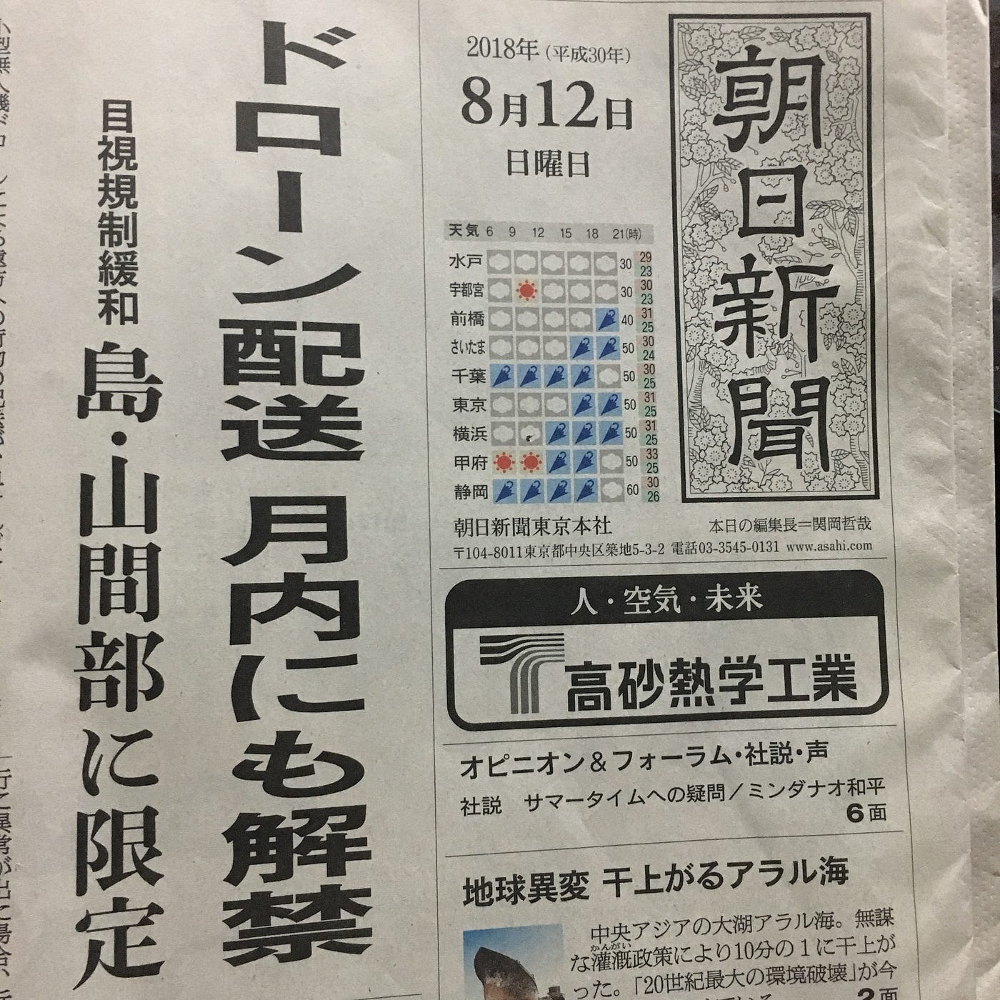
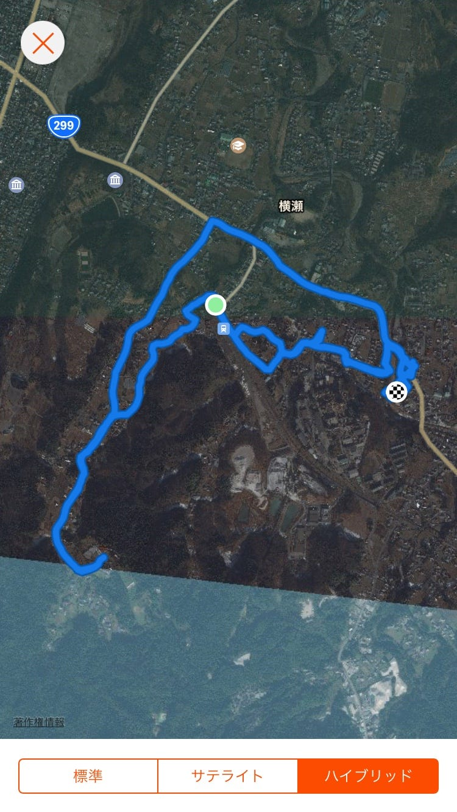
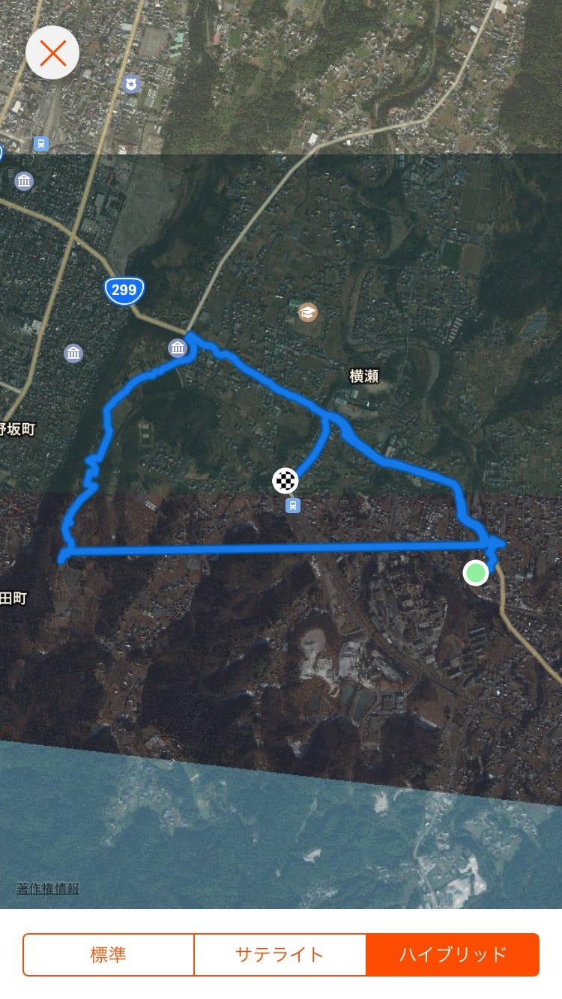

### ドローン目視規制緩和！/横瀬合宿

朝日新聞の一面にドローンに関する記事が掲載されていましたので、今回は取り上げてみます。

### 【ドローン配送 月内にも解禁】

要するに、

今までは航空法に基づき、

宅配業者は目視できる範囲のみでの飛行が許可されていましたが、早ければ今月中にこの規制が緩和され、

離島や山間部への飛行(物資の輸送)が可能になるということです。

また、許可される性能の条件として、

### ・飛行に異常が出た場合近くの安全な場所に着地できる

### ・急な気象の変化を察知できる気象センサーやカメラを備えている

が求められているそう。

現在楽天やNTTドコモ、日本郵便がすでに実験等に参加していますが、これからもどんどん増えていくんだろうな〜〜〜〜！！

ドローンが作るミライが着々と近づいてます…！

==========

ゼミ合宿@横瀬

ストラバ記録です。

うーーん！めっちゃ歩いた！！！

２日目帰り道onにし忘れた大失態。気をつけます。

イングレスを利用したアートや、2時間以上歩いてのジェラート屋さん。

横瀬の自然と触れ合いながら、自分の体力面・精神面の弱さを実感しました。甘々な学生のままではいられぬ。成長します。

