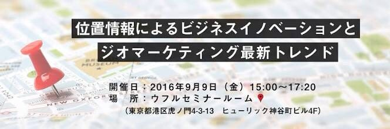
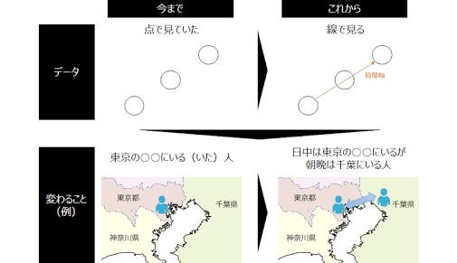

### 今週のおまめ

今週は位置情報広告が含まれるジオマーケティングについてお話させていただければと思います。少し広告のお話とは異なりますが、番外編だと思ってお許し下さい！

ジオマーケティングについては皆さんご存知かと思いますが、その名の通り地理情報を利用したマーケティングのことです。サンプリングやデータ収集、プレゼンテーションの各段階において地理的パラメータをリサーチ方法に利用するものです。もちろん位置が重要な要因となる経路選択、支店ごとの管理地域の決定から支店の位置決定にも関わります。ジオマーケティングの基本はデジタル地図であり、それによって概念を打ち破ったり構築したりもできます。また、その地図にデータを関連させる方法も重要である。とあります。

基礎知識としてこれらのことはもちろん重要ですが、わたし個人として重要だと考えるのはやはり最後の部分である地図にデータを関連させる、というところだと考えます。デジタルは進み、これからはの時代はさらに高技術を用いて地図とデータを一つにし、より使いやすい表現やコンテンツを生み出していくことが、ジオマーケティングにとっても重要なことだと思います。

もちろんこれには位置情報や地理的知識のみならず、マーケティングの知識と製品、価格、流通、プロモーションといった様々な観点が必要です。わたしはもちろん、双方においてまだまだ足りないところだらけなので、もっと勉強が必要です。

また、応用例として挙げられているのがユーザー選択によるコンテンツの表示や地理情報によって自動的にコンテンツを変更するものなどがあります。これも今どんどん進化を遂げていて、最初は国や地域といった大きなものから、現在はそれが個人の趣味趣向や過去の経歴からよりパーソナルなものへと変化しています。これから先もパーソナル化がどのように進化していくのか、アンテナを張っていきたいと思います。

今回は基礎的な話になってしまいましたが、今回はこのへんで失礼します☺︎
