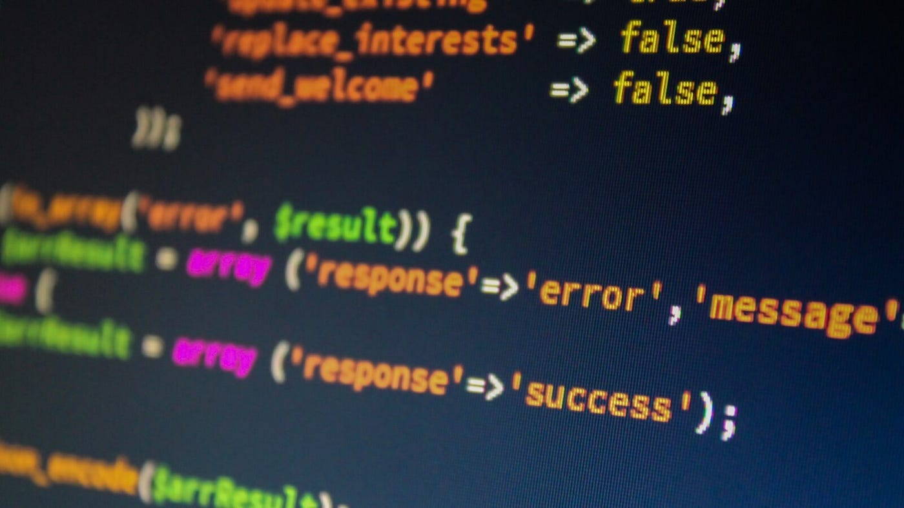

### 意外と楽？『Dreamweaver』でWebサイト作成

安藤です。

ゼミ合宿に参加できず、ブログも2週間提出せず、大変失礼しております。ゼミ楽しそうでしたね…行きたかった…

もうこころにゆとりがありません。

気づけば、就職活動を始めてから半年以上経ってしまっていました。とにかくもがいているだけですね。ですが先日、就活ついでに非常に興味深いセミナー（？）を受けてまいりました。今回はそのお話です。

### # Webサイト作成の体験実習

Web領域を専門に扱う某企業さんが実際に行っている、コンビニエンスストアや化粧品などのホームページ作成のプロセスを学ばせていただきました。

その際に使用したソフトが、Adobeの隠れた至宝**『Dreamweaver』**です。Adobe学生プランに入っていましたが、このソフトに関しては完全にスルーしておりました…

### # Dreamweaverとは？

ざっくり言って、**ホームページを作成するための総合ソフト**です。

卒制をやるにあたって、アナログの紙媒体で作るのもいいななどと何ヶ月か前には述べていたのですが、レイヤーやタグなど複数の情報を整理したいと考えるとWebサイトのほうがクオリティーも上げやすいし見やすいだろうしということで。でもGitHub上でのやり方もちょっとよくわからなかった…ゼミ内ではテンプレを元に作ったけれど、レイアウトすべて自分でデザインしたいとなれば…

壁はこれ…

これ。ドラマとかでよく見るやつ。ハッキングとかの。

自分がサイトをこうデザインしたい！と細かい情報をパソコンに教えてあげるこの文字列をつくるのを**コーディング作業**といいます。

Dreamweaverを知るまでは「サイト作るのにプログラミングとか専門的な文字列とか一から学ぶのは骨が折れそうだな…」と考えていました。でもこの作業、パターンを覚えてしまえば結構意外と簡単だということがわかったんです！

HTMLとCSSについてもちょっと区別がわからなかったのですが、セミナーでなんとなくの位置づけはわかりました。

**HTML**は**サイト定義、つまりサイトの名前とかURL情報とか、画像データの挿入とかの初期設定を行える場所。**

**CSS**は**それらを設定した上でのその見た目、色や幅、位置、マージンのとり方などの設定ができる場所。**

と大雑把に理解しました。（合っていますでしょうか…）

そのほか、画像からリンクに飛ぶためのソースコードやらいろいろ教えていただきました。とても大きな収穫でした。

次回以降、自分の復習のためにも細かい説明を載せていきたいと思います。
