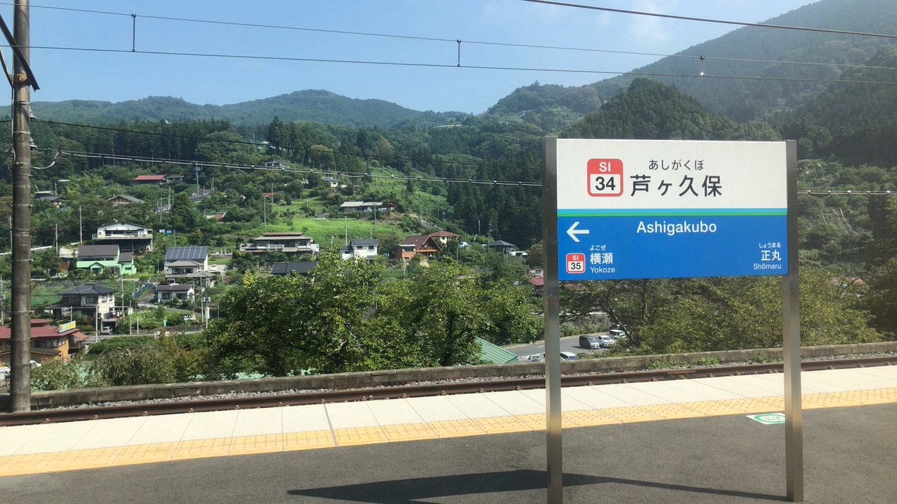
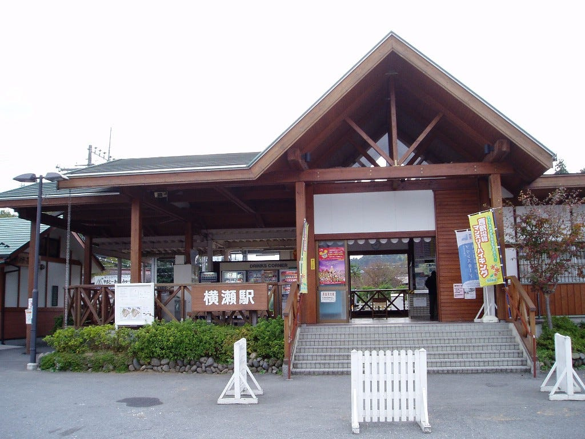
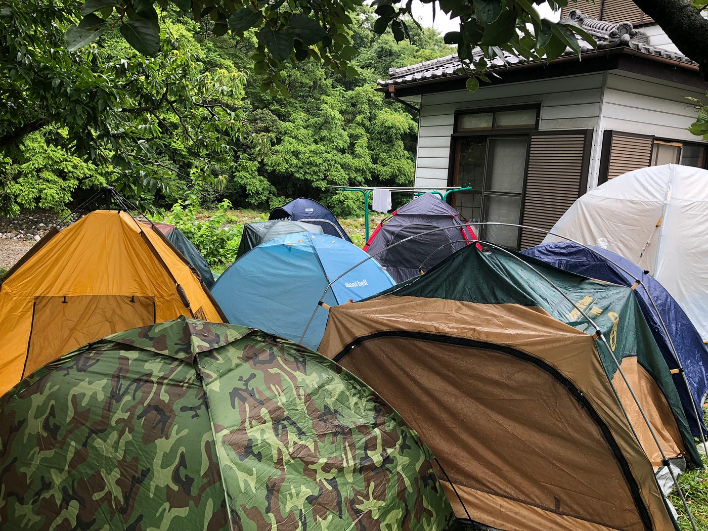
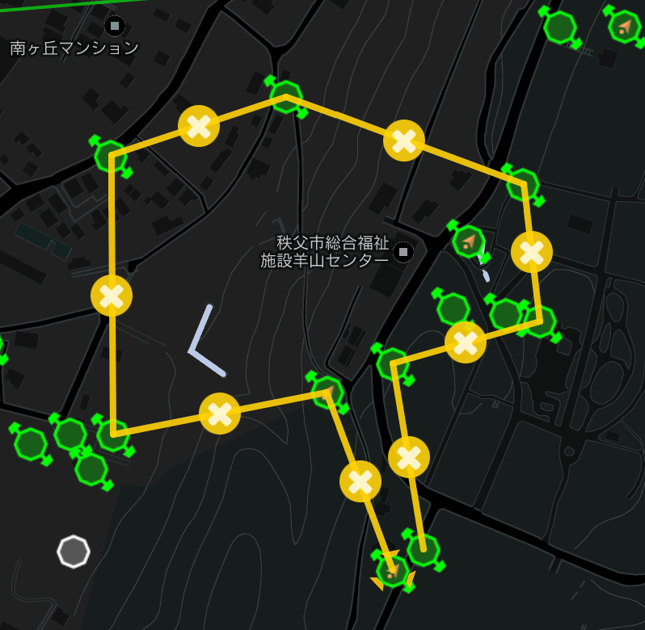
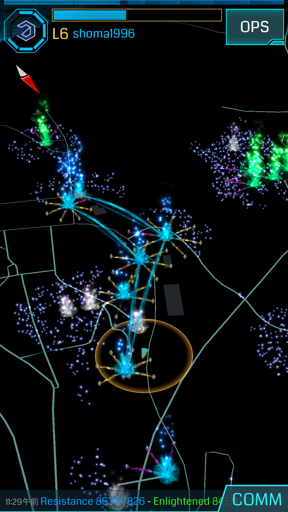
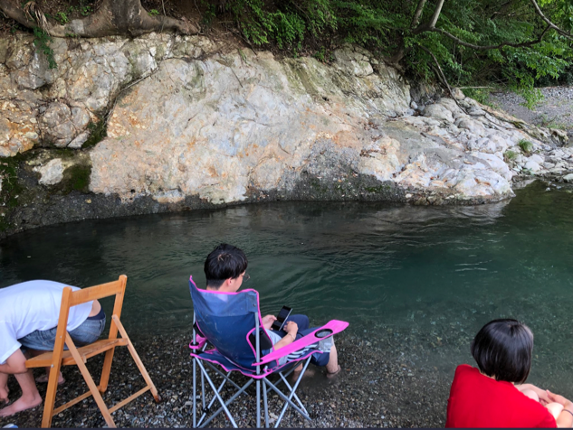
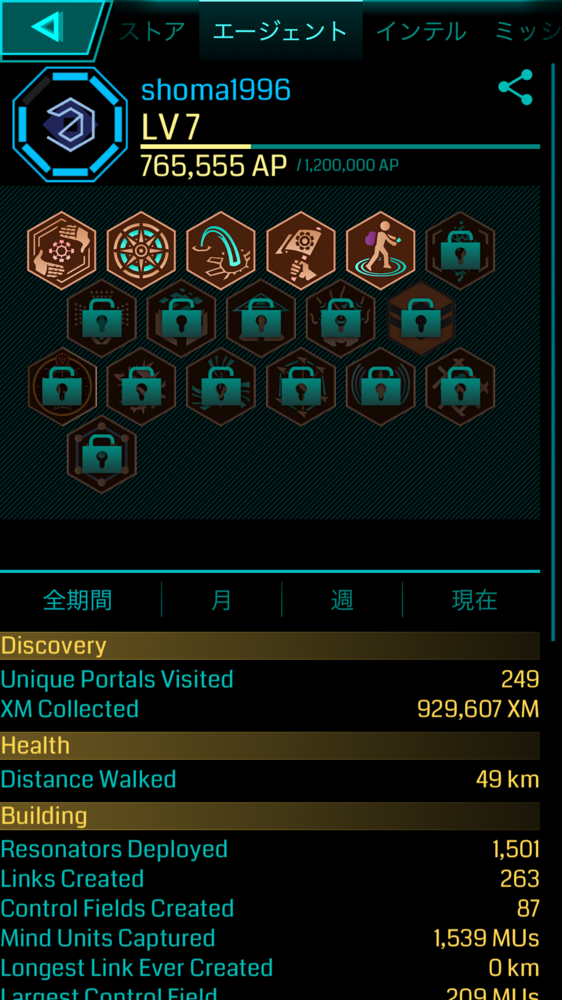

### 摩訶不思議！これを読めば秩父合宿に行った気になれるブログ！

みなさん、こんにちは青山学院大学３年の増田将馬です

8/5〜8まで秩父の古橋亭にて二泊三日の合宿が行われたのでその報告を行います！

[Japan, image by edymaru1996
Mapillary - Street-level imagery, powered by collaboration and computer visionwww.mapillary.com](https://www.mapillary.com/app/user/edymaru1996?lat=35.98275414205713&lng=139.10650374380793&z=13.89379831027726&username%5B%5D=ayame&pKey=hfmzOcE3VDbWTJp5lN43Jw)

### **１日目**

AM１０時に横瀬駅に集合ということで意外とゆっくりだなぁと思っていましたが僕の最寄駅の町田からなんと２時間！毎日大学に３０分しかかかってない僕にしたら千里の道ほどに感じました。ちなみに何ですけど横瀬駅の読み方って「よこぜえき」なんですね。「よこせえき」ってどこですか？と駅員さんに聞いて若干ニヤニヤしてたのはそういうことか…とこのブログを書いてる時に納得しましたorz…とまぁそんな話は置いといて横瀬駅に近づくほど下の写真のような景色になっていきました。内心「おいおい、本当にこんな田舎であってんのか？←失礼」と心配になっていましたが古橋教授が事前に位置情報をシェアしていただいたのでなんとかたどり着くことができました＼(^o^)／

ちなみに横瀬駅はこんな感じ。

写真を撮り忘れてWikipediaから拝借しています…
なかなかおしゃれで良さげな町やん！←（上からと期待を持ちつつ古橋亭へ移動を開始した僕らですが地獄が待っていました
**暑い…**
**熱い…**
**アツい…**
そうなんです。死ぬほど暑いんです
僕は体育会系卓球部に所属しているので移動時間とか走ったりしているので暑さには強い方だと自負していましたが横瀬駅から古橋邸までほとんど影がないんです！僕は田舎出身のかっぺ野郎なんですが（言いたいだけ）木に町が侵略されていてそこそこ日陰が多いんですよね
だけど秩父は太陽がギラギラ照りつけて体力を奪われました…

さーて長い前置きはこのくらいにしておいて１日目の内容に関してまとめましょうか！

**10:00 横瀬駅到着
10:50 古橋亭到着**
[https://www.strava.com/activities/1750293723](https://www.strava.com/activities/1750293723)
13:30 MapillaryでマッピングやポケモンGO、Ingressを行いながらジェラートへ向かって歩き続けました。ジェラート屋に到着したのは15:30だったので約２時間日差しが強い中歩きっぱなしだったのはなかなか辛かった…
けど到着した時に食べたジェラートは美味しかったです！もちろん写真は撮り忘れたのでみなさんのご想像にお任せします（汗[https://www.strava.com/activities/1750459849](https://www.strava.com/activities/1750459849)
[https://www.strava.com/activities/1750506650](https://www.strava.com/activities/1750506650)
**16:30 古橋亭到着**
[https://www.strava.com/activities/1750689932](https://www.strava.com/activities/1750689932)
**18:45 温泉へ出発**
[https://www.strava.com/activities/1751023233](https://www.strava.com/activities/1751023233)
**20:00 買い出しに出発**
僕は温泉の後買い出しの代表に立候補？押し付けられた？ので近くのスーパーに買い出しをしに行きました！自分が好きなシメサバを買い込んだのは僕の仕業です(*^◯^*)
**21:00 古橋邸に到着
22:00 夜ご飯**
夜ご飯は河原の近くでBBQを行いました。あかりがなくなかなか暗かったけどみんなが持ってきた懐中電灯のあかりでなんとか美味しくいただけました！食後のマシュマロも最高でした
**0:30 就寝**
寝るのはテントで寝たんですけどこんな感じになってました

僕は昼テントの入り口を開けっ放しにするという大罪を犯してしまったので仲良く蚊と寝ました。

### 2日目

**6:00 起床**
いやー前日歩きまくったので起きれたのは奇跡としか言えないですね。蚊に刺されまくって腕が真っ赤になってたんですけどなぜか昼頃には跡がなくなってました。人間の治癒力ってすごい！
**6:30ドローン操作**
なぜこんな早起きしたかというとドローンの操作を河原でやってみることになったからです。僕はトップバッターで操作しましたがなかなか面白いですね（適当）古橋教授の授業で何回か操作をしたことあるのである程度操作方法は知っていましたが何回やっても感動します！地面方５０メートルの世界を自分の携帯で見ることができるっていうのがすごいです！大げさかもしれませんが飛行機を自分で操作している感覚になります
**8:00 朝食
9:00 FW開始**
2日目のFWはイングレスでフィールドアートを作成する課題が出ました。

当初はこんな感じのフィールドアートを描こうと計画していました
８月６日は広島に原爆日だったので原爆の煙を頑張って作ろうとしていましたが秩父民が作り上げた鉄壁のポータルを破壊できず断念しました…
それで結局作ったのが

このブーメランという…
まぁなんというか失敗ですよね…
反省点としてはチーム内の平均Ingressレベルが低かったことと自分が前日張り切ってバスターを使いすぎたことが原因です
[https://www.strava.com/activities/1753034914](https://www.strava.com/activities/1753034914)
僕らの班は全員効率重視だったのでパパッとやってパパッと帰ってパパっと川で遊ぼう！と言っていましたが結局帰宅したのは３時間後の12:00でした…
**12:00 古橋邸到着**
FWから帰宅し少し時間が空いたので家の近くの川で涼んでいました

みんなは川の近くで携帯をいじったり、雑談をしていましたが僕を含めた数人は我慢できずに川に飛び込んでいました（いつまでたっても童心は忘れません
**16:30温泉へ出発**
[https://www.strava.com/activities/1753412077](https://www.strava.com/activities/1753412077)
この日は雨が心配だったため早めに温泉に向かいました。幸い行き帰りは雨に降られずなんとか温泉で温めた体を雨で冷やさずに帰宅できました！
**18:30 古橋邸到着
21:00 夜ご飯**
この日の夜ご飯はカレーでした。カレーを作るために具材を細かく刻んでいたんですが普段僕は包丁を握るどころかキッチンに侵入し、ガスを使うことすることすら母親に禁止されているので全くと言っての素人でした。ですが中学生時代に練習したりんごの皮むきの技術を駆使し、微力ながら力になれた…はずです。
僕の血液はラーメンの汁でできているので定期的にラーメンを食べないと体調を崩してしまう体質です（嘘）。古橋邸の近くに怪しいラーメン屋があったので夜な夜な愉快な仲間たち&先輩一人を引き連れて行ってみましたが残念ながら開いてませんでしたorzしぶしぶコンビニでカップ麺を買って食べました
**1:00 就寝**
この日の夜はあいにくの雨でした。浸水はしてきませんでしたが湿気がひどく寝づらかったです。次のキャンプでは何か対策を考えておかなければ…

### 3日目

**7:00 起床
8:00 朝食**
**10:00 ドローン練習**
最終日の朝もあいにくの雨でFWはできませんでした。その代わりに室内でドローンの操作、設定について学びました。今度大阪のイオンでドローンのイベントがあるらしくそのスタッフとしてゼミ生が呼ばれているので全員真面目に聞いていました。
ドローンの基本設定や操作性、子供に対して教える場合何に気をつけなければいけないかなど、今後も必要になるスキルだと感じました。
ドローンのヘリポートを仕舞うのはなかなか難しいと言われていましたが自分は一発でクリア！
これだけはセンスがありそうです(⌒▽⌒)
**12:00昼ごはん
14:00横瀬駅へ出発
15:00解散**
実は１日目の電車で帽子を無くしていましたが届け物センターに届けられていました！いやー日本大好き！と再度確認しました笑
買って一週間しか立っていなかったのでよかったです！

### 感想&後日談

まずこの合宿中で学んだ/成長したことはドローンの操作性、野生で生き抜く根性、雨は大敵ということです。ドローンの操作性、技術、知識に関しては今後自分で培っていける部分なので自分でドローンを購入したいと思います。ヨドバシカメラでピッコロ買ってきます！ドローンバードメンバーに参加しているので腕を磨きたいと思います。
普段住んでいるマンションは１０階なので蚊のことは気にしていませんでしたが、今回の合宿で友達になれるほど関わりました。あいつら絶対に次あったら撲滅させます。

合宿中はIngressを使って色々なことを学びました。合宿中はレベル６でしたが。このブログをぐだぐだ書いてる間に７になりました！

次のゼミの活動はイオンかな？
その時までにはドローンの操作が上手くなっているようにします。

#### おしまい
