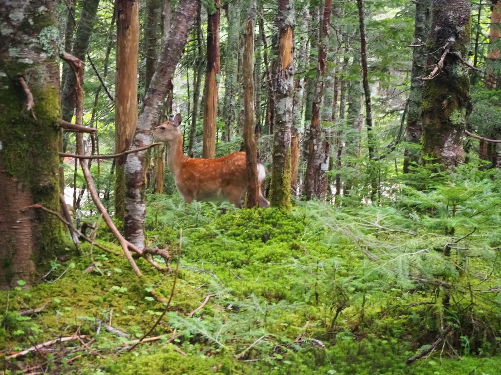
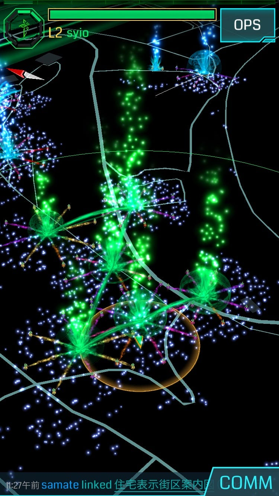

### 自然Week

今週は横瀬と八ヶ岳に行ってきました！

(ゼミ合宿の写真を撮りわすれたので八ヶ岳で見た鹿)

> ゼミ合宿まとめ

今回は一泊して途中まで横瀬合宿に参加しました！

### 1日目:横瀬散策

初日は10時に横瀬に集合しすずしい古橋邸でお昼をたべたあと、

横瀬周辺を歩き「おきうね農園」という所までジェラートを食べに行きました。

かなり暑い日でしたが、この日の歩数は なんと…

### 26,210 歩…！！

普段5千いくかなくらいなので驚きです

[朝のランニング - しおり 山口's 8.0 mi run
しおり 山. ran 8.0 mi on Aug 5, 2018.www.strava.com](https://www.strava.com/activities/1751264901)

### 2日目: ingress フィールドアート

2日目はチームに分かれて初のフィールドアートを作りました！

Zです。

最初地図を見ながら何を作るか考えていたのですが、意外と形にできなかったり距離が遠すぎたり、また他のアートと重なってしまったり、、、

何回か変更を重ねてやっと作ることができた思い出の私の初アートです。

自分は地図を見て現地点からの距離感を掴むことができてないとわかりました。場所の把握能力を次の課題にします！

[朝のランニング - しおり 山口's 3.9 mi run
しおり 山. ran 3.9 mi on Aug 6, 2018.www.strava.com](https://www.strava.com/activities/1753087154)

その数日後に

### 八ヶ岳に行きました！

緑がすごくきれいだったのですが、自分がどのくらい歩いたかなどの記録をし忘れてしまい、、

でもゼミのおかげで、山の形とか植物とか地形等ただ見て歩くだけでない山登りができました。

横瀬も八ヶ岳も本当に自然がきれいで、充実した1週間をありがとうって感じです。

以上、合宿レポートでした。
