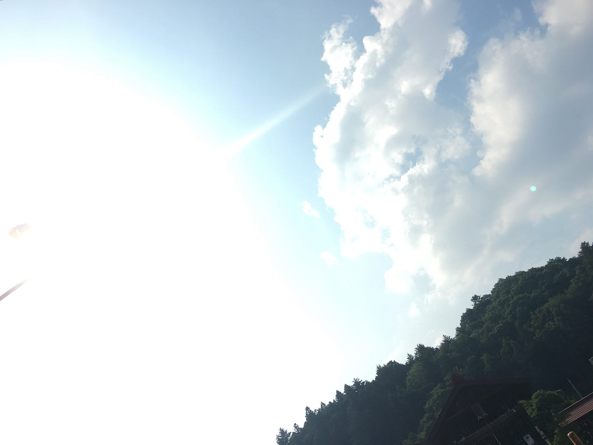
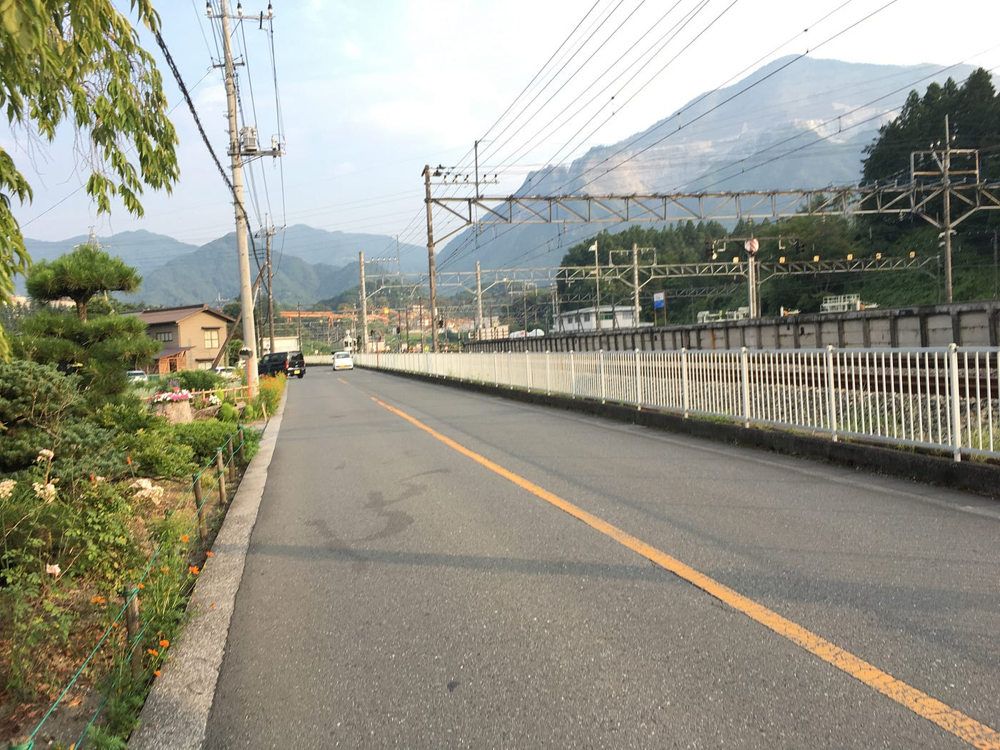
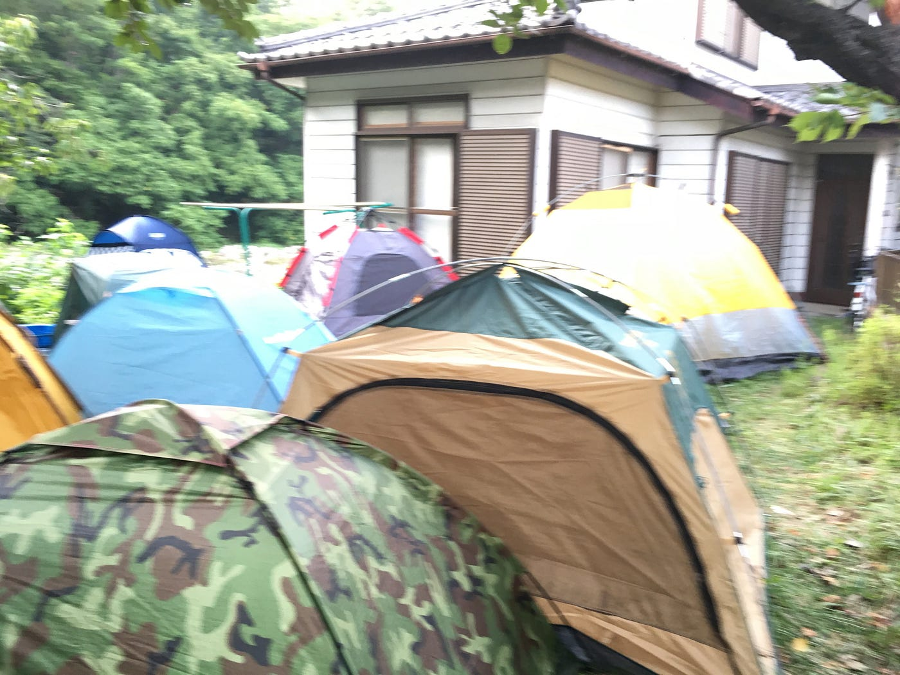
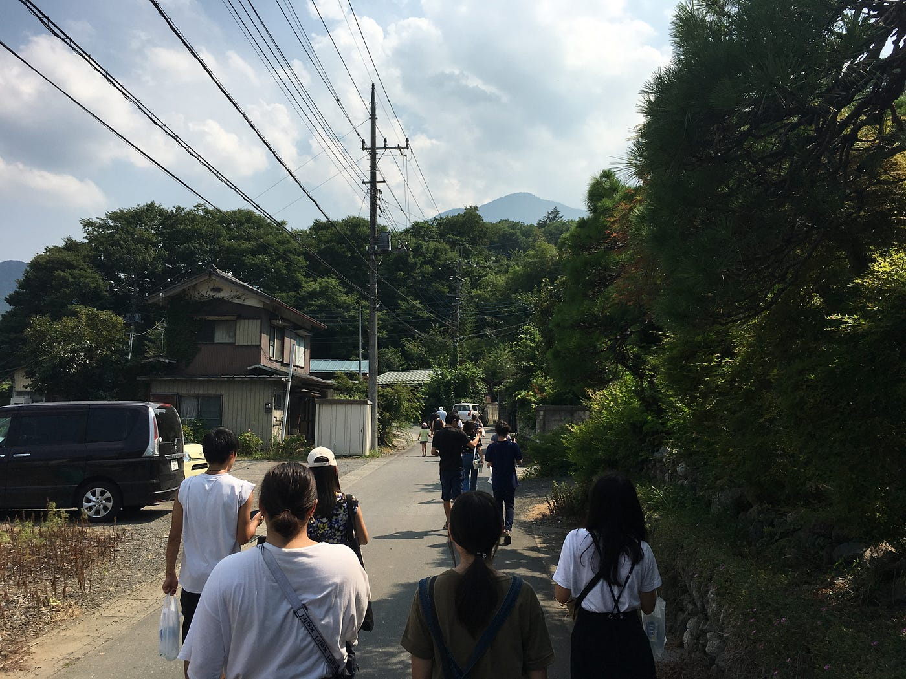
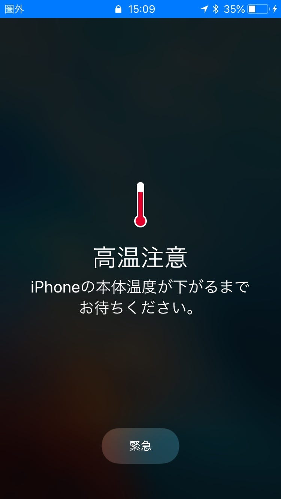
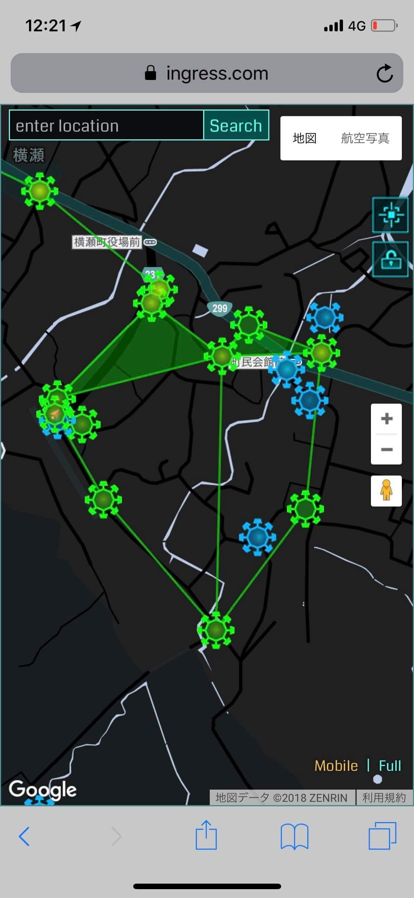

### スマホも悲鳴をあげる！？ 激アツの２泊３日合宿 in 横瀬町

古橋ゼミ3年の福王です。僕は、埼玉県秩父郡の「横瀬町」に8/5~8/7の間、古橋ゼミの夏合宿に参加しました。横瀬町は宿泊先である古橋先生の実家があり、池袋から電車で1時間40分ほどの場所です。

### **１日目**

横瀬駅に着いて最初に思ったのは、「The 田舎」でした。駅周辺にコンビニが見当たらず、辺りは山と畑と民家ばかりで、3日間大丈夫かと心配になりました。幸い、宿泊先の徒歩2分圏内にコンビニがあり、一安心できました。

古橋邸に着いてすぐにテントの組み立てをしました。今までテントの組み立てをした経験がなく、さらに持参したテントに説明書が付いなかったので、組み立てに時間かかるだろうなぁと思っていました。しかし実際には、古橋先生に手伝っていただき、あっさりと組み立てられました。また、テントを組み立てるときには、日陰になる場所・地面の石をどかしておく必要があると理解できました。

午後から、**Strava**と**Mapillary**で**ストリートビュー撮影**をしながらおきうね農園までジェラートを食べに行きました。この日は35度を超える猛暑の中、暑さに悲鳴をあげながら30分くらい歩いていると、iPhoneが火傷しそうなほど熱くなってました。iPhoneの画面を見てみると、iPhoneも熱さに悲鳴をあげてました。そんなこんなの暑さを耐え抜いた後に食べたジェラートは...神。

### **２日目**

2日目は、**Ingress**で**フィールドアート**を作成しました。最初は、田舎で平日の昼間にIngressをやっている人なんていないだろうから、すぐに終わるのかなぁと思っていたが甘かった。僕たちのグループはフィールドアート中にIngressガチ勢に遭遇してしまった。何度もポータル間を歩き回り、フィールドアート完成できないんじゃないかと焦っていました...。しかし、なんと仲間の元にIngressガチ勢の方からコンタクトがあり、フィールドアートを協力してもらえることに。まさかIngressで昨日の敵は今日の友みたいなことが起こると思ってなく、とても面白い経験でした。今回初めてフィールドアートをしてみて、事前のルート設定と各々の役割分担が効率的に進めるために重要だと理解しました。また、Ingressのレベルが低い人は何もできないと思っていましたが、レベル3の僕でもポータルキーを集めるくらいの役割ができると理解しました。

### **３日目**

3日目は、天候が良くなかったので、屋内で**ドローンの勉強会**がありました。ドローンの組み立て方やコントローラの設定方法、イオンモールでのドローンイベントに向けて子供への説明の仕方を教えていただきました。ドローンイベントの運営は安全が第一で、そのためには子供たちに正しいドローンの操縦を知ってもらい、子供のたちの一挙手一投足に注意する必要があると理解しました。勉強会の最後にヘリパッドの収納の練習をしました。最初は全くできなかったけど、武末君の雑巾を絞るような感覚というアドバイスを聞いてから上手くできるようになりました、ありがとう。

### **最後に**

今回のゼミ合宿では、Ingress・Pokemon Go・Strava・Mapillary等のアプリ、テントの設置やBBQ、ドローンの設定・操縦等フィールドワークに関して必要となる基礎の基礎を学べました。初日は猛暑、2日目は豪雨と天候に恵まれませんでしたが、異なる天候でのテント生活は面白い体験でした。今後のゼミ活動では、今回の上積みができるようにしていきたいと思いました。

**活動記録**

Strava

[朝のランニング - 福王 光剛's 17.5 km run
福王 光. ran 17.5 km on Aug 5, 2018.www.strava.com](https://www.strava.com/activities/1751157736)

[朝のランニング - 福王 光剛's 14.5 km run
福王 光. ran 14.5 km on Aug 5, 2018.www.strava.com](https://www.strava.com/activities/1753508457)

[午後のランニング - 福王 光剛's 1.8 km run
福王 光. ran 1.8 km on Aug 7, 2018.www.strava.com](https://www.strava.com/activities/1755223126)

Mapillary

[Japan, image by fukupon
Mapillary - Street-level imagery, powered by collaboration and computer visionwww.mapillary.com](https://www.mapillary.com/app/?lat=35.9750292962752&lng=139.09195208934983&z=17&menu=false&pKey=_Ew0W1iDImxEK5Z7usGxvA&focus=photo)
