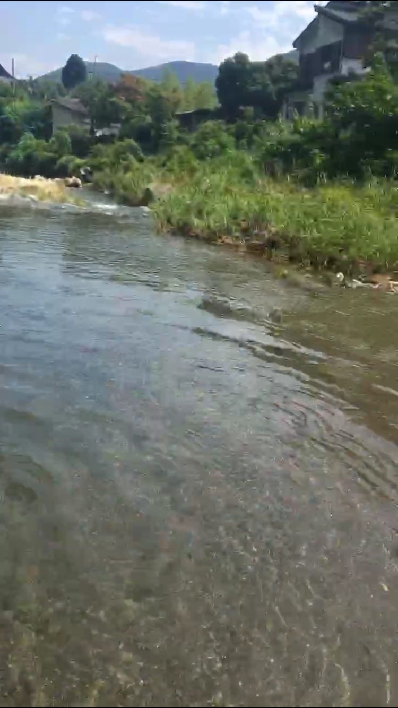
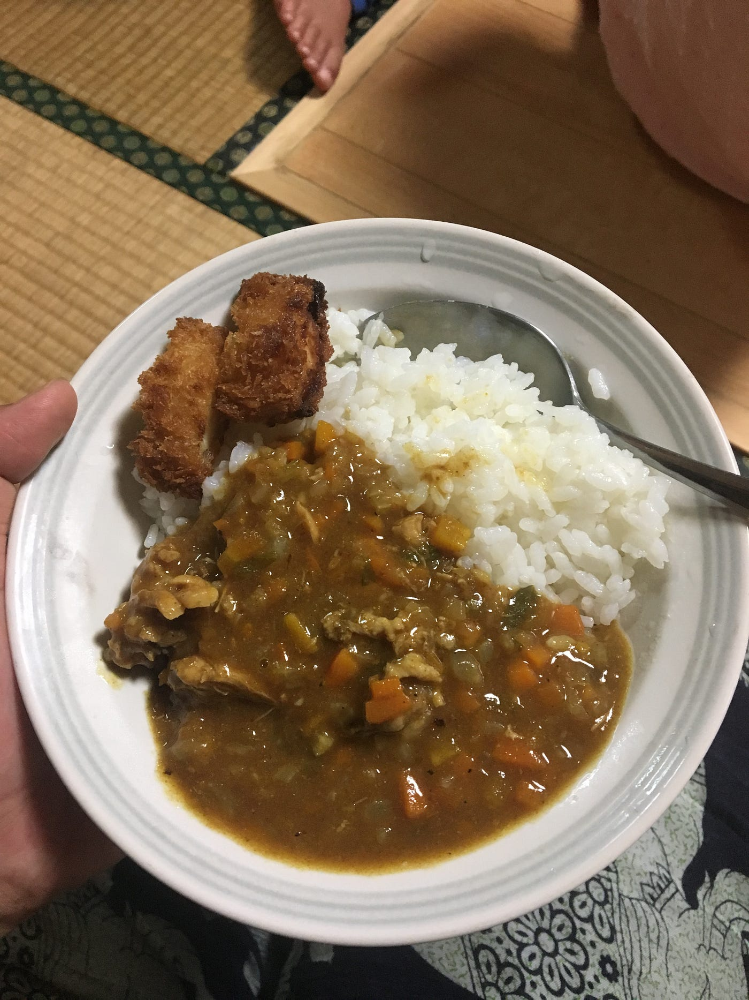
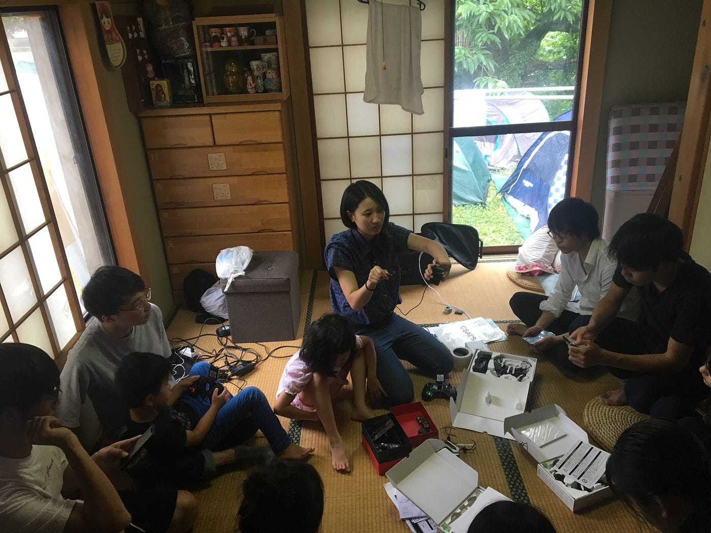
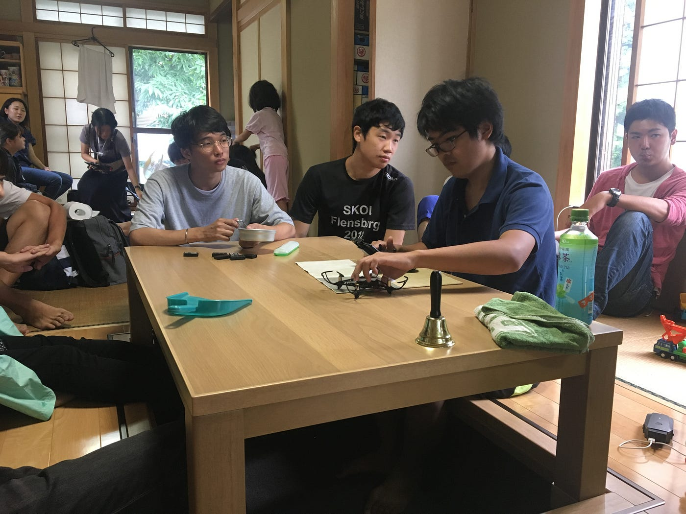

### トンネルを抜けるとそこは

雪国ではありませんでした。

緑豊かな山々でした。
川が綺麗。
私の地元から西武池袋線に乗って横瀬駅に向かうと途中少し長めのトンネルを通り抜けます。
去年の３月同じくゼミ合宿のために古橋邸に向かう電車の中で友達と話していたら、トンネルを向けた途端にいきなり雪景色が広がっていてびっくりしたことを思い出しました。
ここから、夏でも、一人で電車に乗っていても、トンネルに入るとなんとなく出る瞬間を期待するようになりました。

そんな電車の旅です。

### ゼミ合宿

８月５−７日、秩父の古橋邸でゼミ合宿が行われました。
かくいう私は二日目からの参戦でした。

そして二日目からだとあまり歩かなかった。
駅から古橋邸までとお風呂に行くまでの道のりなどの記録はこちら

[https://www.strava.com/athletes/11384539](https://www.strava.com/athletes/11384539)

二日間を通してほとんど子守をしていた私がこの合宿を通して学んだことは、大人数での共同生活について、です。

というのも、
私は高校時代、大学時代を通して運動部など合宿がある部活などに所属していたことがないので、実は20数名で共同生活をすること自体が初めてでした。

夕飯のカレーを作るにも材料の量がおかしい（メニューはケララカレー）

大人数だと役割分担をするにも大変だということに気づかされました。

見ず知らずの人たちとご飯を作ることはなにかと指示を出したり自分が何をやろうかと考えることにもいちいち気を使うし体力はいるしと大変です。

こちら完成したケララカレー。

また3日目の朝は屋内でドローンの飛行練習。

3年生に教えているあやめを激写。

これもまた人数が多いとスペースがない。今まであまり他人と密着してなにか作業することが少なかったので人との距離感に新鮮味を覚えました！

共同生活ってこんな感じなのか！

今までドローンを飛ばすにも4年生の多くて計9人ほどだったのが20数名いるとなかなか順番を回すにも一苦労。

あやめレッスンに全員で参加しました！

1日目から参加していればもう少し書くことがあったのかな…笑笑

自分でしっかりIngressは進めていこうと思います。
