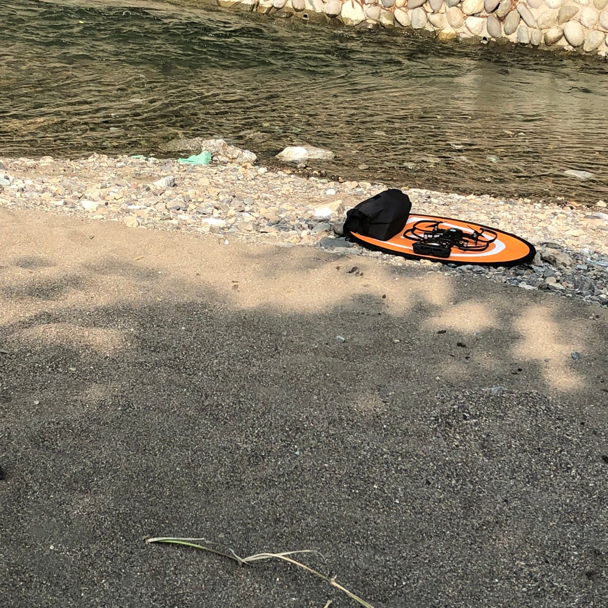
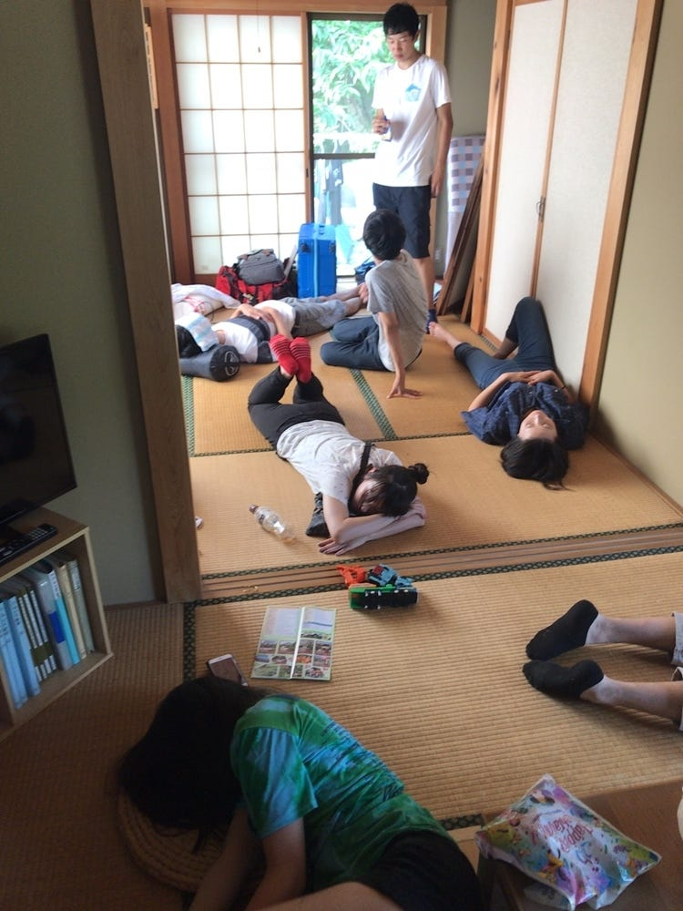
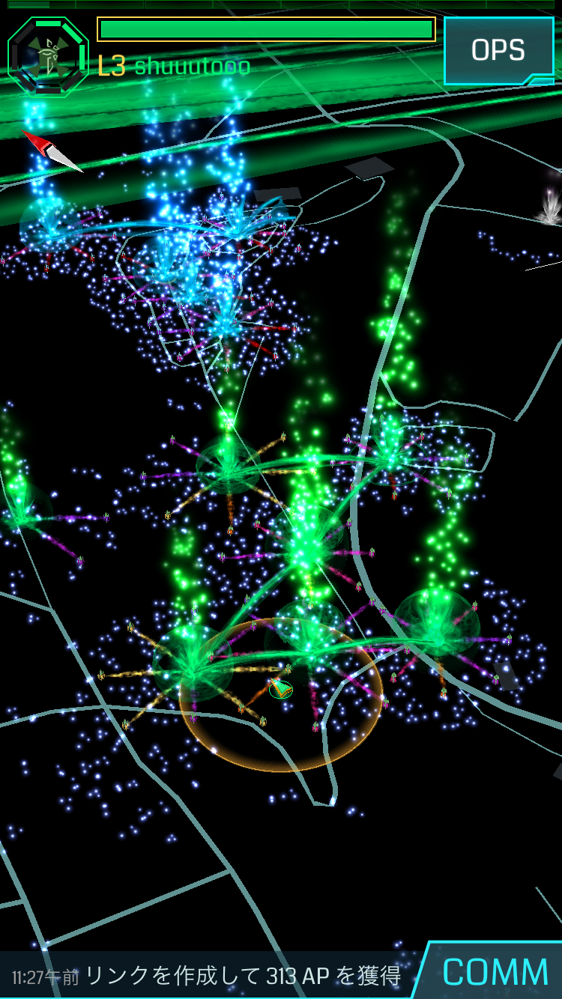

### ”ホット”な合宿三日間

古橋ゼミ三年の松本です。埼玉県秩父郡横瀬町にある古橋邸で初の合宿に参加させていただきました。合宿、とにかく暑かったですね。。。家ではクーラーに頼りきりだったみなさん、川に入ったりしてなんとか涼んでました。クーラーのない時代なんて今では考えられませんね。

#### 一日目

クーラーの話はさておき、一日目の活動報告です。一言でいえば散歩ですね。とにかく灼熱の中歩いて歩いて歩き回った記憶しかありません。実際は、[Mapillary](https://www.mapillary.com/)でストリートビューのデータを取るためにスマホ片手に歩いていました。

[Map data at scale from street-level imagery
Mapillary is the street-level imagery platform that uses computer vision to fix the world's maps.www.mapillary.com](https://www.mapillary.com/app/?lat=35.98383797682641&lng=139.09847357247554&z=14.401001518985595)

みなさんゴール地点であったジェラートを食べるために必死にパシャパシャ撮っていましたね。そして、辿り着いた先の至福のひと時。猛暑日のジェラートは格別でした。

帰ってきた後はみなさんぐったりでしたね。無理もないです。お疲れ様です。この後は温泉入ってバーベキューして、さぁ寝よう！ってところで問題発生。テントが暑い暑い。一時間おきに必ず起きてしまいました。そんな気候的に”ホット”な一日でした。それでは、寝不足から始まる二日目です。

[合宿1日目 - 洲 松本's 10.6 mi run
洲 松. ran 10.6 mi on Aug 5, 2018.www.strava.com](https://www.strava.com/activities/1751430395)

#### 二日目

二日目は朝から始動しました。大きな目的は[Ingress](https://ingress.com/)のアプリを使ってフィールドアートを作ること。絵を描くのが得意ではないため、絵を描くのかと覚悟していましたが全く違いました。簡単に言えばIngressのポータルをつなぎ合わせて何か形を作るというものでした。一般の方との闘いがあったり、当初の目的とは異なる成果になったりと大変でした。この日も一日目と匹敵するくらい歩いたのですが、チームワークだったせいか、迷惑をかけないように行動していたらあっという間に時間が過ぎていました。集中力ってすごいものですね。かと言って、一日目に手を抜いていたわけではありませんよ。

ただ、この二日目と三日目の朝にやったドローンが自分の中では印象的でした。今何かと世間を騒がせているドローン、操縦はかなり難しいのではとビビッていましたが、意外とシンプル。古橋ゼミ、ドローンガチメンバーとして腕を磨きたいと思います。二日目はSNSを駆使した活動やドローンなど”ホット”な話題目白押しな一日でした。

[合宿2日目 - 洲 松本's 4.4 mi run
洲 松. ran 4.4 mi on Aug 6, 2018.www.strava.com](https://www.strava.com/activities/1753029388)

[合宿2日目 夕方から - 洲 松本's 2.6 mi run
洲 松. ran 2.6 mi on Aug 6, 2018.www.strava.com](https://www.strava.com/activities/1753527711)

#### 三日目

三日目はあいにくの天気でしたが、テント内は非常に心地よく睡眠も快適で目覚めのいい朝でした。三日目は雨のため午前中のドローン以外の活動はなく、予定よりも早めに合宿が終わりました。

[合宿3日目 - 洲 松本's 48.5 mi run
洲 松. ran 48.5 mi on Aug 7, 2018.www.strava.com](https://www.strava.com/activities/1755498923)

#### 最後に

このように、ブログを書いてみて合宿中辛いこと、また難しいことなどたくさんありましたが、一週間経った今すごく楽しかったと実感しています。古橋ゼミではこのようなアウトドアの合宿でフィールドワークを多く扱うということで非常に楽しみです。

ん？三日目の”ホット”なことは何かって？

無事に合宿を終えられて”ホッと”しています！

以上、古橋ゼミ三年の松本でした。ありがとうございました。

[Japan, image by シュートm
Mapillary - Street-level imagery, powered by collaboration and computer visionwww.mapillary.com](https://www.mapillary.com/app/user/%E3%82%B7%E3%83%A5%E3%83%BC%E3%83%88m?lat=35.98289462275429&lng=139.1055396573051&z=17&feedItem=user--oSzBN4nYYJYa84F-6e3Ng-activity-user--oSzBN4nYYJYa84F-6e3Ng-publishing_done-image&pKey=OURtZX83cigDsNOaIszh8Q)
