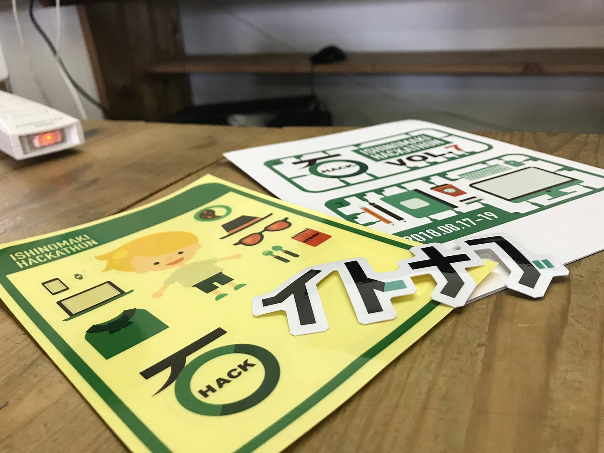

### 石巻ハッカソン体験記

宮城県石巻市に拠点を置く、一般社団法人イトナブ主催の石巻ハッカソンに絶賛参加中。私はIT初心者のため、ハッカソンでバリバリ開発するというよりは、プログラミングのお勉強に来た。

8月17日から19日の３日間のハッカソン。今日は二日目が終わり、明日は最終日で発表がある。今回は17チーム参加チームがあり、明日の発表がとても楽しみだ。私もこの３日間での成果物を発表するらしいので、、少し緊張や。

石巻市まで、青学非常勤講師の山口先生が連れて来てくれた。娘さんも一緒に。ハッカソン前日はみんなでトランポランドというところでひたすらトランポリンした。(笑) めっちゃ楽しかったけど少しまだ筋肉痛が、、笑 山口先生ありがとうございました！！

私が参加しているIT初心者向けの教育プログラム、その名もIT Boot Campにて、今回のハッカソンのスポンサーでもあるGithubのプロモーション担当の方が半分仕事、半分ITのお勉強にきていて、同じ釜の飯を食べていろいろお話をしたり、イトナブの方達と仲良くなったり、今後の卒業作品のアドバイザーになってくれる宣言してくれたり、やさしい方多め！

私はウェブベースのITの勉強を。卒業作品ではiPhone版のアプリを開発する予定なのだが、今回いろいろ話を聞いて、PWAでもありだな〜と方向転換を考えてる。日本ではそれなりのiPhone普及率だが、海外と世界全体を考えると、iPhone固定にするのにはもともと少し悩みがあったため、開発環境やユーザーを考えた時にPWAなかなか良いなと。

ちなみにPWAとは「PWA = モバイルのWEBページでネイティブアプリのようなUXを提供するためのもの」By Qiita.

そんな卒業作品のプロトタイプがこちら。

まだブログでは卒業作品の話はあまりしていないが、（どこに既存のOSM編集ツールと比較して新規性があるのかを伝えるために、他のOSM編集ツールの話をしている最中。）OSM編集ツール、とにわけ地物データ(buildingタグなど)を加えるのに特化した、現場編集型のアプリを作ろうと考えている。

上記の画像は、プロトタイプというよりはUIの構成中といった具合だ。実際まだボタンとしての機能は縮尺を変換するボタンと、現在地に移動する右下のボタンしか動かない。他のボタンはアイコンを貼り付けたのみ。ここからが本番だ！

ちなみにLeaflet活用である。プログラミングの楽しさに触れつつ、これからも頑張っていこうと思う。ソースコードはGithubで随時アップし、先生と話し合って方向性に悩みながら完成を目指す！11月のSotM Asiaまでにバージョン１完成を目指して、、。

[AyameO/GraduationWork
GraduationWork - 卒業作品進歩状況github.com](https://github.com/AyameO/GraduationWork)

それでは明日のハッカソン発表楽しんでくるぜ〜。ほんとにありがたいハッカソンだ。改めてイトナブさんありがとう！！出会いあり、いろいろ学ばせてくれることあり(ITの知識だけでなく、地方で活動する大切さ)、3.11と現状を知る機会あり、イトナブさんは熱いマインドのある団体だ。

以上、明々後日から３週間、アフリカに行くのでブログは毎週末というよりはネットが繋がったら。とりあえず明日、発表内容を共有する。あとはアフリカ体験記ちょっとやる。
