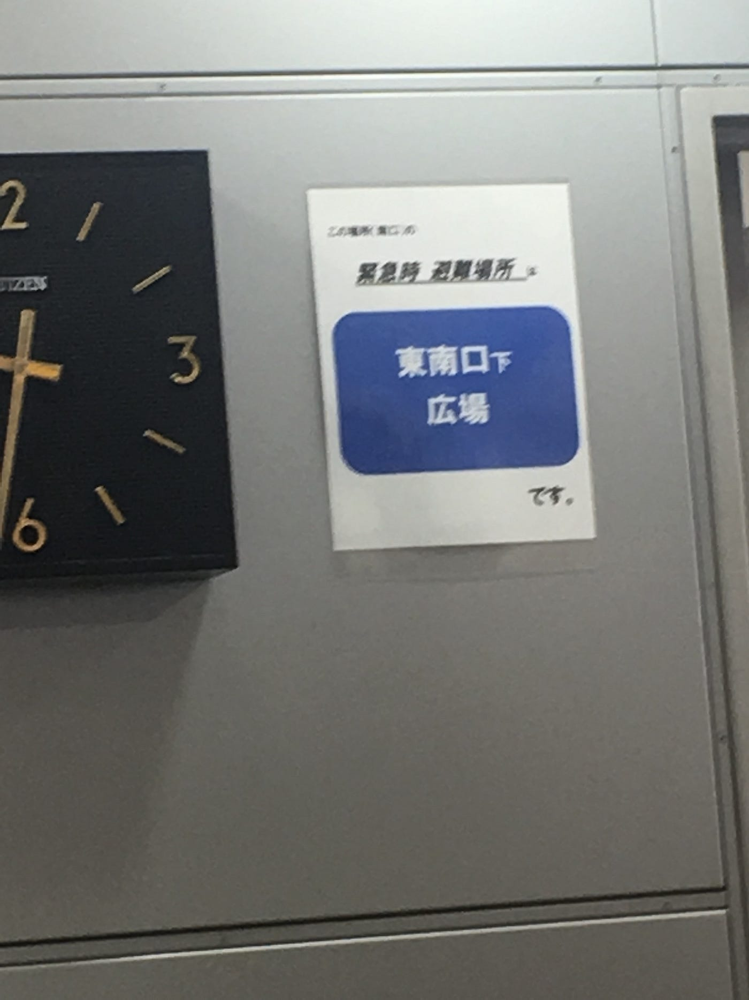
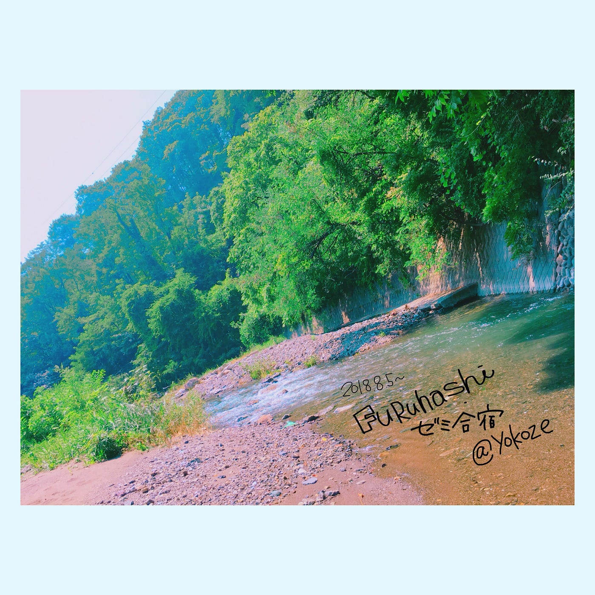

### 駅で見つけた避難案内

今週は、個人的にとても忙しかったです。

皆さまお盆休みいかがお過ごしだったでしょうか？

私は群馬にある母の実家に帰省をちょこっとして、御墓参りをしてきました。

お墓のお掃除は毎年恒例の長野家の行事。

急に過ごしやすくなった気候に加えて、御墓参りも無事済ませ、

夏のダラダラした重たい気分もなんだか軽くなった気がします。

さて、

本日の本題です。

正直なところ、今週は特にブログの記事に出来るようなテーマが無く、

いつも以上に執筆ペースがノロノロです。

(前置きが長くなってしまったのもこのせい…)

ーーーーー

さてさて、

以下の写真はJR新宿駅の南口改札、駅員さんがいるスペースの壁に貼ってあった、避難場所案内です。

あまりに手作り感があるのと、

めちゃめちゃ見にくいトコロに表示があったので、

もしかしたら駅員さん向け……？

駅員さんに聞いてみよう、と思ったのですが、

カウンターは長蛇の列。

……。諦めちゃいました。

面目無い。

避難案内のようなものを見つけたら、随時写真に収めて、こちらで報告します。

気にしてみると意外とあるもんだな〜という感想を持ちました。コレクションしよう。

おまけ。

ゼミ合宿時に撮った写真をイロイロ弄ってみました。

ナツ。カワ。ミドリ。

いいですね。

窓を開けて寝れる季節がそろそろ来そうですね。

嬉しい……。
