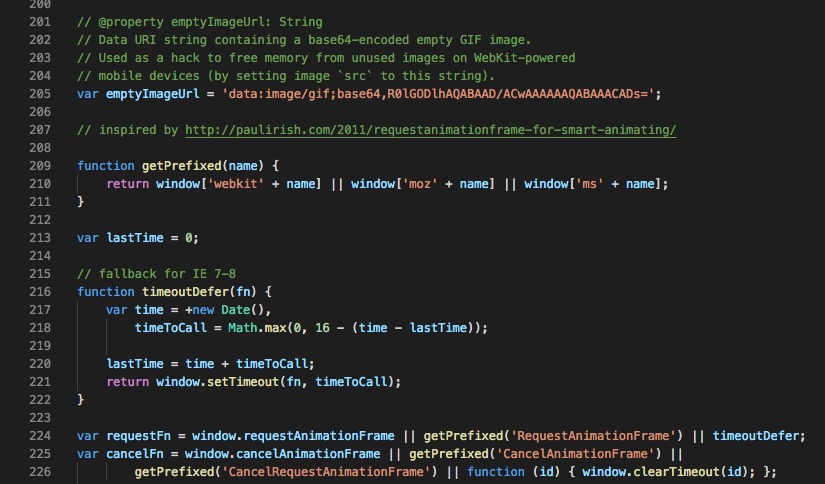

### var と let 。実際は、、

JavaScriptにおける、varとlet問題。
varしか使われてないソースを見た時、人は負の眼差しへと変わる。

JavaScript界(以下JS界)ではしばしばこんなことが議論されるわけだが、はじめにvar,let,constの変数宣言の違いを紹介する。

var = 関数スコープ。ローカル,グローバル変数。再宣言可、再代入可。
let = ブロックスコープ。ローカル変数。再宣言**不**可、再代入可。
const = ブロックスコープ。定数。再宣言**不**可、再代入**不**可。

varにおいてはグローバル変数にも、ローカル変数にもなる。関数のどこで宣言しても、先頭で定義したものとしてみなされる。つまり巻き上げ。ES2015以前はletやconstはなかったため、古いブラウザに対応するためには変数宣言にvarを使いがちだが。

### var 挙動の予測困難説

スコープの領域や、再宣言、再代入が両方ともできるということから挙動の予測が難しい。エラーが出ないで値がundefinedって出てくるって、恐ろしいよね。実装例を下記に貼り付ける。

[【JavaScript】varとfunction"文"は使わずにletとconstを使って欲しい（切実） - Qiita
この記事で言いたいこと タイトルの通りです。 varとfunction文は使わずにletとconstを使って欲しい。 ※多少自分の好みが混ざっています。宗教戦争にならないことを祈ります。 ※2017年になって今更というツッコミ...qiita.com](https://qiita.com/mejileben/items/b8502173216aebae8d36)

実際、再代入ってあんまり必要ないよね。constを基本的に使いつつ、再代入が必要な時だけlet使うと良いらしい。

ていうか個人的にfor文だったり、他のソースを見てとりあえずvarはletに変えよう的なね、考えなのかな〜って思っていたら

一番はじめに貼り付けたリーフレットの一部。というかリーフレットは他のオプションの機能においても、全部var。大切なことなのでもう一度言う。**全部var**。

な！！！ぜ！！！！？

これを見てプログラマーの友達は、「汚いな〜」って驚いてた。
やっぱり他人から見ても綺麗なコードかきたいよね。

const 使ってるからここは変えてほしくないんだ。初期値のままね。みたいにさ、コード上で他人と会話できるっていいよね。

そんなJavaScriptを勉強し始めた学生の疑問とぼやき。新しいものは積極的に使うべきと学んだ。

あ、そういえば、石巻ハッカソン IT Bootcamp部門、IT初心者部門で優勝賞をいただき一万円分のプリペイドカードをいただいたので、サーバー代に使わせてもらいます。ありがとうございます！！

では8/21–9/12までタンザニア、ケニアいってきまーす！
