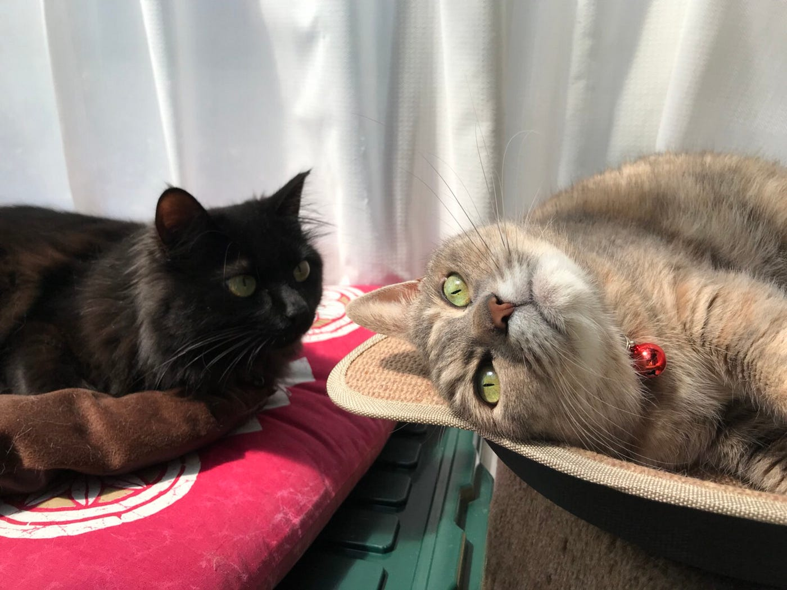

### 外に出る。

今週は来年就職予定のインターンに行ったので、その振り返りをします！

(実家にも帰ったにゃ！)

四年になり授業もほとんど無く、就職活動も無事終了していた私は

大量の暇な時間を、ひたすら娯楽にバイトに時に無駄に過ごしまくっていました。

最後の夏休みを「暇だ〜」と言いながら過ごす私の

#### 突然のインターン！(3日)

短い時間でしたが、社会を覗けたとても貴重な時間でした。

> 自分を見直す。

今回が最初ではなく就職活動からですが、自分の今までやってきたことを見直しました。

結局今まで勉強したこととほぼ異なる分野に進むことになったわけですが、それは勿体無くもしょうがないかなと思っています。

それよりも、自分の人間力を鍛えればよかったと後悔しています。

色々な経験をしてる先輩方や考え方がかっこいい社長と話す機会をいただけて、社会人であることについて考えさせられたからです。

社長は「仕事のための勉強をしようよ！」ということを朝礼で話してたのですが、

まとめると頑張れば成果もでるし、その方が断然仕事が楽しいし、それが社会人だと。

私が書くと普通に聞こえちゃいますがかっこよかったんです！笑

そんな感じで、だら〜んと過ごす自分を変えようと思った今日だったのです！

時間がたっぷりある大学生中に色々人間力を鍛えれたり勉強してできる社会人になろうと思います。

以上甘ちゃんから社会に出る準備をする、という意味で外にでるでした！
