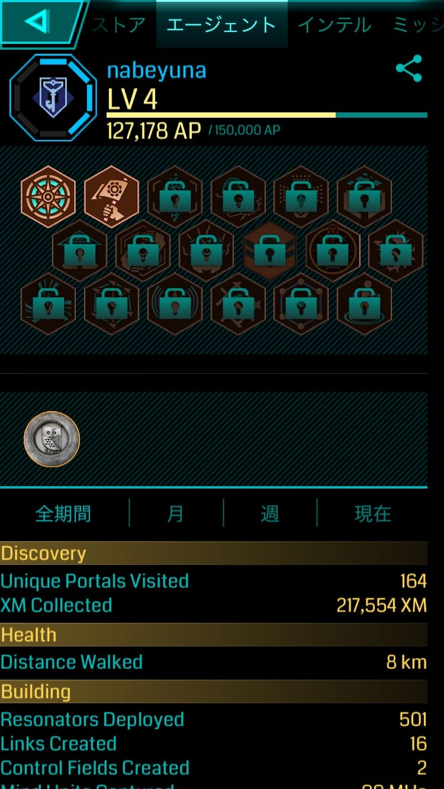

### 最近のあれこれ

はじめました（遅い）

渡辺ゆうなです。夏休み予定詰めすぎていろいろやばい。その分充実してるけど！

ゼミ合宿ではポケモンGOで真剣にスペシャルリサーチを頑張っていた私ですが、ミュウを捕まえてからはイングレスにシフトしてしまいました。

ゼミ合宿ではレベル２だったので後輩にとてもお世話になったのですが、先週ぐらいからちょこちょこやり始めた結果レベル４になることができました！ この調子で８までいけるかな〜

ネタがないので静岡旅行で感じたこと

静岡の富士に４日間ぐらい滞在したのですが、観光地を回りまくるってよりかはローカルな場所に訪れてました。ホテルではなく静岡に住んでいる人の家にお邪魔していたので、東京ではあまり食べない茹で落花生や、その家で朝採れた野菜などをいただいたりしてました。

そこで感じたのが、ご近所付き合いっていいなってこと！

私は上野に住んでるのですが、正直家族ぐるみのご近所付き合いは０です。隣にどんな人が住んでるかなんて何も知らない。

でも静岡は違うんですよねえ、（地方の人からしたら当たり前かもしれないけど）道で会ったら挨拶するし、野菜の交換とかするし、お茶会とかめちゃしてるし。 そういうのがあるってのは知ってたけど、ほぼ初めて経験したので新鮮でした。

地元の小さなお祭りにも行ったんですけどみんな知り合い！みたいなかんじでした。上野の祭りなんてほぼヤクザなのに！

そういう環境で育つのとそうでもないので性格とかも変わってきそうですよね。

研究進めます。
