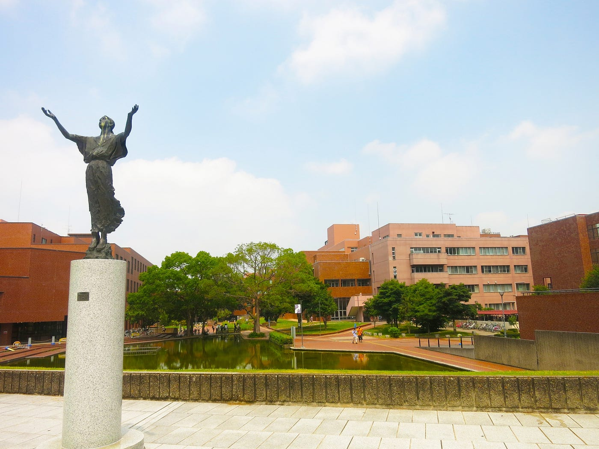
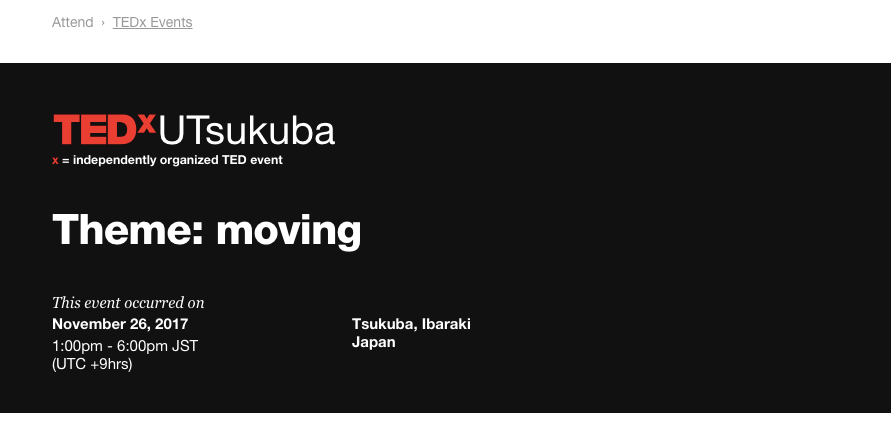

### 池の数が相模原キャンパスの比にならない大学

大学内に４つあるらしいです。池。
筑波大学のTEDx関係のお友達とお話している時に聞き相模原キャンパス自然自慢よくしていたけどやっぱり比じゃないなと感じたことをよく覚えています。

ということで今回は他大学TEDx紹介第５弾、TEDxUTsukuba さんを紹介させていただきます。

まず注意しなければならないのが、筑波大学の学生が主体となって運営しているTEDxUTsukubaと、筑波全体で運営しているTEDxTsukubaは別物だということ。

TEDxUTsukuba

[http://www.tedxutsukuba.com/](http://www.tedxutsukuba.com/)

TEDxTsukuba

[http://www.tedxtsukuba.com/](http://www.tedxtsukuba.com/)

名前が似ているので私も最初混乱しました。
運営しているメンバーはほとんどは一緒と伺いましたが、団体もイベントの日程なども全く別だそうです。

メンバーは会う人会う人みなさん気さくな方ばかりで、いつも私もカメラ周りのテック系の機材の相談や、パートナーの相談などをさせていただいています。
大きく、昔からある団体な分規模も大きいんですね。

またよくバーベキューをされている時のお写真がとても素敵な印象です笑

私は参加することができなかったのですが、
昨年のイベントは2017年11月26日に行われました。

テーマは「moving」

何か行動を起こすきっかけとなるイベント、という思いが込められているそうです。

メンバーの方でもそのような方がとても多いように思います。
私自身があまりしっかり他大学や他団体のお手伝いをさせていただけているわけではないのですが、そのような機会をいただいた際は必ずといっていいほど筑波大学の方が誰かしらいます。

そしてこのTEDxUTsukuba さん、イベント自体は２回目のようですが、TED公式ホームページを拝見するとサロンを何回か行われています。

[TEDx | Event Listing | TED
TED.com, home of TED Talks, is a global initiative about ideas worth spreading via TEDx, the TED Prize, TED Books, TED…www.ted.com](https://www.ted.com/tedx/events?autocomplete_filter=TEDxUTsukuba)

TEDxにおけるSalonというのは、TEDxUniversityはもちろん、TEDxYouthやTEDxinternal events のオーガナイザーたちが、一般的なTEDxイベントの合間に行う小さなトークイベントのようなものです。

数名のスピーカーを呼ぶことや、ディスカッションを行なったりするのですが、一般的なTEDxイベントとの違いは、それらを必ず公にする必要なないということです。

規模は小さくなりますが、ライブスピーカーを交えてテーマについてディスカッションができ、定期的に開くことができる点に置いて、TEDxイベントに継続性を持たせることができます。

[Salon event
TED is a nonprofit devoted to Ideas Worth Spreading - through TED.com, our annual conferences, the annual TED Prize and…www.ted.com](https://www.ted.com/participate/organize-a-local-tedx-event/before-you-start/event-types/salon-event)

最後に私が面白いなと思ったTEDxUTsukubaさんの2016年のトークを紹介させていただいて終わり。

学校内を自転車で移動する人が多く、自転車は移動手段の一つ、という単純な考えを違った味方で考えるところが面白かったです。
