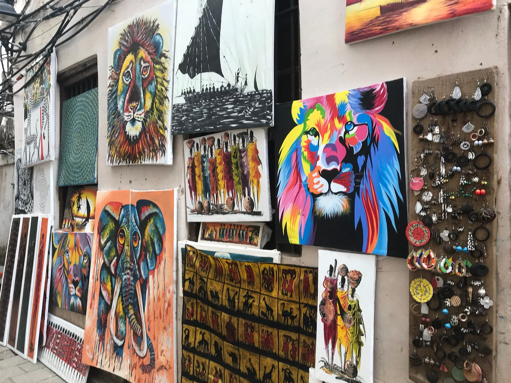
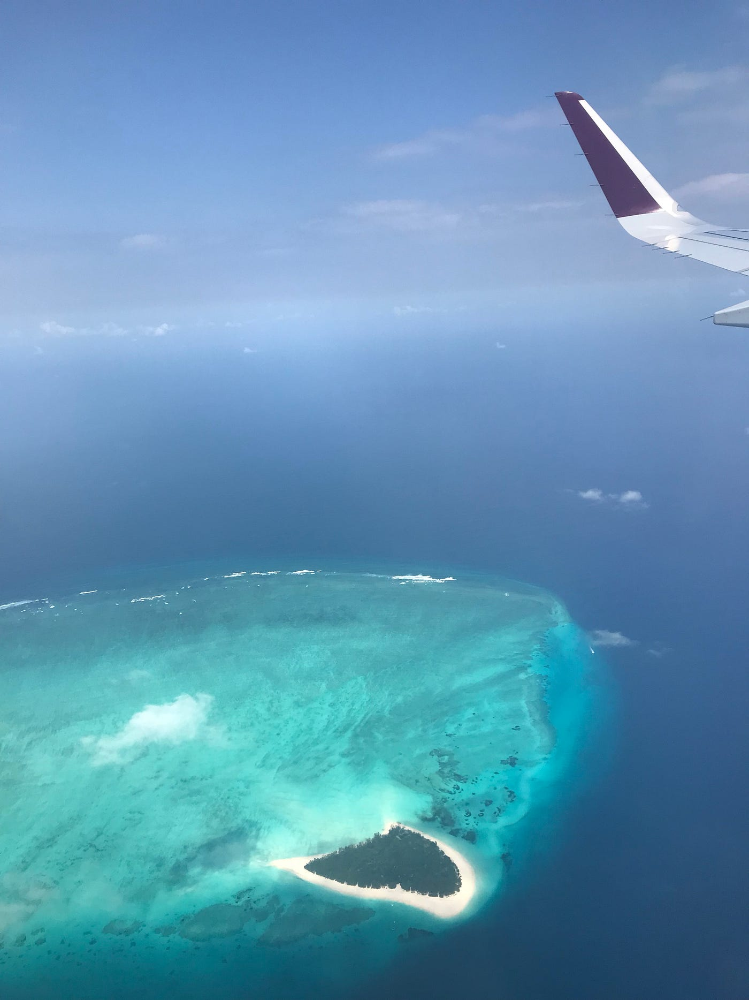
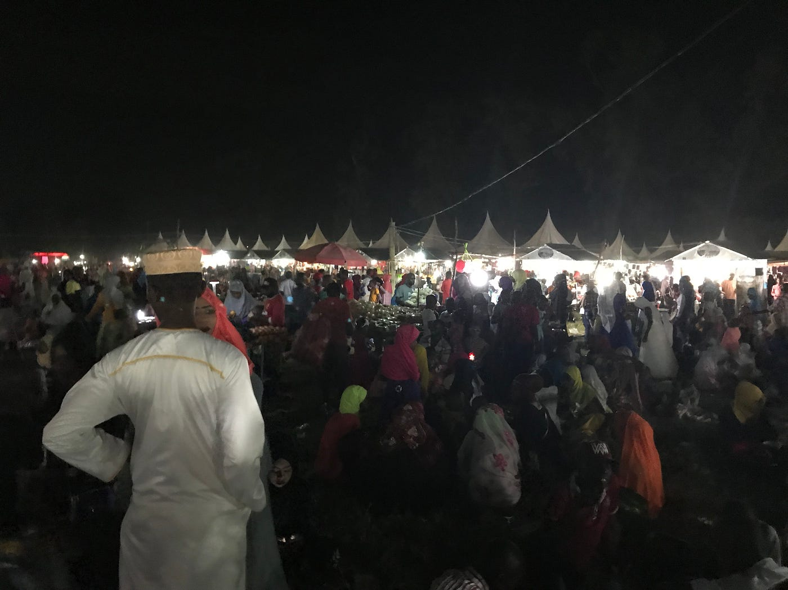
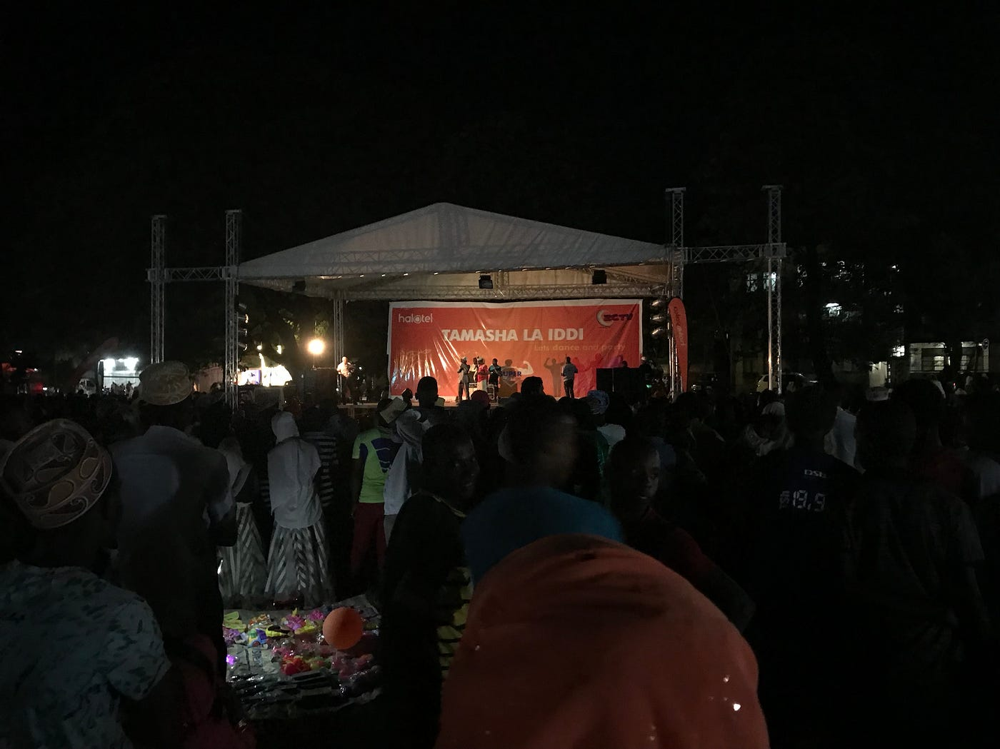
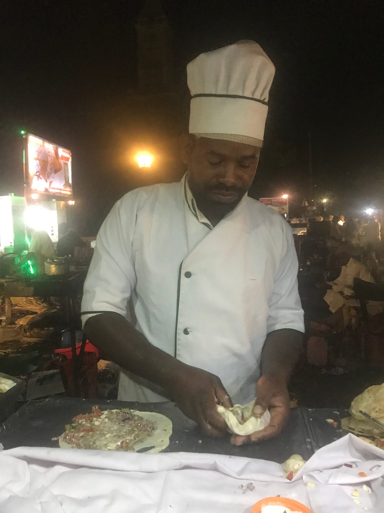
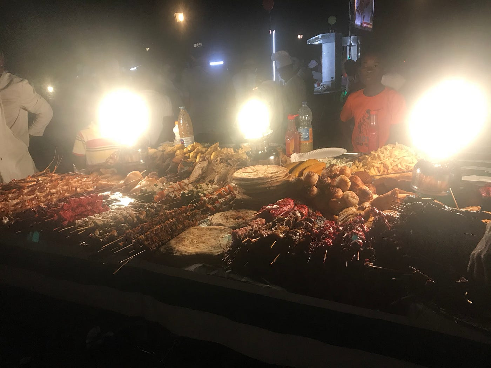
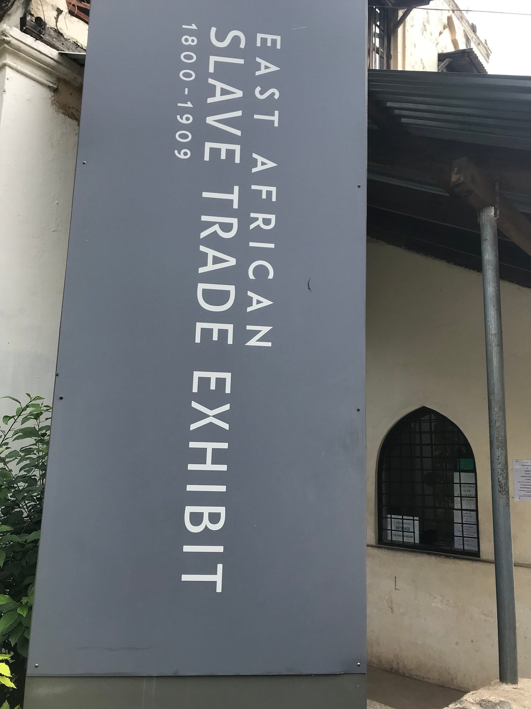

### アフリカ上陸！

Jambo! こんにちは！

初アフリカ上陸中！

初めてのアフリカ大陸、場所は現在、タンザニアのザンジバル島という島に来ている。

上の写真は行きしなの飛行機から見えたザンジバル島の隣の島！綺麗ですな〜。

昨日上陸して、空港からゲストハウスに向かう車内でお祭りを発見！

年に1回(4日間)のイスラム教のお祭りらしい。タンザニアではイスラム教の人が多い！だからワクフもあったよ！

上の写真の何倍もお店があってかなり盛り上がってた！少し街から遠いため(ゆうて2kmぐらい)、観光客は誰もいなかったっす！

イスラム教のお祭りだけど、現地のゲストハウスの人が行っていいんやで〜って教えてくれたのでゲストハウスで会った、日本人のまささんと行って来た！

謎のライブもやってて、子供達も夜遅くまでいるという。謎の光景。楽しかった！

こっちの伝統料理を少し紹介。

ザンジバルスープとザンジバルピザ。ザンジバルスープの方は現地の人も結構飲んでた！

海沿いのナイトマーケット的なのでは大量の海鮮料理だったりなんか色々と。

ザンジバルの歴史を語ると、昔はオマーンのスルタンの支配下で、奴隷貿易が盛んに行われてた。(その前は1499年にバスコ・ダ・ガマ上陸)そこからイギリス領となった大陸のタンガニーカが独立して、そのタンガニーカ共和国と、革命後に共和国となったザンジバル共和国が併合して、タンザニア連合共和国が誕生！1964年のこと。

ブラックな話だけど、アフリカの奴隷はしばしばこのザンジバル島に連れてこられて、ここのね、奴隷市場というところが大聖堂の地下にあるんだけど、ここで売買されてたらしい。

そんなブラックな歴史。大聖堂を訪れたけど、入場料が5ドルだったので入り口でやめた。後日友達と合流したら行こうと思う。

今回のアフリカ旅では2週間(タンザニアで1週間、ケニアで1週間)、日本のNGOのNICEというところ主催のボランティアに参加する。明日からスタート。マングローブや森で木を植える作業をする予定。

今日夕方に他の日本人メンバー(学生)3人が到着し、みんなでワイワイナイトマーケット散策！明日の集合時間まで観光する！

今は35ドルのライオンの絵を買おうか悩み中。笑

ザンジバル島は観光客が夜出歩いても比較的安全な街。子供が元気！ナイロビは治安が悪いから、気をつけなきゃ。

古橋研究室っぽく、昨日と今日の歩いたログを載せとく。

[Zanzibar-Stone Town day1 - Ayame Otsuki's 6.7 km run
Ayame O. ran 6.7 km on Aug 22, 2018.www.strava.com](https://www.strava.com/activities/1791256749)

[Zanzibar - Stone Town day2 - Ayame Otsuki's 6.4 km run
Ayame O. ran 6.4 km on Aug 23, 2018.www.strava.com](https://www.strava.com/activities/1791997111)

以上、アフリカ、タンザニア、ザンジバル島訪問記でした！
